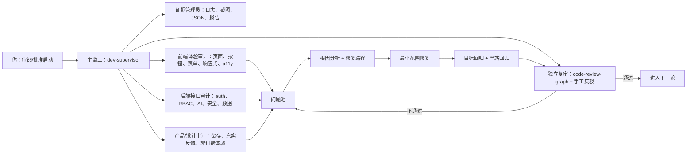
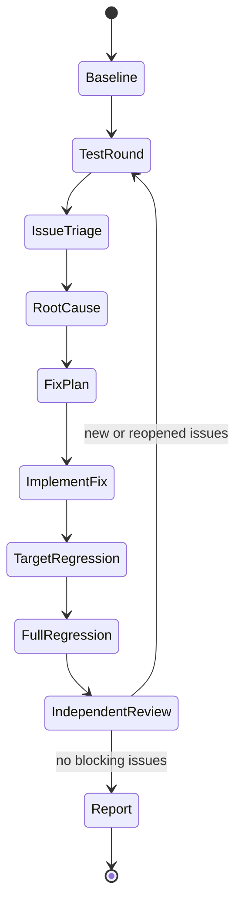

# EduAI Prism 12小时前后端全细节内测与自我迭代方案

版本：2026-07-08 preflight review  
范围：`D:\VB\LLM-School\app` 本地 Next 应用与线上地址 `https://app-eta-olive-27.vercel.app`  
状态：启动前审阅稿，待确认后执行至少 12 小时循环内测  

---

## 1. 本次目标

对 EduAI Prism 登录后全站进行至少 12 小时的前后端细节内测，覆盖页面、按钮、表单、接口、权限、安全、视觉、响应式、可访问性、性能、线上可用性与历史问题回归。

本方案先交付给你 review；确认后再进入长时间执行阶段。执行阶段不以“跑完一遍”为完成，而以“问题发现 -> 深度分析 -> 修复方案 -> 自我迭代升级 -> 回归复测 -> 下一轮继续”的闭环为准。

---

## 2. 当前工程事实

| 项目 | 当前事实 | 对内测的影响 |
| --- | --- | --- |
| 技术栈 | Next `16.2.6`、React `19.2.4`、Tailwind 4、Radix、motion、Recharts、three、node:sqlite | 需要同时测 SSR/CSR、水合、浏览器交互、SQLite 运行时 |
| npm 脚本 | `dev`、`build`、`start`、`lint` | 没有内置 `test` 脚本，需要用自写 HTTP/Playwright 脚本补齐 |
| 本地 Git | 当前根目录和 `app` 均不是 Git 仓库 | 无法做 git checkpoint、PR diff、CodeRabbit PR 审查；改用 supervisor 台账、日志、code-review-graph 和文档证据 |
| 线上地址 | `https://app-eta-olive-27.vercel.app` | 线上测试以低频健康检查和真实登录流为主，避免压测式请求 |
| 线上数据 | Vercel SQLite 使用临时目录 | 适合演示和功能验证，不适合验证长期数据留存 |
| 生产密钥 | 上次部署通过 CLI env 注入 `EDUAI_SESSION_SECRET`、`EDUAI_ENABLE_DEMO_SEED=true` | 后续重新部署需再次配置等价环境变量 |
| 已知平台警告 | Node 24 `node:sqlite` ExperimentalWarning | 记录但不视为应用缺陷，除非引发功能异常 |

---

## 3. 内测总原则

1. 证据优先：每个“通过/失败/已修复”都必须有命令输出、截图、JSON 日志、HTTP 状态码或文件行证据。
2. 不碰高风险动作：不删除数据、不做破坏性迁移、不写入真实密钥、不群发邮件、不做生产压测、不重新部署，除非你单独批准。
3. 先复现再修复：每个问题先保留复现证据，再做最小范围修复。
4. 修复后至少两层回归：目标回归 + 相关模块回归；涉及共享组件/API 时追加全站回归。
5. UI 不只看“能打开”：必须检查按钮语义、键盘可达、移动端、不溢出、loading/empty/error/success 四态、Toast 反馈、禁用态原因。
6. 后端不只看 200：必须验证 401/403/429/400、越权、无效参数、超长输入、Unicode、XFF 伪造、匿名访问和角色边界。

---

## 4. 12 小时时间盒

| 时间段 | 阶段 | 目标 | 主要产物 |
| --- | --- | --- | --- |
| 00:00-00:30 | 启动与基线 | 刷新 supervisor、确认依赖、端口、目标地址、环境变量、历史问题池 | `runbook.json`、环境日志、基线状态 |
| 00:30-01:30 | 静态与构建 | lint、tsc、build、硬编码色值/假按钮/无障碍静态扫描 | `static-build.log`、静态问题清单 |
| 01:30-03:00 | 后端/API 第一轮 | 登录、会话、权限、AI 安全、知识库、工单、审计、模型配置接口 | `api-round-1.json`、接口问题清单 |
| 03:00-04:30 | 前端浏览器第一轮 | 四角色主路径、桌面/平板/手机、按钮/表单/导航/弹窗 | 截图、console/pageerror、DOM 审计 |
| 04:30-05:30 | 问题整理与修复计划 1 | 按 P0/P1/P2/P3 分级，做根因分析和修复路径 | `issues-round-1.md`、修复任务队列 |
| 05:30-07:00 | 自我迭代修复 1 | 只修确认问题，避免无关重构 | 修改记录、目标回归日志 |
| 07:00-08:30 | 回归第二轮 | 重跑静态、API 目标回归、浏览器目标回归 | `regression-round-2.json` |
| 08:30-09:30 | 深水区专项 | 安全边界、长文本、文件上传、导出、权限开关、禁用态、错误态 | 专项证据与剩余风险 |
| 09:30-10:30 | 自我迭代修复 2 | 修第二轮确认问题；高风险项只给方案，不擅自改 | 修改记录、复测结果 |
| 10:30-11:30 | 全站最终回归 | 52+ 路由/角色/视口矩阵，线上健康检查，code-review-graph | `final-regression.json`、graph log |
| 11:30-12:00+ | 总结与交付 | 问题总表、已修复列表、未修复风险、后续建议 | 最终内测报告与修复报告 |

如第 12 小时仍有 P0/P1 未闭环，不强行收尾；进入追加循环，直到问题被修复、降级为外部依赖，或需要你批准高风险动作。

---

## 5. 可视化分工



### 角色职责

| 角色 | 职责 | 输出 |
| --- | --- | --- |
| 主监工 | 保持 12 小时节奏、记录 timeline、控制风险、强制证据门 | 监督日志、Round Execution Report |
| 前端体验审计 | 页面、按钮、输入、弹窗、表格、导出、响应式、键盘、无障碍 | 截图、DOM/a11y JSON、前端问题 |
| 后端接口审计 | 登录、会话、权限、AI 安全、知识库、工单、审计、限流 | HTTP JSON、接口问题、越权证据 |
| 产品/设计审计 | 角色路径、留存机制、文案诚实性、非付费体验、校园/后台风格统一 | 产品问题、设计一致性问题 |
| 独立复审 | 尝试推翻“已修复/已通过”的结论，检查影响半径 | review 结论、必须重测项 |
| 证据管理员 | 统一命名、保存日志、维护问题清单、最终报告 | `.codex-supervisor/qa-12h-*` 目录和 Markdown 报告 |

---

## 6. 覆盖矩阵

### 6.1 角色与账号

| 角色 | 账号 | 重点验证 |
| --- | --- | --- |
| 教师 | `teacher / Teacher@123` | dashboard、chat、class、knowledge、prompts、agent、教学输出质量 |
| 学生 | `student / Student@123` | learn/explore/chat、学术诚信、危机拦截、不可访问后台 |
| 管理员 | `admin / Admin@123` | admin analytics/audit/permissions/models/agents、权限和审计 |
| 科研 | `research / Research@123` | chat、dashboard、class 脱敏、后台禁止访问 |

### 6.2 页面路由

| 分类 | 路由 |
| --- | --- |
| 登录与入口 | `/login`、`/` |
| 教师/通用 | `/dashboard`、`/chat`、`/class`、`/knowledge`、`/prompts`、`/prompts/new`、`/agent`、`/agent/new`、`/hub`、`/profile` |
| 学生 | `/learn`、`/explore`、`/chat`、`/profile` |
| 管理 | `/admin/analytics`、`/admin/audit`、`/admin/permissions`、`/admin/models`、`/admin/agents` |

### 6.3 API 路由

| 分类 | 路由 |
| --- | --- |
| Auth/session | `/api/auth/login`、`/api/auth/logout`、`/api/auth/me`、`/api/auth/switch-role` |
| AI/chat | `/api/chat`、`/api/chat/sessions`、`/api/chat/sessions/[id]`、`/api/chat/feedback` |
| Safety | `/api/safety`、`/api/safety/tickets`、`/api/integrity` |
| Knowledge | `/api/knowledge`、`/api/knowledge/[id]`、`/api/knowledge/search` |
| Admin | `/api/audit`、`/api/admin/models/[id]`、`/api/admin/permissions/[roleId]`、`/api/agents`、`/api/agents/[id]` |
| Product | `/api/prompts`、`/api/prompts/[id]`、`/api/class`、`/api/search`、`/api/favorites`、`/api/notifications`、`/api/user/prefs`、`/api/profile/account`、`/api/profile/password` |

### 6.4 视口

| 设备 | 尺寸 | 必看点 |
| --- | --- | --- |
| 手机窄屏 | 390x844 | 登录表单、底部导航、表格横向滚动、按钮不挤压 |
| 手机大屏 | 430x932 | 卡片间距、弹窗、键盘弹起后的输入区 |
| 平板 | 768x1024、1024x768 | Sidebar/Sheet 切换、两栏布局、表格可读 |
| 桌面 | 1366x768、1440x900 | 信息密度、右栏、图表、管理台表格 |

---

## 7. 按钮与功能专项清单

| 模块 | 必测按钮/功能 | 失败判定 |
| --- | --- | --- |
| 登录 | 解锁、账号密码输入、登录、忘记密码、注册演示入口、移动端直接显示表单 | 无反馈、误报密码错误、移动端无输入框、无法键盘提交 |
| Shell | 侧边栏跳转、移动端菜单、搜索、通知、主题/偏好、退出 | 无 aria 名称、焦点丢失、路由错误、无真实反馈 |
| Chat | 发送、模型切换、深度思考、附件/上传、导出、复制、反馈、历史会话、危机弹窗 | 假按钮、直接给学生完整答案、安全拦截不生效、导出文件错误 |
| Knowledge | 上传、范围选择、搜索、筛选、查看文件、跨班/跨学部权限 | 误泄露私有/跨学部文件、搜索假阳性、移动端表格裁切 |
| Prompts | 搜索、分类、发送到对话、新建、编辑字段、状态反馈 | 提示词不进入 chat、表单无 label、保存无反馈 |
| Agent | 新建流程、滑块、开关、更多操作、启用/停用、搜索筛选 | 无名按钮、滑块无名称、配置未保存、禁用态无原因 |
| Profile | 资料保存、密码更新、偏好开关、设备下线、隐私说明 | 假保存、错误态吞掉、禁用态不说明 |
| Admin Analytics | KPI、图表、筛选、导出、模型健康 | 图表空白、数据误导、移动端溢出 |
| Admin Audit | 筛选、导出、工单处理、错误态 | 匿名可访问、工单详情泄露、失败显示为空数据 |
| Admin Permissions | 权限开关、保存角色、导出权限表、新增/批量禁用态 | 越权、开关无名称、保存无审计提示 |
| Admin Models | 配额滑块、治理开关、保存、模型状态 | 滑块无 a11y、生产密钥误写、禁用功能伪装可用 |
| Admin Agents | 搜索筛选、导出、处理/历史禁用态、事件详情 | 假按钮、状态颜色无文字、审计链断裂 |

---

## 8. 后端与安全专项

### 8.1 必测边界

- 匿名访问所有受保护 API：应返回 401/重定向，不得返回业务数据。
- 学生访问后台与管理 API：应返回 403 或被重定向。
- 管理员访问教师/科研敏感数据：按产品边界返回脱敏或拒绝，不得泄露学生真实标识。
- `switch-role`：学生不得切管理员；演示切换不得污染真实授权。
- Chat 安全：危机、自伤、隐藏在 history 的危机、学术诚信、软关怀、普通学习问题都需分支正确。
- Rate limit：登录、chat、safety、integrity 等接口需验证 429；XFF 伪造不能绕过认证后限流。
- 输入校验：空 body、坏 JSON、超长文本、非法枚举、SQL wildcard、Unicode 混合、文件名控制字符。
- 数据最小化：session cookie 只含最少 claim；科研/教师端不下发不必要 PII。
- 错误形态：400/401/403/404/409/429/500 均返回可理解错误，不吞成空态。

### 8.2 AI 质量

| 场景 | 通过标准 |
| --- | --- |
| 教师普通教学请求 | 返回课堂导入/板书/提问/教学步骤，不是学生学伴语气 |
| 学生求完整答案 | 明确拒绝代写，给思路和分步引导 |
| 危机表达 | 不进模型，硬拦截，显示热线/求助，生成安全工单或安全提示 |
| 软关怀 | 温和回应，不过度升级为危机，不生成工单 |
| 科研问题 | 给研究设计/指标/隐私提醒，不泄露真实学生信息 |
| 管理问题 | 给治理、审计、资源配置建议，不承诺不存在的付费/企业功能 |

---

## 9. 视觉与体验专项

### 9.1 Dual-Register Unity 回归

| 区域 | 应有风格 | 不通过示例 |
| --- | --- | --- |
| 管理台 Console | 克制、密集、表格优先、少渐变、零 3D 角色 | 大面积可爱插画、卡片套卡片、彩色玩具感 |
| 校园 Campus | 温暖、鼓励、任务/成就/探索、适度 3D | 空洞游戏化、过度 emoji、付费诱导 |
| Chat | 三栏结构、模型上下文、安全状态、引用来源清楚 | 社交 IM 化、联系人资料卡主导、导出/复制假按钮 |
| 学生留存 | 真实任务、真实产出、温和排行 | 焦虑打卡、付费墙、虚假稀缺 |

### 9.2 视觉检查

- 390px、768px、1024px、1440px 不横向溢出。
- 按钮文字不挤压，不被图标盖住。
- 表格在移动端用横向滚动，不压缩到不可读。
- loading/empty/error/success 四态齐全。
- 深色/浅色、reduced-motion、键盘 focus 可见。
- 页面唯一 H1，标题层级正确。
- 图表有标签、单位、图例或辅助说明。
- 状态不只靠颜色，必须有文字或图标辅助。
- 管理端禁用功能必须写明“演示环境未开通/需要外部基建”，不能伪装可用。

---

## 10. 问题分级

| 级别 | 定义 | 处理要求 |
| --- | --- | --- |
| P0 | 数据泄露、越权、危机/未成年人安全失效、登录不可用、主流程全断 | 立即停止当前轮，优先修复并全量回归 |
| P1 | 关键功能不可用、重要按钮假操作、AI 角色严重错配、移动端关键页面不可用 | 本轮内修复或给明确阻断原因 |
| P2 | 可访问性缺陷、局部响应式问题、错误态/空态不完整、视觉一致性问题 | 排入当前或下一修复批次 |
| P3 | 文案、微交互、性能微优化、低频边界 | 记录建议，不阻塞长测 |

---

## 11. 问题记录模板

```markdown
### QA12H-R{轮次}-{模块}-{序号}

- 严重级别：
- 类型：frontend / backend / security / design / product / perf / a11y
- 页面/API：
- 角色/账号：
- 视口/环境：
- 复现步骤：
- 实际结果：
- 预期结果：
- 证据：
- 初步根因：
- 修复路径：
- 风险评估：
- 回归范围：
- 状态：open / fixing / fixed / verified / wontfix-with-reason
```

---

## 12. 自我迭代闭环



每一轮修复前必须写清楚：

1. 假设：这个问题为什么发生。
2. 最小改动：只改哪里，不改哪里。
3. 验证：什么证据可以证明修复；什么证据会推翻修复。
4. 影响半径：改动是否影响共享组件、API、权限或会话。

---

## 13. 插件、agent、skill 使用策略

| 能力 | 本轮可用性 | 使用策略 |
| --- | --- | --- |
| dev-supervisor | 可用 | 全程监工、timeline、ledger、handoff、证据门 |
| Karpathy principles | 可用 | 每次修复前强制做假设、范围、验证检查 |
| Browser plugin | 视环境而定 | 优先真实浏览器交互；失败则降级 Playwright Edge |
| Playwright/Edge | 可用性高 | 批量浏览器、截图、console、a11y、overflow 检查 |
| code-review-graph | 可用 | 每轮修复后 build/review；无 git diff 时做结构影响审查 |
| CodeRabbit | 当前降级 | 当前不是 Git/PR 工作流，不能做 PR review；如提供 GitHub 仓库/PR 再启用 |
| GitHub | 当前降级 | 当前本地非 git；如提供仓库，可用于 issue/PR/CI 联动 |
| CircleCI | 当前降级 | 未见现成配置；可在测试脚本沉淀后再设计 CI |
| Jam | 按需 | 需要 Jam UUID；若你提供 bug 录屏，可拉取截图/网络日志分析 |
| Expo | 不适用 | 当前是 Web/Next 应用，不是 React Native/Expo |
| OpenAI Developers | 不主动使用 | 不创建/写入 API key；仅在你明确要求配置模型密钥时使用 |
| Superpowers | 当前无直接工具 | 用 supervisor + Playwright + code-review-graph 兜底 |
| edX | 不适用 | 课程学习工具，不用于本产品内测 |

---

## 14. 交付物

执行阶段应生成：

1. `.codex-supervisor/qa-12h-20260708/`：所有日志、截图、JSON、脚本输出。
2. `开发材料/EduAI-Prism-12小时内测问题清单-20260708.md`：按 P0/P1/P2/P3 分类的问题清单。
3. `开发材料/EduAI-Prism-12小时内测执行报告-20260708.md`：每轮做了什么、发现什么、修了什么、证据在哪里。
4. `开发材料/EduAI-Prism-12小时内测修复与优化升级报告-20260708.md`：修复说明、影响范围、回归结果。
5. 如有修复：更新 `.codex-supervisor/ledger.json`、`handoff.md`、`progress.md`、`findings.md`。

---

## 15. 启动前确认点

请 review 下面 5 点，确认后即可进入正式 12 小时执行：

1. 目标地址：是否同时测本地生产态和线上 `https://app-eta-olive-27.vercel.app`。
2. 账号范围：是否使用当前 demo 账号四角色即可。
3. 风险边界：是否确认不做生产压测、不做破坏性数据操作、不写真实密钥。
4. 修复策略：是否允许我在发现 P0/P1/P2 后直接做可逆代码修复并回归。
5. 交付节奏：是否按“每轮问题清单 + 修复报告 + 最终总报告”的方式交付。

默认建议：确认以上 5 点后，先执行完整 12 小时内测；P0/P1 立即修，P2 批量修，P3 记录为后续优化建议。

