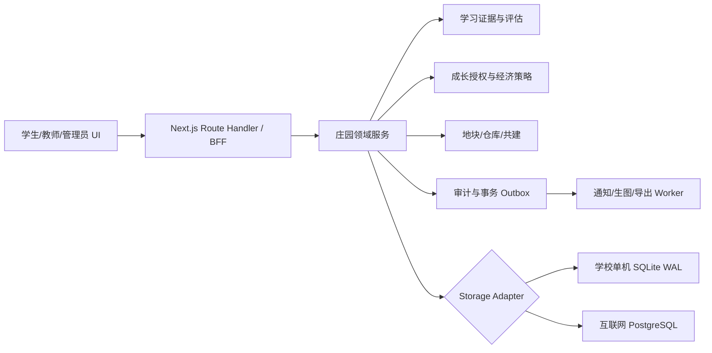
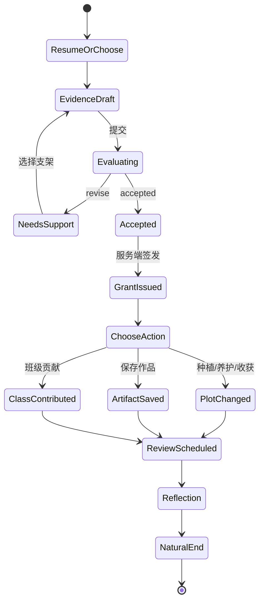
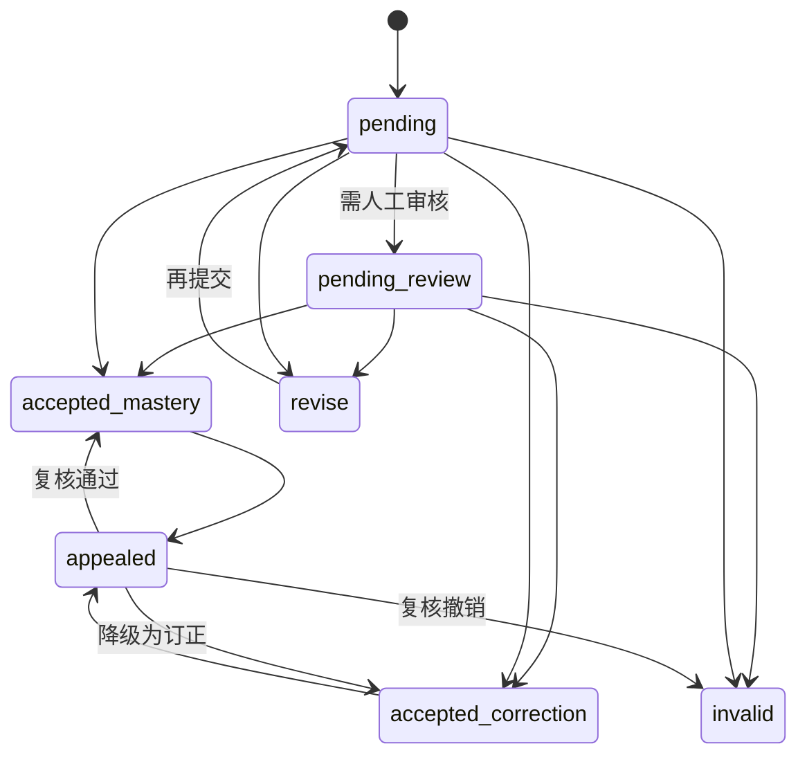
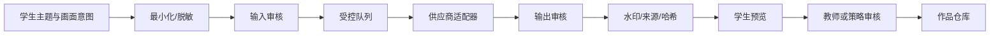
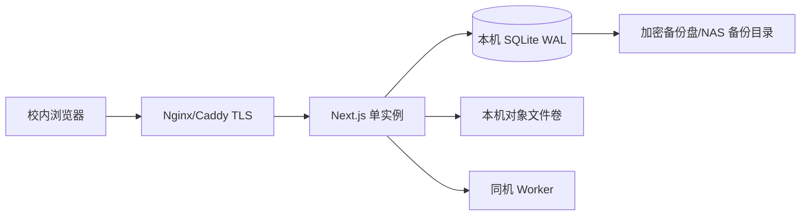
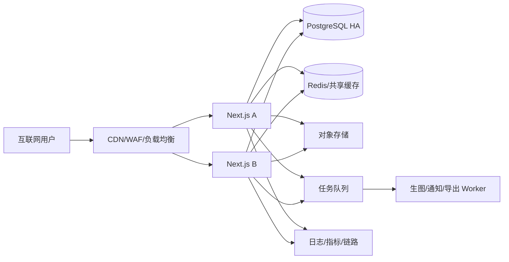

# EduAI Prism 个人庄园全栈闭环解决方案与双部署技术路线 v4.0

> 版本：4.0  
> 日期：2026-08-24  
> 适用范围：学生端个人庄园、教师证据复核、管理员策略与审计、学校本地部署、互联网部署  
> 前置成果：已认可的 `/student/manor` 视觉实现、v3.0 前端闭环路线、现有 `/api/manor` 与 SQLite 领域逻辑  
> 本文性质：实施级架构与产品规格，不代表已经完成后端迁移或生产上线  

---

## 0. 一页决策

### 0.1 最终产品定义

个人庄园不是独立小游戏，也不是学习后的奖励页，而是学生学习证据的可视化投影：

```text
课程目标 -> 学习任务 -> 可核验证据 -> 形成性反馈 -> 一次性成长授权
        -> 学生自主选择庄园行动 -> 成果卡/复习计划 -> 教师复核与申诉
        -> 纵向成长回放 -> 自然结束
```

只有服务端接受的学习证据能够签发成长授权。点击、在线时长、连续登录、重复浇水、普通点赞、反复小额认捐不得直接生成高价值奖励。农场外观可以活泼，证据判定、权限、审计和部署必须严肃、可解释、可回滚。

### 0.2 推荐架构

采用“单一领域内核 + 存储适配器 + 两套部署配置”，不维护本地版和互联网版两套业务代码：



推荐先实现“模块化单体”，而不是立即拆微服务。当前团队、数据量和学校私有化场景更需要可部署、可诊断和事务一致性；当生图、通知、导出任务确实形成独立容量压力时，再将 Worker 横向扩展。

### 0.3 六项立即决策

| 决策 | 结论 | 理由 |
| --- | --- | --- |
| 视觉是否推倒重做 | 否 | 当前经典农场空间语言、24 地块和多端基础已获认可 |
| 是否直接把 UI 接到旧 `/api/manor` | 否 | UI 是 24 地块，旧 API 只接受 0-5；语义和测试边界也不同 |
| 后端是否全部重写 | 否 | 保留鉴权、同班访问、服务端经济校验、事务和幂等重放等有效基础 |
| 主权威数据是什么 | `EvidenceRecord + GrowthGrant + DomainEvent` | 能解释“为什么成长、由谁判定、何时消费、如何撤销” |
| 学校本地是否可继续 SQLite | 可，但限单主机单写者 | SQLite WAL 不适合网络共享盘和多主机写入 |
| 公网是否使用 SQLite | 否 | 多实例、持久化、备份恢复和并发要求应使用 PostgreSQL |

### 0.4 发布红线

以下任意一项未满足，不得宣称“个人庄园闭环完成”：

1. 学习结果未返回或证据未接受时，界面不得提前发能量、推进作物或显示成功。
2. 每个奖励都能从学生端追溯到证据，从教师端追溯到量规与判定，从管理员端追溯到策略版本和审计事件。
3. 每个写操作都有幂等键；断网重试不重复扣减、奖励、收获或贡献。
4. 24 地块模型、前端、API、数据库和测试使用同一契约。
5. “今天到这里”真正停止任务召回、庆祝和高显著奖励入口，不只是显示一句文案。
6. 学校本地版完成备份恢复演练；公网版完成 PostgreSQL 恢复、限流、告警与密钥轮换演练。
7. 不在客户端、仓库、日志、截图或文档中保存真实模型密钥。已经公开过的密钥必须先废止并轮换。

---

## 1. 范围、非目标与证据边界

### 1.1 本方案覆盖

- 学生端从首次进入到长期使用的完整 UI、状态、按钮和恢复路径。
- 教师端证据审核、退修、覆盖、复习安排、协作治理和申诉处理。
- 管理员端奖励策略、审计、内容安全、数据治理与运行健康。
- 学习证据、成长授权、地块、仓库、作品、共建、离线队列的数据模型。
- 对现有 `/api/manor` 和 SQLite 的兼容迁移，而不是另起一套不可复用后端。
- 学校局域网单机部署和公网多实例部署。
- 前端、API、数据库、可访问性、儿童福祉、视觉和灾备验收。

### 1.2 本方案明确不做

- 不引入付费、充值、会员、广告换奖励、抽卡、盲盒或现金价值兑换。
- 不以总在线时长、点击量、连续签到、通知打开率作为留存目标。
- 不复制 QQNCmini 商标、角色、原始按钮、运行时、业务接口或专有代码。
- 不允许浏览器直接访问模型或生图供应商，也不允许把密钥写入 `NEXT_PUBLIC_*`。
- 不以一个固定“每日使用分钟数”替代学校、年龄、任务和个体差异的配置与试点验证。
- 不在首期拆分微服务、上 Kubernetes 或引入复杂事件流平台，除非真实容量数据证明需要。

### 1.3 QQNCmini 参考边界

`C:\Users\nuoya\AppData\Local\QQNCmini` 是 CEF/CefSharp 微端外壳与远程资源入口，不是可直接移植的完整产品源码。安全参考范围仅包括：

- 全幅 2.5D 场景、斜向田块、建筑热点和边缘工具布局。
- 木质 HUD、纸张任务板、金黄反馈、绿色成长和清晰白描边的视觉语法。
- 高频操作常驻、低频操作进入弹层、场景状态直接可见的交互模式。

现有去标识重绘资产继续作为空间基线；正式上线资产必须重新记录来源、提示词/制作人、模型、日期、授权和人工复核结果。

---

## 2. 当前状态审计

### 2.1 已有可复用能力

| 层 | 已有能力 | 证据位置 | 处理意见 |
| --- | --- | --- | --- |
| 学生视觉 | 24 地块、6 工具、活动入口、建筑热点、仓库、好友、移动导航 | `app/app/(shell)/student/manor/page.tsx` | 保留视觉与交互骨架 |
| 学习原型 | 选任务、提交答案、支架、能量、养护、反思、复习、总结 | `LearningHub.tsx` | 替换模拟仓储，补全证据身份与恢复状态 |
| 可访问性 | 键盘菜单/单选/标签、焦点锁、返回焦点、live region、减少动效 | 页面与 CSS | 继续补 200% 缩放、高对比和非地图列表 |
| API 鉴权 | 学生角色、同班参观、演示只读 | `app/app/api/manor/route.ts` | 保留并扩展对象级授权 |
| 经济安全 | 余额服务端校验、作物条件、越界与重叠校验 | `app/lib/server/db.ts` | 下沉到领域服务和数据库约束 |
| 事务/幂等 | 多项写入使用 `BEGIN IMMEDIATE` 与 `manor_operations` 重放 | `db.ts` | 扩展到所有写操作和失败结果 |
| 后端测试 | 种植、养护、收获、解锁、购买、摆放、参观、点赞、共建 | `app/tests/e2e-b4.mjs` | 升级为 24 地块契约测试 |

### 2.2 现有断点

| 严重度 | 断点 | 当前后果 | v4 处理 |
| --- | --- | --- | --- |
| P0 | 前端 24 地块，后端 6 地块 | 正常 UI 会操作后端不存在的地块 | 数据库扩展到 24，保留 0-5 数据，6-23 初始锁定 |
| P0 | 前端学习仓储是本地 mock | 刷新丢失、教师不可见、无法审计 | 新增 HTTP repository 与服务端证据账本 |
| P0 | 普通农具可绕过证据推进作物/产币 | 学习成为附加层，形成两套经济 | 农具改为消费 `GrowthGrant` 或仅作无经济的装饰反馈 |
| P1 | 后端按正积分行数计算雨露 | 一次正积分不论质量和数值都等于一滴 | 独立 `growth_grants` 账本，明确来源和策略 |
| P1 | API 无 `stateVersion/expectedRevision` | 离线或多设备会覆盖新状态 | 乐观并发控制，409 返回权威快照 |
| P1 | `place` 等写操作缺少幂等 | 重试可能产生重复或覆盖 | 所有 mutation 强制 operationId |
| P1 | 审计在事务外且字段不足 | 无法证明奖励与地块变化因果 | 事务内 DomainEvent + Outbox + 不可变审计投影 |
| P1 | 健康结束只改本地文案 | 仍可继续被任务与奖励召回 | 服务端记录本次结束，前端进入舒缓态 |
| P1 | 本地/公网部署无正式手册 | 难以备份、恢复、扩容和排障 | 两套 profile、同一镜像、明确 RPO/RTO |
| P2 | 庄园专项测试不在默认 `check` | 改动可能绕过庄园门禁 | 将契约、真实 API 和视觉门禁纳入 CI |

### 2.3 当前真实调用链

```text
当前学生端：
/student/manor -> ManorPage 本地状态 -> LearningHub
-> createManorLearningRepository(mock) -> 本地 energy/plot/portfolio

当前未接入的后端：
/api/manor -> session/role -> domain-like db functions
-> SQLite transaction -> farm snapshot
```

v4 的第一目标不是增加更多按钮，而是让两条链在版本化契约下汇合。

---

## 3. 苏格拉底式多角色审阅结论

### 3.1 六个关键问题与产品决策

| 问题 | 反证结论 | 最终决策 |
| --- | --- | --- |
| 作物能证明学习吗 | 不能；作物只是证据的可视化投影 | 成果卡展示证据摘要和下一步，作物不单独作为成绩 |
| 同题先错后对等于掌握吗 | 不一定；可能是试探答案 | 标记为“订正”，需独立变式或延迟提取后升为掌握 |
| 不显示排行榜就不会比较吗 | 不成立；庄园繁荣度也可能成为代理排名 | 默认关闭同伴资源对比，只显示合作和个人纵向变化 |
| 学生能结束使用吗 | 当前不能完全保证 | 结束后冻结召回，允许浏览成果但不显示新奖励入口 |
| 教师能解释奖励吗 | 当前 mock 没有证据 ID、量规和策略版本 | 教师端展示完整因果链并支持带理由覆盖/申诉 |
| 本地与公网要两套系统吗 | 不需要，会导致长期分叉 | 同一领域层和 API，替换存储、任务和观测适配器 |

### 3.2 产品真值

庄园中所有面向学生的成长变化，都必须能回答四句话：

1. **我学会了什么。** 对应课程目标和证据类型。
2. **系统为什么这样判断。** 对应量规、答案、教师反馈或自动判定理由。
3. **庄园为什么发生变化。** 对应一次性成长授权及其消费记录。
4. **下一次什么时候做什么。** 对应可推迟、可解释的复习或迁移建议。

任意变化回答不了其中一项，就只是装饰性游戏反馈，不得进入学习成效统计。

---

## 4. 教育产品与年龄策略

### 4.1 北极星指标

优先指标：

- 有效学习循环完成率。
- 7/14/30 日延迟保持率。
- 答错后使用支架并成功订正的比例。
- 由订正升级为独立掌握的比例。
- 学生自主选择等价任务和表达方式的比例。
- 教师审核一致率、申诉翻转率和自动判定误差。
- 健康自然结束率与结束后不被重新召回率。
- 不同年龄、语言、设备、网络和辅助技术群体的奖励差异。

禁止作为北极星指标：总在线时长、连续签到、点击次数、通知打开率、个人排行、付费转化。

### 4.2 年龄分层

| 年龄段 | 学生界面 | 激励与社交 | 证据与自主 |
| --- | --- | --- | --- |
| 低龄小学 | 单目标、少数大按钮、朗读/口述/操作入口 | 默认隐藏币值、等级、通知角标和同伴庄园 | 教师/监护人确认公开；提供语音与图形支架 |
| 高龄小学 | 任务选择和有限规划；不公开比较 | 强调“学会了什么”，装饰不影响学习能力 | 提供非计时、低带宽和多模态等价路径 |
| 初中 | 私人纵向成长；可关闭推荐 | 协作必须有角色和成果，不显示分数排名 | 增加信息素养、AI 使用说明和申诉入口 |
| 高中 | 降低幼态视觉密度，支持长期项目 | 允许自定主题和作品陈列，仍无随机经济 | 强化目标制定、来源标注、量规、导出与作品权利 |

年龄策略必须版本化为 `agePolicy`，由学校学籍年级映射到产品年龄档，不由学生在前端自行选择。学籍缺失、冲突或同步失败时采用最安全默认：低龄界面、作品私密、同伴参观关闭、自由文本互动关闭、AI 作品待人工审核；待教师/管理员修复后再放宽。监护授权记录用途、范围、版本、生效/撤回时间，不把一次同意解释为永久或全功能同意。四个年龄档和未知年龄都进入权限、社交、公开、币值与可访问性契约测试。

### 4.3 福祉设计

以 UNICEF RITEC 的安全、包容、自主、情绪、胜任、关系、创造和身份八个维度作为发布审计框架，但不把该框架误称为本产品的学习疗效证明。每个版本仍需用真实学生试点数据验证。

必须实现：

- 无断签惩罚、作物死亡、限时消失、随机稀缺或羞耻召回。
- 结束、休息、继续三个动作视觉权重相近。
- 推迟复习不清零成长，离线和教师审批延迟不减少奖励。
- 动效、声音、数值、社交和个性化均可独立关闭。
- 高价值成果不因速度、题目难度、设备性能或是否使用辅助技术而增加。

---

## 5. 完整 UI 闭环

### 5.1 学生端信息架构

```text
个人庄园
├─ 今日任务：推荐任务、等价替代、继续、为什么推荐
├─ 知识田：24 地块、种子、成长阶段、支持、收获
├─ 记忆温室：待复习、可推迟、迁移挑战、复习历史
├─ 创作工坊：解释卡、观察记录、项目、AI 辅助配图
├─ 班级共建：共同目标、角色、我的证据、预设感谢
├─ 学习仓库：成果卡、作品、图鉴、装饰、成长回放
├─ 邻居参观：同班、只读、隐私受控、不显示经济数据
└─ 健康使用：休息/结束、安静时段、动效/声音/隐私
```

### 5.2 首次进入闭环

1. 欢迎页说明“庄园记录学习成长，不会因中断受罚”。
2. 选择偏好：看、听、做、讲，可多选或跳过。
3. 选择柔性周目标：2-5 次，可随时修改。
4. 完成 2-3 分钟轻量诊断；加载失败可跳过并稍后补做。
5. 查看第一颗知识种子的推荐理由与两个等价选择。
6. 完成一个短任务，收到真实反馈后土地发芽。
7. 生成成果卡和复习建议，进入自然结束卡，不自动播放下一个任务。

### 5.3 日常核心闭环



### 5.4 地块状态

统一状态枚举：

```text
locked | empty | selecting | planted | learning | review_due |
needs_support | ready | harvesting | completed | sync_pending |
sync_conflict | sync_error
```

每个状态同时提供图形、文字、图标和读屏描述。地块点击最多显示四个上下文动作：一个主动作、一个安全替代、一个查看证据、一个更多菜单。

| 状态 | 主动作 | 次动作 | 禁止行为 |
| --- | --- | --- | --- |
| `empty` | 选择知识种子 | 查看推荐原因 | 随机抽种子 |
| `learning` | 继续任务 | 换种表达 | 用等待倒计时替代学习 |
| `review_due` | 开始回顾 | 明天/本周 | 推迟后枯萎或扣分 |
| `needs_support` | 看一个支架 | 拆小一步 | 红色失败羞耻动画 |
| `ready` | 收获成果卡 | 稍后收获 | 限时消失 |
| `sync_pending` | 查看同步记录 | 继续浏览 | 重复显示最终奖励 |
| `sync_conflict` | 使用最新状态并重放 | 查看差异 | 静默覆盖服务端 |

### 5.5 需要新增或补全的学生 UI

| 页面/组件 | 核心字段 | 核心动作 | 必备状态 |
| --- | --- | --- | --- |
| `OnboardingFlow` | 偏好、周目标、诊断状态 | 跳过、保存、继续 | 加载、失败、恢复 |
| `MissionBoard` | 目标、掌握度、预计时长、推荐理由、等价性 | 开始、继续、换一个、关闭个性化 | 空、过期、离线 |
| `SeedDrawer` | 学科、先修、周期、成果类型 | 筛选、选择、查看条件 | 锁定、无结果 |
| `PlotActionSheet` | 地块状态、证据摘要、授权余量 | 学习、养护、收获、查看证据 | pending/conflict/error |
| `MemoryGreenhouse` | 记忆强度、建议窗口、最近证据 | 现在、明天、本周、查看历史 | 空、数据不足 |
| `CreationWorkshop` | 作品类型、草稿、来源、可见性 | 保存、提交、配图、撤回 | 审核中、被退回 |
| `ClassBuild` | 共同目标、我的角色、我的证据 | 选角色、提交、感谢、退出公开 | 冻结、审核中 |
| `LearningWarehouse` | 成果卡、作品、图鉴、装饰、回放 | 筛选、导出、布置、删除 | 权限受限、导出中 |
| `WellbeingCenter` | 本次循环、节奏、声音、动效、隐私 | 休息、结束、继续短任务 | 舒缓态、安静时段 |
| `RecoveryCenter` | 草稿、离线动作、冲突、会话状态 | 重试、放弃、查看差异、重新登录 | 部分成功、过期 |

“今天到这里”写入服务端 `wellbeing_session { endedAt, quietUntil, source, policyVersion, revision }`。在 `quietUntil` 前，所有页面、设备、重新登录和通知服务都抑制新任务角标、奖励庆祝和召回消息；学生仍可浏览已有成果、恢复未提交草稿、修改设置或主动解除安静状态。状态通过增量同步传播，不能只存在于当前 React 组件。

### 5.6 教师端闭环

新增“庄园证据中心”，采用克制的工作台风格，不复制学生端农场背景：

```text
待审核 -> 证据详情 -> 量规与自动判定 -> 教师结论
      -> 成长授权/退修 -> 下次复习 -> 学生可见反馈 -> 申诉/复核
```

教师列表字段：学生、课程目标、证据类型、提交时间、自动判定与置信度、辅助使用、风险标签、时限。

教师详情必须并列显示：

- 课程目标、量规版本和任务原文。
- 学生原始答案/作品、尝试次数、提示与适配方式。
- 自动判定理由、模型/规则版本、置信度和异常标记。
- 上一次相关证据、复习间隔和纵向变化。
- 可选结论：掌握、订正、退修、无效、转交复核。
- 所有覆盖必须填写理由；学生可以看到儿童可理解的反馈。

审核策略：客观题即时反馈并抽样复核；开放作品、边界置信度、异常重复、AI 内容和申诉必须进入人工队列。

教师端按钮与状态合同：

| 场景 | 主动作 | 安全替代 | 状态与恢复 |
| --- | --- | --- | --- |
| 队列加载 | 查看下一条 | 调整筛选 | 骨架、空队列、加载失败、重试 |
| 证据详情 | 提交结论 | 保存草稿/转交 | 防重复提交、旧 revision 冲突、刷新最新 |
| 退修 | 发送可理解反馈 | 保存草稿 | 必填理由、焦点定位到错误字段 |
| 申诉复核 | 维持/改判 | 转交复核人 | 显示原判、申诉、时间线和 SLA |
| 批量操作 | 应用同一量规 | 逐条检查 | 部分失败逐条呈现，不回滚成功项 |

弹层关闭后返回触发按钮；表格在窄屏改为列表；拒绝、无权限、会话过期和服务不可用均保留教师草稿。

### 5.7 管理员端闭环

| 工作台 | 功能 | 红线 |
| --- | --- | --- |
| 策略版本 | 奖励上限、证据类型、年龄档、公开范围 | 不允许直接修改历史账本 |
| 因果审计 | evidence -> evaluation -> grant -> action -> artifact | 不只记录 URL 和结果 |
| 内容安全 | 提示词、审核结果、来源、撤回、申诉 | 不展示不必要的学生隐私 |
| 运行健康 | API、数据库、队列、备份、同步冲突 | 不能用“页面能开”代表健康 |
| 数据权利 | 查阅、更正、导出、删除、保留期限 | 删除需有任务和证据链 |
| 福祉审计 | 结束率、通知、社交、差异、公平性 | 不展示个人排行榜 |

管理员所有发布型动作采用“草稿 -> 双人复核 -> 定时生效/立即生效 -> 可回滚新版本”，不原地修改已生效策略。页面必须覆盖加载、空、无权限、版本冲突、部分失败、审批中、已发布和回滚完成状态；危险操作需二次确认并把焦点返回原入口。

### 5.8 响应式策略

- `>=1180px`：完整场景，任务板与知识田并行。
- `768-1179px`：场景可平移，关键面板固定；提供地块列表替代精确地图点击。
- `<768px`：任务优先的纵向壳层；地图是可选标签，不用裁切桌面舞台作为主流程。
- 所有断点保持“任务、照料、成果、伙伴、我的”五个一级入口可达。
- 200% 文本缩放和 400% 浏览器缩放下不遮挡；在 320 CSS px 宽度完成单列 reflow，不产生双向滚动。
- 支持横竖屏，不锁定方向；触控目标至少 44×44px；不以颜色作为唯一状态。
- 覆盖 WCAG 2.2 的焦点不被遮挡、名称/角色/值、错误关联、动态公告与一致帮助入口。
- 验收至少包含 NVDA+Chrome、VoiceOver+Safari 或平台等效组合，并记录浏览器/读屏版本。

---

## 6. 统一视觉系统

### 6.1 两种表皮，一个语义系统

| 端 | 表皮 | 共同语义 |
| --- | --- | --- |
| 学生端 | 2.5D 农场、木材、纸张、绿色和金黄、一次性成长动画 | 同一状态色、图标、文案、错误码和可访问性规则 |
| 教师/管理员 | 白/浅灰工作台、紧凑表格、清晰筛选和审计时间线 | 同一证据状态、策略版本、风险等级和动作层级 |

教师端不应被改成卡通农场，学生端也不应被改成蓝紫 SaaS 仪表盘。统一来自语义令牌和组件合同，不来自强行使用同一背景。

### 6.2 色彩与材质

| 令牌 | 值 | 用途 |
| --- | --- | --- |
| `--earth-700` | `#5A3A24` | 木质边、标题、学生端主轮廓 |
| `--earth-500` | `#8A5A36` | 木质按钮与工具 |
| `--leaf-600` | `#2F7D4A` | 可执行的健康成长 |
| `--leaf-300` | `#A9D98E` | 成功背景 |
| `--sun-500` | `#E5A92F` | 收获、里程碑、焦点 |
| `--sky-600` | `#2E6F9E` | 学习、复习、信息动作 |
| `--ink-900` | `#20252B` | 主文本 |
| `--paper-100` | `#FFF8E8` | 任务与说明 |
| `--danger-600` | `#B33A3A` | 真实危险与破坏性动作 |

状态色必须通过 WCAG 2.2 对比度测试。危险红不用于普通答错，金色不用于可付费稀缺。

### 6.3 动效

| 动效 | 时长 | 规则 |
| --- | --- | --- |
| 按钮按压 | 80-140ms | 不改变布局 |
| 抽屉/弹层 | 180-240ms | 透明度与短位移 |
| 作物成长 | 450-700ms | 仅在服务端确认后播放一次 |
| 收获庆祝 | 800-1200ms | 可立即跳过，不阻塞结束 |
| 共建推进 | 600-900ms | 说明贡献来源，不模拟随机爆奖 |

`prefers-reduced-motion` 下关闭漂浮、粒子、视差和缩放回弹；状态变化仍用文本与图标反馈。

### 6.4 资产制作清单

优先补齐：

1. 24 地块的空、锁定、学习中、待复习、需要支持、成熟、同步异常图层。
2. 数学、语文、英语、科学、综合实践五套知识种子和成长阶段。
3. 记忆温室、创作工坊、班级共建、学习仓库的日间/安静状态。
4. 低龄朗读、无障碍高对比、离线、恢复、申诉和内容拦截插图。
5. 教师端证据状态和审计图标，不使用卡通角色代替严肃状态。

生图资产采用透明背景 2x PNG/WebP，统一光源、透视和比例。任何模型生成结果都必须去标识、人工复核、登记来源并通过儿童内容安全检查。

资产发布门禁同时检查：`app/public/art/REGISTRY.md` 来源清单完整、提示词/作者/模型/日期/授权/哈希可追踪、禁用品牌与文字扫描通过、去身份化复核通过、与已认可场景基线的布局/透视差异在人工审核范围内。单纯截图相似不代表版权或来源合格。

---

## 7. 学习证据、奖励与复习的权威链

### 7.1 核心证据对象

```ts
interface EvidenceRecord {
  id: string;
  studentId: string;
  objectiveId: string;
  missionId: string;
  evidenceType: "mastery" | "correction" | "retrieval" | "transfer" | "expression" | "collaboration" | "reflection";
  artifactRef: string | null;
  latestAttemptId: string;
  attemptCount: number;
  hintsUsed: string[];
  accommodationCodes: string[];
  provenance: "student" | "teacher" | "ai-assisted" | "imported";
  status: "pending" | "pending_review" | "accepted_mastery" | "accepted_correction" | "revise" | "invalid" | "appealed";
  evaluatorType: "rule" | "model" | "teacher";
  evaluatorId: string;
  rubricVersion: string;
  policyVersion: string;
  rewardClass: "mastery_progress" | "correction_support" | "transfer_progress" | "artifact_progress" | "collaboration_progress" | "none";
  grantEligibility: "eligible" | "ineligible" | "pending_review";
  confidence: number | null;
  operationId: string;
  createdAt: string;
  decidedAt: string | null;
}
```

每次提交另存不可变的 `EvidenceAttempt`，不得覆盖旧答案：

```ts
interface EvidenceAttempt {
  id: string;
  evidenceId: string;
  sequence: number;
  answerPayload: unknown;
  hintsUsed: string[];
  accommodationCodes: string[];
  operationId: string;
  submittedAt: string;
}
```

`EvidenceRecord` 保存聚合状态，`EvidenceAttempt` 保存每次原始输入。退修后再次提交只追加 attempt 并推进聚合版本，教师始终能查看此前答案、提示、适配与判定。

### 7.2 成长授权

```ts
interface GrowthGrant {
  id: string;
  studentId: string;
  evidenceId: string;
  units: number;
  remainingUnits: number;
  allowedPurposes: Array<"plot" | "artifact" | "class_build">;
  status: "available" | "reserved" | "partially_consumed" | "consumed" | "revoked";
  policyVersion: string;
  issuedAt: string;
  consumedAt: string | null;
}
```

规则：

- 每个接受证据在全生命周期最多签发一个授权；唯一约束为 `evidenceId`。策略升级不追溯重奖旧证据，`policyVersion` 只记录签发依据。
- 授权签发时只给出 `allowedPurposes`，学生选择行动时再确定用途，保留自主选择。
- 每次消费追加不可变的 `grant_consumptions(amount, purpose, operationId, reversalOf)`；部分消费更新 `remainingUnits`，撤销已消费授权必须生成补偿记录而不是删除流水。
- 同题答错后改对记为 `accepted_correction + correction_support`：可清除“需要支持”或完成订正反馈，但不能推进“独立掌握”阶段；独立变式或延迟提取通过后才产生 `mastery_progress`。
- 同等学习目标的不同表达方式使用相同授权上限。
- 每日柔性上限只限制游戏反馈，不丢弃学习证据和教师反馈。
- 撤销错误判定时生成补偿事件，不删除历史行。
- 作物、装饰币、班级进度不得反向生成新的学习授权，防止自循环刷资源。
- 学习授权不因不活跃、教师审批延迟或离线而过期；短时 reservation 超时后自动恢复为 `available`。

### 7.3 证据状态机



授权资格与证据状态分轨：`accepted_mastery` 可签发掌握授权；`accepted_correction` 只签发订正支持授权；`revise/invalid/appealed/pending/pending_review` 不签发可消费授权。开放作品和 AI 辅助证据在人工结论前保持 `pending_review`，该状态可被教师队列、API DTO 和审计序列化。

最终判定者由 `evidenceType + ageBand + rubricVersion` 的策略表强制：确定答案的客观题可由规则终判；模型只能给建议、理由和置信度，不能独立终判开放作品、AI 辅助内容、低龄公开内容、异常重复或申诉。该限制同时存在于领域层、数据库约束和契约测试，不能只靠教师端文案。

### 7.4 复习调度

不把“明天 3 分钟”写死为所有年龄和任务的规则。调度器输入包括：证据类型、首次/订正、提示使用、独立变式、上次间隔、目标难度和学生选择；输出是建议窗口和理由。

学生可选择“现在、明天、本周”，推迟只调整窗口，不让作物衰败。教师可对特定目标覆盖建议，并留下理由。

### 7.5 防作弊与公平性

- 重复相同答案、异常短时大量提交、循环小额认捐只产生风险标记，不自动惩罚。
- AI 辅助作品必须记录辅助范围；只要量规允许，不因使用合规辅助而降低奖励。
- 按年龄、语言、残障、设备和网络条件监测奖励分布差异。
- 教师审批延迟期间使用“待确认”状态，不让学生承受损失。
- 学生可查看判定理由并发起一次可追踪申诉。

---

## 8. 后端领域架构

### 8.1 模块化单体边界

```text
app/lib/manor/
  contracts/       API DTO、错误码、版本
  evidence/        证据提交、评估、申诉
  rewards/         成长授权、上限、补偿
  farm/            24 地块、作物、收获
  artifacts/       成果卡、作品、仓库
  collaboration/   班级共建、角色、预设互动
  wellbeing/       使用节奏、安静时段、结束会话
  audit/           领域事件、Outbox、审计投影
  storage/         接口、SQLite、PostgreSQL 适配器
```

`route.ts` 只负责鉴权、输入校验、请求上下文和 HTTP 映射；业务事务进入领域服务。React 组件只派发命令，不直接计算余额、阶段或最终奖励。

### 8.2 领域事件

最低事件集合：

```text
evidence.submitted
evidence.evaluated
evidence.appealed
growth_grant.issued
growth_grant.consumed
growth_grant.revoked
plot.planted
plot.nurtured
plot.harvested
artifact.saved
review.scheduled
class_contribution.accepted
wellbeing.session_ended
sync.conflict_detected
```

领域写入、授权消费、状态变更和 Outbox 必须在同一数据库事务内完成。审计投影失败不回滚已提交学习动作，但 Outbox 保留重试并触发告警。

### 8.3 版本与并发

- API 响应包含 `schemaVersion`、用户范围的 `stateVersion` 和实体 `revision`。
- Mutation 请求包含 `operationId` 和 `expectedRevision`。
- revision 不匹配返回 `409 conflict`、权威快照和可重放建议。
- 所有写操作，包括摆放、点赞、结束会话、可见性更新，都必须幂等。
- 幂等键按 `(principalId, commandType, operationId)` 约束，同时保存 schemaVersion、规范化 payload 哈希、`processing/succeeded/rejected` 状态、响应摘要和过期时间；同键不同 payload 返回 409。
- 客户端离线命令最长保留 14 天，幂等记录至少保留 30 天；消费账本和领域唯一约束在幂等记录清理后仍阻止重复经济动作。
- 并发首个请求以数据库原子 claim 获得执行权，其他请求读取处理中或终态结果；Outbox 消费者也按 eventId 去重。

---

## 9. API 契约

### 9.1 路由建议

保留 `/api/manor` 作为短期兼容层，新能力使用 `/api/v2/manor`：

| 方法 | 路由 | 用途 |
| --- | --- | --- |
| GET | `/api/v2/manor/bootstrap` | 一次获取策略、任务摘要、24 地块、仓库、同步版本 |
| GET/PATCH | `/api/v2/manor/preferences` | 首次偏好、周目标、年龄策略投影和个性化开关 |
| POST | `/api/v2/manor/evidence` | 提交证据，返回即时反馈或待审核 |
| POST | `/api/v2/manor/evidence/{id}/appeal` | 学生申诉 |
| POST | `/api/v2/manor/plots/{plotId}/actions` | 种植、养护、收获、清理 |
| POST | `/api/v2/manor/layout/actions` | 装饰摆放、撤回和批量布局 |
| POST | `/api/v2/manor/reviews` | 安排/推迟复习 |
| POST | `/api/v2/manor/artifacts` | 保存成果卡或作品草稿 |
| PATCH | `/api/v2/manor/artifacts/{id}` | 可见性、提交、撤回、删除请求 |
| POST | `/api/v2/manor/class-build/contributions` | 带证据与角色的班级贡献 |
| GET/PATCH | `/api/v2/manor/class-build/role` | 查看和选择协作角色/私密参与 |
| GET | `/api/v2/manor/neighbors` | 同班且按隐私策略可见的邻居 |
| GET | `/api/v2/manor/visits/{studentId}` | 最小化只读参观 DTO |
| POST | `/api/v2/manor/visits/{studentId}/likes` | 幂等点赞，不产生学习授权 |
| GET/PATCH | `/api/v2/manor/wellbeing/settings` | 安静时段、动效、声音、数值和通知 |
| POST | `/api/v2/manor/session/end` | 真正进入舒缓结束态 |
| GET | `/api/v2/manor/sync?after={cursor}` | 增量同步与离线恢复 |
| POST | `/api/v2/manor/ai-jobs` | 提交受控 AI 配图作业 |
| GET/DELETE | `/api/v2/manor/ai-jobs/{id}` | 查看、取消或请求删除作业 |
| GET | `/api/v2/teacher/manor/evidence` | 教师队列、筛选和 SLA |
| GET | `/api/v2/teacher/manor/evidence/{id}` | 证据、尝试、量规、建议与审计详情 |
| POST | `/api/v2/teacher/manor/evidence/{id}/decision` | 教师判定与覆盖 |
| GET/POST | `/api/v2/admin/manor/policies` | 查看或创建不可变策略版本 |
| GET | `/api/v2/admin/manor/audit/{correlationId}` | 因果审计链 |
| GET/POST | `/api/v2/admin/manor/content-cases` | 内容安全、撤回与申诉处理 |
| GET/POST | `/api/v2/admin/manor/data-requests` | 查阅、更正、导出、删除任务 |

### 9.2 写请求示例

```json
{
  "operationId": "01J6MANOR8G1W9M5N7P3R2K4H6",
  "expectedRevision": 12,
  "action": "nurture",
  "grantAllocations": [{ "grantId": "grant_8b91", "amount": 1 }],
  "evidenceId": "evidence_72f1"
}
```

成功响应：

```json
{
  "ok": true,
  "schemaVersion": "manor.v2",
  "stateVersion": 1842,
  "result": {
    "operationId": "01J6MANOR8G1W9M5N7P3R2K4H6",
    "plot": { "id": 8, "revision": 13, "state": "review_due", "stage": 2 },
    "grantConsumptions": [{ "grantId": "grant_8b91", "amount": 1, "remainingUnits": 1 }]
  },
  "next": { "kind": "review", "window": "2026-08-25/2026-08-27", "reason": "首次独立提取后建议短间隔回顾" }
}
```

冲突响应：

```json
{
  "ok": false,
  "error": {
    "code": "MANOR_REVISION_CONFLICT",
    "message": "这块知识田已在另一台设备更新。",
    "retryable": true,
    "correlationId": "corr_f4c2"
  },
  "authoritative": {
    "plot": { "id": 8, "revision": 14, "state": "ready", "stage": 3 },
    "stateVersion": 1844
  }
}
```

### 9.3 错误码

| 错误码 | HTTP | 学生文案方向 | 客户端动作 |
| --- | ---: | --- | --- |
| `AUTH_REQUIRED` | 401 | 登录已过期，草稿还在 | 保存草稿并重新登录 |
| `FORBIDDEN` | 403 | 当前账号不能执行此操作 | 返回安全页面 |
| `EVIDENCE_PENDING` | 409 | 证据还在确认中 | 显示待确认，不重试扣减 |
| `GRANT_ALREADY_USED` | 409 | 这份成长能量已用于其他行动 | 刷新权威状态 |
| `MANOR_REVISION_CONFLICT` | 409 | 另一台设备已更新 | 合并或重放 |
| `CONTENT_REVISE` | 422 | 内容需要修改后再提交 | 保留草稿和原因 |
| `RATE_LIMITED` | 429 | 操作太频繁，请稍后继续 | 尊重 `Retry-After` |
| `DEPENDENCY_UNAVAILABLE` | 503 | 外部服务暂不可用 | 使用模板/本地降级 |

---

## 10. 数据模型与迁移

### 10.1 新增核心表

| 表 | 主键/唯一约束 | 作用 |
| --- | --- | --- |
| `learning_evidence` | `id`; unique(studentId, operationId) | 权威学习证据 |
| `evidence_attempts` | `id`; unique(evidenceId, sequence); unique(studentId, operationId) | 不可变的每次答案、提示和适配 |
| `evidence_decisions` | `id`; evidenceId + version | 自动/教师判定历史 |
| `growth_grants` | `id`; unique(evidenceId) | 一次性成长授权，策略升级不追溯重奖 |
| `grant_consumptions` | `id`; unique(principalId, commandType, operationId, grantId) | 一个操作内多授权的分项消费、用途、撤销和补偿 |
| `manor_plots_v2` | `(userId, plot)`; plot 0-23 | 24 地块和 revision |
| `manor_actions` | unique(principalId, commandType, operationId) | 幂等 claim、规范 payload 哈希、状态及响应摘要 |
| `review_schedule` | `id`; objectiveId + studentId | 复习窗口和理由 |
| `learning_artifacts` | `id` | 成果卡、作品、来源和可见性 |
| `class_build_roles` | `(projectId, userId)` | 角色、责任和私密参与 |
| `domain_events` | `eventId`; correlationId | 不可变因果日志 |
| `outbox` | `eventId`; status | 可靠异步投递 |
| `manor_policy_versions` | `version` | 奖励、年龄、公开和福祉策略 |

### 10.2 6 地块到 24 地块

迁移规则必须是确定性的：

1. 冻结 `MANOR_PLOT_COUNT=6` 的写入版本，建立数据库备份和校验摘要。
2. 新表创建 0-23 共 24 行；0-5 原样迁移作物、阶段和时间。
3. 6-9 按产品现有视觉设为已解锁空地；10-23 设为锁定。
4. 旧 API 改为委托 v2 领域层并只投影/操作 0-5，v2 API 返回 24；影子读比较不产生额外业务写入。
5. 校验每个用户的行数、作物数、累计收获、授权余额和仓库数量。
6. 小班级灰度 v2 客户端；旧端仍可经兼容层写 0-5，但与 v2 共用事务、幂等和 revision，不形成双写。
7. 完成一个兼容窗口后关闭旧接口写入，保留 v2 schema 兼容的旧版应用镜像和只读投影。

禁止把 6 个真实地块简单复制成 24 个，否则会复制作物和经济资产。

### 10.3 应用回滚与数据恢复

灰度开始写入 v2 后，不允许用迁移前备份作为普通应用回滚，那会丢失已接受的证据、授权和庄园动作。回滚分为两类：

- **应用回滚**：切换到上一版仍理解 v2 schema 的镜像和 feature flag；v1 兼容接口继续委托 v2 领域层并投影 0-5，所有灰度数据保留。
- **灾难恢复**：仅在数据库不可修复时冻结写入，恢复最近一致快照，再从不可变事件/事务日志重放至目标点，并校验数据库与对象存储引用。

迁移必须保持 expand -> backfill -> dual-read -> compatible-write -> cutover -> contract 的顺序。删除旧列和旧表是独立发布，且要晚于最后一个可回滚应用版本。

### 10.4 SQLite 与 PostgreSQL 适配

领域层不得依赖 `PRAGMA`、`INSERT OR IGNORE` 或问号占位符。差异封装在 repository 和 migration adapter：

- SQLite：单主机、WAL、非零 busy timeout、受控 checkpoint、在线备份 API。
- PostgreSQL：连接池、行级锁或可重试 Serializable 事务、迁移锁、时间点恢复。
- 两端运行同一组仓储契约测试和领域不变量测试。

---

## 11. 离线与多设备同步

### 11.1 IndexedDB Outbox

客户端仅保存最小必要草稿和待同步命令：

```text
operationId, userIdHash, commandType, entityId,
expectedRevision, payloadCiphertext, createdAt, retryCount
```

禁止在 Outbox 保存模型密钥、会话密钥、完整同学名单或不必要的敏感资料。

共享设备上按登录主体创建独立加密存储分区；退出登录立即删除该主体的解密材料并隐藏队列。离线命令最长保留 14 天，超过后转为“需要确认”，不得自动执行可能扣减或公开内容的旧命令。

### 11.2 同步规则

| 操作 | 离线策略 | UI 策略 |
| --- | --- | --- |
| 答案/作品草稿 | 本地保存，联网后提交 | 标“草稿”，不显示最终奖励 |
| 已接受证据的养护 | 可排队，授权服务端保留 | 标“待同步”，不播放最终成长动画 |
| 收获/购买/共建 | 可排队但不乐观最终确认 | 保持 pending，不提前增加资产 |
| 布置装饰 | 可本地预览 | 冲突时显示差异并允许重放 |
| 点赞 | 可丢弃型 | 过期后不补发连锁通知 |

服务端必须按 operationId 重放相同响应。409 冲突不能自动无限重试；客户端最多自动合并一次，之后进入恢复中心。

增量游标是服务端签名的不透明值，内部绑定 `tenantId + studentId + lastSequence + issuedAt`。`domain_events` 在业务事务内为每个学生分配单调序列，删除和撤回产生 tombstone；tombstone 至少保留 90 天。游标最长有效 30 天，过期返回 `SYNC_CURSOR_EXPIRED` 并要求重新执行 bootstrap 全量同步。接口只能扫描当前主体的事件，按 sequence 稳定排序，并用 `nextCursor/hasMore` 分页；测试覆盖跨用户隔离、删除、游标过期、两设备乱序和全量恢复。

---

## 12. AI 与生图安全路线

### 12.1 服务端作业链



### 12.2 安全要求

- 密钥只存在于服务端 Secret Manager 或学校服务器受限环境变量。
- 供应商域名固定 allowlist；禁止学生传入任意 URL，防止 SSRF。
- 请求只包含创作所需最少数据，不发送姓名、班级、学校或学习诊断详情。
- 输入和输出均审核；失败时提供模板素材与手工创作，不阻断学习闭环。
- 显示“AI 生成/AI 辅助”，记录模型、策略版本、提示词摘要、内容哈希和撤回状态。
- 限制并发、每日次数和像素，限额用于成本与安全，不制造稀缺奖励。
- 已在对话中公开过的任何真实密钥视为泄露，先废止再配置新密钥；文档和仓库只使用变量名。

---

## 13. 权限、安全、隐私与未成年人保护

### 13.1 权限矩阵

| 能力 | 学生 | 教师 | 监护人 | 管理员 |
| --- | --- | --- | --- | --- |
| 查看本人庄园/证据 | 是 | 所属班级、最小必要 | 被授权子女摘要 | 审计用途 |
| 修改地块 | 本人且有授权 | 否；可纠错补偿 | 否 | 仅策略补偿流程 |
| 判定证据 | 自动作答输入 | 所属班级 | 否 | 策略与复核权限分离 |
| 公开作品 | 按年龄与策略申请 | 审核/撤回 | 配置同意 | 管理规则 |
| 班级互动 | 预设短语 | 冻结/撤回 | 查看摘要 | 审计与投诉 |
| 导出/删除 | 发起本人请求 | 教学记录权限内 | 依法代为发起 | 执行并留审计 |

### 13.2 API 安全

- 每个对象 ID 执行对象级授权，不能只验证“已登录”。
- 使用 SameSite、HttpOnly、Secure Cookie；写请求验证 Origin/CSRF。
- Zod 校验之外，在数据库加 CHECK、FK、unique 和 revision 约束。
- 按用户、班级、IP 和业务动作分层限流；对高成本 AI 单独配额。
- 错误响应不泄露 SQL、文件路径、供应商响应或他人标识。
- 日志默认脱敏，关联使用 `correlationId`；访问审计不可被业务管理员任意修改。

### 13.3 合规落地

依据《未成年人网络保护条例》，设计阶段必须考虑未成年人身心特点、个人信息保护、网络素养、防沉迷、监护职责、投诉举报和影响评估。正式上线前由项目责任方按部署地区完成法律、等保/数据安全和学校制度复核；本方案不是法律意见。

---

## 14. 双部署技术路线

### 14.1 共同构建产物

```text
同一代码仓库
-> 同一 CI 质量门禁
-> 同一 Next.js standalone 容器镜像
-> DEPLOYMENT_PROFILE=school-lan | public-cloud
-> 选择存储、对象存储、队列、观测与模型适配器
```

不得用条件分支改变奖励规则；部署差异只影响基础设施、容量和外部依赖。

### 14.2 学校局域网单机



约束：

- 仅一个应用写实例；数据库、WAL、SHM 位于同一主机本地磁盘，不放网络共享盘。
- Nginx/Caddy 负责 TLS、请求大小、超时、限流和静态资源。
- `output: "standalone"`，固定 Node 24 运行时；健康检查失败自动重启。
- 外网不可用时，核心学习与庄园照常运行；生图转为模板或排队。
- 每小时使用 SQLite Online Backup API 生成一个一致的**完整快照**；该 API 可分步复制页面，但产物不是差异备份链。快照完成后校验、加密并复制到校外/异机受控介质，执行小时/日/周轮换。
- 建议 RPO 1 小时、RTO 4 小时；上线前进行损坏快照、整机丢失和对象文件不一致三类恢复演练。

适用：单校、试点、并发较低、可接受单机维护窗口的环境。

### 14.3 公网多实例



要求：

- 应用实例无状态；会话和业务数据不写临时本地盘。
- PostgreSQL 使用受控迁移、连接池、自动备份与时间点恢复。
- 多实例使用一致的 Server Action 加密密钥、部署 ID 和共享缓存/标签协调。
- 对象存储使用私有桶、短期签名 URL、服务端内容类型与大小校验。
- Worker 与 Web 进程隔离，高成本任务具有超时、重试、死信和人工恢复。
- 建议 RPO 15 分钟、RTO 60 分钟；季度恢复演练并保存证据。

### 14.4 环境配置

```text
DEPLOYMENT_PROFILE
DATABASE_DRIVER
DATABASE_URL or EDUAI_DB_DIR
OBJECT_STORAGE_DRIVER
QUEUE_DRIVER
EDUAI_SESSION_SECRET
EDUAI_SESSION_SECRET_PREVIOUS
LLM_BASE_URL
LLM_API_KEY
LLM_IMAGE_BASE_URL
EDUAI_IMAGE_MODEL
AUDIT_RETENTION_DAYS
```

配置启动时做模式校验：公网 profile 检测到 SQLite、默认会话密钥、HTTP 模型端点或临时目录时直接 fail-fast。

沿用项目现有变量名，避免滚动发布中因重命名导致启动失败。会话密钥轮换期间仅允许“当前 + 上一个”两把验证密钥，上一个密钥的宽限期不超过现有最长会话期限；新会话只用当前密钥签名。若未来重命名变量，至少保留一个发布窗口的显式别名和弃用告警。

---

## 15. 运维、可观测与灾备

### 15.1 健康端点

| 端点 | 内容 | 用途 |
| --- | --- | --- |
| `/api/health/live` | 进程事件循环和基本内存 | 容器存活 |
| `/api/health/ready` | DB、迁移版本、队列、对象存储 | 接流量前检查 |
| `/api/health/deep` | 受保护的读写探针和依赖状态 | 运维诊断，不对公网开放 |

### 15.2 关键指标

- `manor_evidence_decision_latency_seconds`
- `manor_growth_grant_issued_total`
- `manor_growth_grant_replay_total`
- `manor_revision_conflict_total`
- `manor_outbox_oldest_age_seconds`
- `manor_teacher_queue_age_seconds`
- `manor_ai_job_failure_total`
- `manor_wellbeing_end_respected_total`
- `db_lock_wait_seconds` / `db_pool_wait_seconds`
- 备份最近成功时间和恢复演练结果

不得把学生答案、提示词全文或未成年人身份作为指标标签。

### 15.3 备份与恢复证据

每次演练记录：备份 ID、开始/结束时间、校验哈希、恢复环境、迁移版本、抽样用户计数、24 地块不变量、授权账本余额、RPO/RTO 实测、执行人与复核人。

---

## 16. 分阶段实施路线

以下估算以 5 人核心团队为基准：2 名前端、2 名后端/平台、1 名产品设计兼教育研究，并有教师顾问、安全与测试支持。每个阶段都必须形成可独立验收的软件，不把所有风险堆到最后。

### Phase 0：契约冻结与安全清理，1 周

- 冻结 `manor.v2` 状态、命令、错误码和 24 地块语义。
- 轮换所有曾公开密钥，扫描仓库、日志、文档和构建产物。
- 把庄园专项模型、API、视觉测试纳入默认 CI。
- 为当前 SQLite 做可恢复备份并记录基线摘要。

验收：契约评审通过；密钥扫描无真实值；旧数据可恢复；CI 能同时覆盖现有 UI 与 API。

### Phase 1：证据账本与成长授权，2 周

- 新建 `learning_evidence`、`evidence_attempts`、`evidence_decisions`、`growth_grants`、`grant_consumptions`、`domain_events`、`outbox`。
- 实现客观题、订正、开放作品的判定状态机。
- 替换“正积分行数=雨露”的算法；保留旧余额只作兼容投影。
- 建立奖励防自循环和每日柔性上限测试。

验收：未接受证据无法获得授权；同一证据重放不重复奖励；撤销产生补偿事件。

### Phase 2：24 地块与 v2 API，2 周

- 完成 6->24 迁移、版本化 migration ledger 和 repository adapter。
- 实现 bootstrap、偏好、证据/申诉、地块/布局、复习、作品、共建角色、邻居、健康设置、结束会话和同步接口。
- 同步交付教师队列/详情/判定与管理员策略/审计的最小 API，使任何 `pending_review` 都有处理出口；AI 作业先交付契约和模板降级，暂不调用供应商。
- 所有写操作增加 operationId、expectedRevision 和稳定错误码。
- 旧 `/api/manor` 委托 v2 领域层并兼容读写 0-5，同时执行无副作用的影子读比较；兼容窗口结束后才切只读。

验收：0-5 原数据不变，6-23 状态确定；学生、教师和管理员的契约测试闭合；并发、冲突、幂等、增量同步和应用回滚测试通过。

### Phase 3：学生端真实接入，2 周

- 保留当前视觉，拆出 HTTP repository、controller 和 server/session/ui/policy 状态。
- 完成 `SeedDrawer`、`PlotActionSheet`、`RecoveryCenter`、真实温室和仓库。
- 将农具改为授权消费或纯装饰，不再直接产币/推进。
- 实现 IndexedDB Outbox、会话恢复和移动端任务壳层。
- 先灰度客观题和规则可终判路径；开放作品只有在 Phase 2 教师最小队列可用时开启，否则保持草稿/模板模式。

验收：真实用户刷新后状态保持；断网重试不重复奖励；390/768/1024/1440 全流程可完成。

### Phase 4：教师与管理员闭环，2 周

- 上线教师证据队列、详情、量规、退修、覆盖和申诉。
- 上线管理员因果审计、策略版本、内容安全和数据权利任务。
- 共建加入角色、证据、隐私参与和预设互动治理。
- 在 Phase 2 最小处理出口上补齐批量审核、申诉 SLA、版本冲突、部分失败和多端可访问性体验。

验收：任意成长可在三个角色端解释；教师覆盖有理由；审计能按 correlationId 重建因果链。

### Phase 5：双部署与运维，2 周

- 输出 standalone 容器、反向代理、学校单机和公网 profile。
- SQLite 增加 busy timeout、checkpoint、在线备份与恢复脚本。
- PostgreSQL adapter、对象存储、队列、共享缓存和可观测接入。
- 完成配置 fail-fast、健康检查、告警和灾备演练。

验收：同一构建在两种 profile 通过仓储契约测试；达到目标 RPO/RTO。

### Phase 6：AI 配图与受控试点，2-3 周

- 接入输入/输出审核、供应商 allowlist、队列、来源标识和人工替代。
- 至少选取两个低风险班级：先用第一个班完成技术安全试运行，硬停止条件未触发后再加入第二个班，收集可用性、保持信号、公平和福祉数据。
- 完成教师访谈、学生可理解性测试和监护人反馈。
- 根据证据调整上限、文案、推荐和复习窗口。

验收：AI 故障不阻断核心闭环；无密钥泄露；试点报告能回答可用性、保持信号、误差、公平与退出五类问题，不把小样本信号表述为学习疗效。

试点开始前由产品负责人、教研负责人、学校负责人和数据保护负责人共同签署指标卡。默认最小试点为至少 2 个班、连续 4 周；样本不足时只做可用性结论，不宣称学习疗效。每个年龄档在扩面前必须完成该年龄档自己的试点与门禁，不能用小学试点批准初中/高中；未知年龄始终保持最安全默认。硬停止条件：任何 P0/P1 安全或数据问题、重复经济动作大于 0、开放作品被模型独立终判大于 0、结束后系统召回大于 0。运营门槛：教师待审 p95 不超过 2 个教学日、申诉 p95 不超过 3 个教学日；任一受保护/适配分组的有效闭环率或误判率与总体绝对差异超过 5 个百分点且每组样本不少于 30 时暂停扩面并复核。分组样本少于 30 时不得判定“公平门禁通过”，该群体保持私密/限域功能，由无障碍、教研和数据保护负责人完成定性风险审查并签字后才能扩大，出现不利信号立即暂停。学习保持率只与预注册基线比较，不用短期在线时长替代。

### Phase 7：灰度切换与旧链下线，1-2 周

- 影子读比较、单班级写入、同年龄档双班试点、该年龄档灰度、该年龄档默认开启依次进行；不同年龄档分别重复门禁。
- 兼容窗口内监测状态差异、冲突、教师队列和恢复时间。
- 只有 Phase 6 预注册的教育、福祉、公平、安全和教师容量门禁全部通过，才关闭旧接口写入；保留一版理解 v2 schema 的应用回滚镜像和数据导出。

验收：连续两周无 P0/P1 问题，试点停止条件未触发，教育/福祉/公平指标达标；应用回滚与灾难恢复演练成功；旧接口调用量归零。

---

## 17. 测试与质量门禁

### 17.1 关键不变量测试

- 学习评价返回前，能量、作物、币和共建进度不变化。
- 同一 `evidenceId` 跨策略版本最多签发一个授权，策略升级不重奖历史证据。
- 每次退修重提都追加不可变 attempt，教师能看到答案、提示、适配和 operationId 的完整历史。
- 授权可按 amount 部分消费；剩余量、reservation 超时、事务失败、消费后撤销和补偿均守恒。
- 订正授权只能完成支持/订正反馈，不能推进独立掌握阶段。
- 作物/币/点赞/在线时长不能生成学习授权。
- 24 地块始终存在且编号 0-23 唯一。
- 同一 operationId 返回同一业务结果；不同 payload 使用同一 ID 返回冲突。
- revision 冲突不覆盖权威状态。
- 并发相同幂等键只执行一次；同键不同主体、命令或 payload 不得重放错误结果。
- 游标同步包含 tombstone，游标过期触发全量同步且不跨用户泄露事件。
- 推迟复习、离线、审批延迟不会造成资产损失。
- 开放作品、AI 辅助内容、低龄公开内容和申诉不能由模型独立终判。
- 结束状态在刷新、跨页面、重新登录、第二设备和通知服务中持续生效。

### 17.2 测试矩阵

| 层 | 范围 | 通过标准 |
| --- | --- | --- |
| 单元 | 状态机、奖励、防自循环、复习、冲突合并 | 分支和不变量全覆盖 |
| 仓储契约 | SQLite/PostgreSQL 相同 repository 行为 | 同一测试套件两端通过 |
| API | 鉴权、对象授权、校验、幂等、409、限流 | 错误码和快照稳定 |
| 数据迁移 | 6->24、重复执行、中断恢复、校验摘要 | 无重复资产、可回滚 |
| 浏览器 | 首次、日常、订正、复习、离线、恢复、结束 | 等待真实响应后断言结果 |
| 视觉 | 390/768/1024/1280/1440 | 无遮挡、溢出、不可达按钮 |
| 无障碍 | 键盘、读屏、200% 文本、400%/320px reflow、高对比、方向、焦点不遮挡、错误关联、减少动效 | WCAG 2.2 AA 目标，无严重问题 |
| 资产来源 | 来源清单、品牌扫描、去身份化、授权、场景基线 | 缺一项即阻断发布 |
| 安全 | BOLA、CSRF、限流、SSRF、上传、秘密扫描 | P0/P1 为 0 |
| AI 安全 | 对抗提示、输入/输出审核、隔离、超时、回调鉴权、删除和来源校验 | 失败可降级且无越权/泄露 |
| 灾备 | 损坏 SQLite 快照、PostgreSQL PITR、数据库/对象存储协调恢复 | 达到 RPO/RTO 且数据不变量通过 |
| 教育质量 | 误判、申诉、保持、公平、健康结束 | 试点阈值由学校评审批准 |

### 17.3 真实用户测试脚本

每次测试必须等待按钮返回、网络结束和持久化读取后再评价：

1. 学生答错，使用一种支架，再次作答。
2. 验证只得到“订正”而不是直接掌握。
3. 完成独立变式，等待服务端签发授权。
4. 选择地块养护，刷新页面验证阶段和授权消费。
5. 断网完成草稿与一个排队动作，恢复网络并验证只执行一次。
6. 教师查看同一证据，退修或批准，学生端收到可理解结果。
7. 学生推迟复习并点击“今天到这里”，验证不会继续召回。
8. 管理员按 correlationId 查看完整因果链。
9. 在教师端制造旧 revision、部分批量失败和申诉改判，验证草稿、焦点与审计完整。
10. 在 320 CSS px、400% 缩放、横竖屏、键盘和读屏组合下重走核心路径。

### 17.4 发布阻断

- P0/P1 数据、鉴权、未成年人安全、秘密泄露问题：阻断。
- 教育闭环可被普通点击绕过：阻断。
- 视觉相似但关键按钮无真实结果：阻断。
- 只在一种数据库或一种部署 profile 通过：阻断双部署交付。
- 依赖异常时系统伪造“成功”：阻断。

---

## 18. 完整证据链与交付记录

每条验收标准绑定以下 EvidenceRecord：

```text
criterionId
-> test/gate id
-> exact command and environment
-> start/end/exit code/output digest
-> artifact hash or screenshot hash
-> base/head/diff identity
-> reviewer verdict
-> unresolved findings and waiver
```

截图只证明像素结果，不能证明后端成功；接口返回只证明一次请求，不能证明多端一致。关键闭环必须同时具备：浏览器操作记录、网络响应、数据库/事件不变量和独立复审。

---

## 19. 风险登记

| 风险 | 触发信号 | 缓解 | 回滚 |
| --- | --- | --- | --- |
| 视觉保留但学习可绕过 | 普通农具产生经济 | 授权消费/纯装饰 | 关闭经济型工具 flag |
| 6->24 重复资产 | 作物/收获计数异常 | 确定性迁移与摘要 | 灰度前停止切换；灰度后应用回滚并保留 v2 数据，灾难恢复才用快照+事件重放 |
| SQLite 锁竞争 | `SQLITE_BUSY`、事件循环延迟 | 单写者、busy timeout、短事务 | 降级只读并恢复队列 |
| 公网多实例状态分裂 | 临时盘或缓存不一致 | PostgreSQL、共享缓存、部署 ID | 回滚单版本集群 |
| 教师队列过载 | 待审龄超过 SLA | 扩充审核轮值、延长并透明说明 SLA、自动题抽样、风险分层、批量量规 | 保持成果“待确认”，暂停新增需人工审核活动，不削减既有学生的表达机会 |
| 奖励压过学习 | 选高币任务、刷重复动作 | 等价奖励、柔性上限、原因优先 | 关闭奖励视觉层 |
| 庄园成为代理排名 | 同伴参观与资源比较上升 | 默认隐私、无经济 DTO | 关闭参观 flag |
| AI 泄露/不当内容 | 审核失败、供应商异常 | 双审核、脱敏、allowlist、撤回 | 模板素材降级 |
| 健康结束失效 | 结束后立即回流 | 会话结束策略和通知冻结 | 全局关闭召回 |
| 双部署代码分叉 | profile 出现业务分支 | 适配器和契约测试 | 阻止合并分叉变更 |

---

## 20. 决策日志

1. 选择模块化单体，直到真实容量证明需要微服务。
2. 选择 24 个持久化地块，而不是 6 个经济地块加 18 个纯视觉单元，避免长期语义分裂。
3. 选择 `/api/v2/manor` 增量迁移，不直接替换旧接口。
4. 选择独立成长授权账本，不再从积分流水行数推导雨露。
5. 选择 PostgreSQL 作为公网主存储，SQLite 仅用于单主机学校部署。
6. 选择教师/管理员工作台的克制严肃风格，与学生农场共享语义而非共享皮肤。
7. 选择 AI 生图为可降级的异步能力，不作为完成学习闭环的前置条件。
8. 选择个人纵向成长和班级共同目标，不做个人排行榜。

---

## 21. 权威资料与项目证据

### 21.1 项目内证据

- `开发材料/EduAI-Prism-个人庄园前端闭环升级优化路线-v3.0-20260824.md`
- `开发材料/EduAI-Prism-QQNCmini-农场资源审计与复刻映射-20260823.md`
- `开发材料/EduAI-Prism-个人庄园教育化重构-设计实施与验收报告-20260823.md`
- `app/app/(shell)/student/manor/page.tsx`
- `app/app/(shell)/student/manor/components/LearningHub.tsx`
- `app/app/(shell)/student/manor/model/manor-learning.ts`
- `app/app/api/manor/route.ts`
- `app/lib/server/db.ts`
- `app/lib/gamify.ts`
- `app/tests/e2e-b4.mjs`
- `app/tests/manor-fidelity.mjs`
- `app/tests/manor-learning-loop.mjs`

### 21.2 外部权威资料

- [UNICEF RITEC Design Toolbox](https://www.unicef.org/childrightsandbusiness/workstreams/responsible-technology/online-gaming/ritec-design-toolbox)：儿童数字游戏福祉设计框架。
- [EEF Teacher Feedback](https://educationendowmentfoundation.org.uk/education-evidence/guidance-reports/feedback)：形成性反馈原则与实施证据。
- [EEF Metacognition and Self-Regulated Learning](https://educationendowmentfoundation.org.uk/education-evidence/guidance-reports/metacognition)：计划、监控、评价和课程内嵌策略。
- [未成年人网络保护条例](https://xzfg.moj.gov.cn/front/law/detail?LawID=1694)：网络素养、个人信息、未成年人模式、防沉迷与影响评估。
- [W3C WCAG 2.2](https://www.w3.org/TR/WCAG22/)：多设备 Web 可访问性标准。
- [OWASP API Security Top 10 2023](https://owasp.org/API-Security/editions/2023/en/0x11-t10/)：对象授权、认证、资源消耗、敏感业务流、SSRF 与配置风险。
- [Next.js Self-Hosting](https://nextjs.org/docs/app/guides/self-hosting)：反向代理、多实例缓存、部署 ID 和自托管要求。
- [SQLite WAL](https://www.sqlite.org/wal.html)：同主机、单写者、checkpoint 和 WAL 文件约束。
- [PostgreSQL Transaction Isolation](https://www.postgresql.org/docs/current/transaction-iso.html)：并发隔离与可重试事务。
- [Roediger & Karpicke, Test-enhanced learning](https://www.psychologicalscience.org/journals/psychological-science/j.1467-9280.2006.01693.x/)：提取练习与延迟保持的经典实验依据。
- [Gamification and intrinsic motivation meta-analysis](https://link.springer.com/article/10.1007/s11423-023-10337-7)：游戏化对内在动机的平均效应与边界。
- [Negative effects of gamification mapping study](https://www.sciencedirect.com/science/article/pii/S0950584922002518)：无效、动机下降、作弊和规则钻营等风险分类。

资料边界：RITEC 与教育综述用于设计依据，不直接证明本产品有效；最终成效必须由真实学校试点和持续数据审查验证。

### 21.3 主张—证据矩阵

| 产品主张 | 依据 | 能支持什么 | 不能直接支持什么 |
| --- | --- | --- | --- |
| 反馈应说明差距与下一步 | EEF Feedback | 反馈设计原则 | 本产品必然提高成绩 |
| 反思应嵌入真实学科任务 | EEF Metacognition | 计划、监控、评价的课堂应用 | 固定能量数值或动画形式 |
| 合理的数字游戏可支持福祉 | UNICEF RITEC | 安全、自主、胜任、关系等设计审计 | 本产品疗效或固定使用时长 |
| 延迟提取可支持保持 | Roediger & Karpicke | 复习不应只做重复阅读 | 所有年龄统一“明天 3 分钟” |
| 游戏化存在小幅平均收益和显著边界 | 元分析/负效应映射 | 必须审计动机、作弊和无效机制 | 任何排行榜、币值或签到都有效 |
| 本产品的年龄档、奖励量、复习窗口、公平阈值 | 预注册学校试点 | 仅在本部署情境内验证 | 在未试点前宣称普遍有效 |

---

## 22. 下一步执行顺序

1. 评审并冻结本文中的 24 地块、EvidenceRecord、GrowthGrant 和 v2 API 决策。
2. 先完成 Phase 0 的密钥轮换、数据备份、契约测试和 CI 门禁。
3. 再实施 Phase 1 的证据账本，确保学习与奖励只有一条权威链。
4. 完成 Phase 2 后，才把已认可学生 UI 从 mock 切到真实 API。
5. 学生端、教师端、管理员端和双部署每一阶段都独立验收，不等待“大版本一起上线”。

本方案的核心取舍是：保留用户已经满意的农场体验，把其背后的学习、奖励、教师审核、数据一致性和部署运维改造成可以解释、验证、恢复和长期演进的产品系统。
