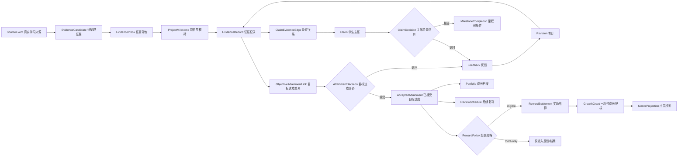

# EduAI Prism 个人庄园前端升级与跨学科证据链闭环路线 v5.0

> 版本：5.0  
> 日期：2026-08-25  
> 文档类型：前端产品规格、交互契约、跨学科证据模型与实施路线  
> 适用范围：学生端 `/student/manor` 及其与活动、错题、对话、知识库、成长档案、通知、徽章和教师评价的联动  
> 前置文档：`EduAI-Prism-个人庄园全栈闭环解决方案与双部署技术路线-v4.0-20260824.md`  
> 交付边界：本文定义下一阶段怎么改、如何验收，不代表文中所有接口和页面已经实现  
> 继承关系：v4 的鉴权、审计、授权经济和双部署原则继续有效；当 v5 与 v4 的庄园前端、项目证据模型或实施顺序冲突时，以 v5 为准  
> 估算假设：5 人核心小组（产品/学习设计 1、前端 2、后端/数据 1、测试/DevOps 1）及学科教师兼职评审；人员不足时按依赖串行延长，不压缩质量门禁  

---

## 0. 一页决策

### 0.1 产品重新定义

个人庄园不是独立小游戏、签到奖励页或学科题目的换皮容器，而是学生学习过程的“可解释投影层”：

```text
真实学习来源
  -> 待整理证据
  -> 学生说明“它证明了什么”
  -> 关联项目里程碑与学科目标
  -> 自动规则/教师量规评价
  -> 反馈、修订与再提交
  -> 接受的证据
  -> 一次性成长授权
  -> 庄园行动、作品展示、班级共建
  -> 成长档案与后续复习
```

庄园负责让成长“看得见、愿意继续”，但不负责把点击包装成学习成果。点击、停留时长、在线天数、普通点赞和重复浇水只能作为行为轨迹，不能单独证明学生掌握了知识或能力。

### 0.2 本轮必须解决的五个根问题

| 根问题 | 当前表现 | v5 决策 |
| --- | --- | --- |
| 跨学科关系牵强 | 语文、数学、科学只共享“农场”词汇，没有共同问题和证据关系 | 改为“共同真实问题 + 学科目标 + 必要贡献 + 关系说明 + 统一成果” |
| 证据链断裂 | 做题、作品、地块、档案分别存在，无法解释彼此为何相连 | 引入 `ObjectiveAttainmentLink`、`ClaimEvidenceEdge`、`Revision` 和来源追溯 |
| 按钮伪可用 | 一些按钮只弹说明、永久禁用或映射到不相干面板 | 每个可见按钮必须绑定导航、查询或命令；否则移除或给出条件与下一步 |
| 学生端数据孤岛 | 活动、错题、对话、知识库、档案、通知没有进入庄园 v2 | 建立统一事件信封、证据适配器和庄园投影器 |
| 测试证据失真 | 测了 mock 或只打开面板，却宣称业务闭环 | 按“点击 -> 请求 -> 返回 -> 持久化 -> 刷新 -> 下游可见”逐项验收 |

### 0.3 推荐方案与备选方案

**推荐方案 A：保留全幅农场主场景，在同一庄园内加入“项目地图、证据背包、论证工坊、反馈修订、成长回放”。** 这能延续已认可的视觉体验，也能把学习链嵌入现有行为路径。

**备选方案 B：庄园只做结果投影，跨学科项目在独立证据工作台完成。** 它开发更快、风险更小，但沉浸感和页面联动较弱。若学校没有稳定的教师复核能力，或现有学习源无法提供稳定 `sourceRevision/contentHash`，应先采用 B，禁止用未经核验的自动判定冒充完整闭环。

### 0.4 发布红线

以下任一项未满足，不得宣称“个人庄园证据闭环完成”：

1. 结果未返回、证据未接受或事务未提交时，UI 不得提前显示成功或发放成长授权。
2. 每条跨学科关联必须有共同项目、目标、来源、关系类型、学生说明和评价依据。
3. 任一可见按钮必须有真实结果、明确禁用原因和可达下一步，不得出现静默点击。
4. 刷新页面后，任务、证据、授权、地块、作品、修订和反馈必须保持一致。
5. 行为轨迹不得被展示为“已掌握”；AI 建议不得被展示为教师结论。
6. 移动端必须能完成任务、复习、证据整理、健康结束和错误恢复的主链路。
7. 未成年人的数据采集必须最小化、可解释、可撤回，并按角色隔离。

### 0.5 三套标记不得混用

| 维度 | 枚举 | 含义 |
| --- | --- | --- |
| 缺陷严重度 `Severity` | `S0/S1/S2/S3` | 对安全、数据、学习判断或体验的影响 |
| 交付优先级 `DeliveryPriority` | `D0/D1/D2` | 实施先后，不代表缺陷严重度 |
| 验收门禁 `GateLevel` | `G0/G1/G2` | 是否阻断试点、发布或后续优化 |

后文沿用“P0/P1”字样的地方均指当前源码审计中的历史优先级；新任务必须使用 `CR-MANOR-xxx` 验收条件 ID，并分别填写上述三列。

---

## 1. 本轮审计范围与事实基线

### 1.1 已核验的代码与材料

- 当前庄园页面：`app/app/(shell)/student/manor/page.tsx`
- 当前学习面板：`app/app/(shell)/student/manor/components/LearningHub.tsx`
- 当前前端仓储：`app/app/(shell)/student/manor/model/manor-learning.ts`
- 未挂载的概念原型：`ManorExperience.tsx`、`ManorScene.tsx`、`model/manor-experience.ts`
- 庄园 v2 服务与路由：`app/lib/server/manorV2.ts`、`app/app/api/v2/**`
- 学生端活动、错题、学习、通知、档案、徽章、积分、知识库、对话、思维导图接口和页面
- v4 全栈路线、QQNCmini 静态审计材料与代表性导出图

本轮不读取真实学生数据库，不执行 QQNCmini 二进制，不把缓存或反编译产物作为可发布资产，也不把静态源码审计误写成运行时通过。

### 1.2 当前已有真实能力

1. 庄园 bootstrap、失败重试和操作 busy 状态。
2. 客观题证据提交、服务端判定、成长授权生成。
3. 播种、滋养、收获、铲除与仓库刷新。
4. 作品保存、班级共建贡献、学习会话结束。
5. 教师证据队列/决定与管理员 correlation 审计已有 v2 基础。

这些能力应保留，但需要统一到新的项目、证据关系和任务运行状态中。

### 1.3 当前高优先级缺陷

#### P1：任务完成状态过早

当前任一证据被接受后，就可能把 `daily.completed` 置为完成。完整链路中的地块行动、复习或反思并未完成，刷新却可能显示 `1/1`，并使保留给任务的授权被其他用途消费。

**修复原则：**新增持久化 `MissionRun`，只有满足该任务版本的必需步骤和量规后才能完成；成长授权按 `allowedPurposes` 和 `reservedUnits` 服务端校验。

#### P1：跨学科关系没有进入真实链路

当前学科任务彼此独立，任意合格授权可滋养任意地块；地块动作没有写入 `objectiveId`，作品学科还可能被前端固定为“科学”。较完整的证据关联校验只存在于未挂载的内存 mock 中。

**修复原则：**保留原型中的“共同问题、证据关系、论证、限制和修订”概念，重写为真实 HTTP 契约，不直接挂载 mock 适配器。

#### P1：移动端主链不完整

移动端隐藏记忆温室、健康节奏、仓库、好友和部分活动入口，学生可能无法主动结束学习或完成复习。

**修复原则：**移动底栏改为五个稳定入口并允许二级抽屉，不以 `display:none` 删除必需能力。

#### P2：按钮语义与真实结果不一致

- “新增应用”“站内信”“消息中心”“问题反馈”“关闭农场”只弹说明。
- “装扮农场”实际打开作品工坊。
- “好友列表”实际打开班级面板。
- “浇水、施肥、除虫”都调用同一 `nurture`。
- 10-23 号地块服务端固定锁定，界面却显示没有来源的“还需 320 成长值”。

**修复原则：**名称、图标、命令、返回值和最终状态必须一致；无契约能力不进入正式导航。

#### P2：测试覆盖与声明不一致

现有验证存在“只打开第二种编辑器便算完成”“未点击全部农具却声明工具通过”“验证未挂载 mock 而非真实页面”等情况。

**修复原则：**验收证据必须绑定当前路由、真实请求、响应内容、数据库变化和刷新结果。

---

## 2. 教育与产品原则

### 2.1 采用证据中心设计，而非主题拼盘

证据中心设计把评价拆为三个问题：学生应具有什么能力、什么表现能证明它、什么任务能引出该表现。庄园应据此建立：

- **学生模型：**项目目标、学科目标、当前掌握、待复习、修订质量。
- **证据模型：**允许的证据类型、量规、来源可信度、关系和判定规则。
- **任务模型：**能产生这些证据的真实活动、挑战和表达任务。

### 2.2 跨学科的判定规则

共享一个农场主题不构成跨学科。一个跨学科项目必须同时满足：

1. 有一个学生能理解、现实中有意义的驱动问题。
2. 每个学科都有独立课程目标，不把学科内容稀释成装饰。
3. 每个学科贡献对最终成果都是必要的，删除后成果会明显变差。
4. “目标达成”与“论证关系”分开建模：前者说明证据是否证明课程目标，后者才使用 `supports`、`contradicts`、`context` 或 `method`。
5. 学生用自己的话解释为什么该证据与目标或主张有关；界面称“我的理由”，内部字段可称 `warrant`。
6. 最终成果包含证据、推理、局限和修订，不只是一张好看的海报。
7. 同一证据支持多个目标时，每个目标有独立说明，奖励只结算一次。

### 2.3 游戏化边界

- 奖励掌握、修订、坚持完成困难步骤和真实协作，不奖励机械在线。
- 默认展示个人成长和班级共同进度，不做公开个人总榜。
- 失败后提供可执行提示和再次尝试，不用惩罚性掉级制造焦虑。
- 保留学生选择：同一目标可通过文字、语音、图表、图片或演示表达。
- 强奖励只用于状态跃迁；普通点击使用轻反馈，避免持续刺激。
- 设自然结束、静默时段、学习时长提醒和教师可配置的活动窗口。

### 2.4 “学习轨迹”与“学习证据”严格分层

| 类型 | 例子 | 可以做什么 | 不可以做什么 |
| --- | --- | --- | --- |
| 行为轨迹 | 打开页面、停留时长、点击工具、对话轮数 | 判断可用性、提醒中断、改善界面 | 单独证明掌握、直接发高价值奖励 |
| 证据候选 | 作业提交、测验尝试、错题修订、实验记录 | 进入证据背包等待整理 | 未核验前写入正式成长结论 |
| 已接受证据 | 满足规则或量规、来源完整、通过复核 | 支持目标、签发一次性授权、进入档案 | 被重复消费或无痕修改 |
| 成长投影 | 作物、建筑、徽记、班级设施 | 呈现进步、激励下一步 | 成为权威学习记录本身 |

---

## 3. 推荐跨学科项目模板

### 3.1 示例项目：校园节水与微气候共生花园

**驱动问题：**如何在不损害植物健康的前提下，让校园试验田的灌溉用水减少 20%，并向师生证明方案可靠？

| 学科/领域 | 必要贡献 | 可观察证据 | 在最终成果中的作用 |
| --- | --- | --- | --- |
| 科学 | 设计土壤湿度、蒸腾或光照对照实验 | 变量表、照片、观测记录、结论 | 判断植物是否健康及何时需要浇水 |
| 数学 | 计算基线、节水率、均值、波动和误差 | 原始数据、计算过程、图表 | 证明“减少 20%”是否成立 |
| 语文 | 访谈使用者，撰写有证据的建议书 | 访谈提纲、摘录、论证文稿 | 让方案能被真实受众理解和采纳 |
| 信息科技 | 整理数据、制作可追溯图表或传感器方案 | 数据表版本、可视化、算法说明 | 降低记录成本并显示证据来源 |
| 美术/劳动 | 设计节水标识与可维护的种植布局 | 草图、材料选择、实作记录 | 让方案可使用、可维护、可传播 |

这里的连接不是“都和农场有关”，而是每个学科共同回答一个可验证问题。

每个里程碑必须提供等价参与路径：真实试验田、教师提供的匿名数据集、无障碍模拟实验或纸笔记录。不得因学生没有传感器、摄像设备、场地条件或特定身体能力而降低量规等级；照片上传必须移除定位等 EXIF 元数据。

### 3.2 项目里程碑

```text
M1 发现问题
  -> M2 建立基线
  -> M3 设计并实施测试
  -> M4 解释数据与反例
  -> M5 形成方案和公开成果
  -> M6 接收反馈、修订和回看
```

每个里程碑必须定义：学科目标、必需证据、可选表达方式、量规、教师介入点、庄园投影和完成条件。

每个发布版本还必须固定 `requiredSubjects`、`optionalSubjects`、`requiredObjectiveIds`、`distinctSourceMinimum`、`counterEvidenceMinimum` 和 `integrationRubricVersion`。示范项目 MVP 的基线是：至少 3 个必需学科、3 个不同来源、1 条反例或局限、1 个共同主张、1 次教师反馈后的修订；五个领域是完整模板，不要求每个学校首个试点一次性全开。

### 3.3 防止“牵强关联”的自动与人工校验

前端提交证据关系前先执行以下检查，服务端必须再次校验：

- 是否选择了具体 `objectiveId`，而不是只选择学科名。
- 是否填写至少一条关系说明，并包含测量、观察、文本依据或方法信息。
- 是否存在来源、时间、作者、版本和内容摘要。
- 是否说明反例或局限；高阶项目不得只有支持性证据。
- 跨学科多目标链接是否分别填写说明。
- 关系被拒绝后能否看到量规项、教师反馈并创建新修订。

---

## 4. 统一证据、逻辑与数据链

### 4.1 权威链路



`ObjectiveAttainmentLink` 只回答“这份表现是否证明某个课程目标”，必须绑定成功标准和量规；`ClaimEvidenceEdge` 只回答“这份材料怎样支持或挑战某个主张”。两者分别产生 `AttainmentDecision` 与 `ClaimDecision`：只有前者能进入奖励资格判断，后者只参与里程碑完成。背景资料、AI 对话、知识库引用、档案汇总和庄园投影可以帮助论证，但不能单独形成可奖励的目标达成。

### 4.2 来源追溯信封

所有跨页面事件采用统一最小信封：

```ts
type LearningEventEnvelope = {
  eventId: string;
  eventType: string;
  occurredAt: string;
  collectedAt: string;
  tenantId: string;
  actorId: string;
  studentId: string;
  classId?: string;
  sourceSystem: "activity" | "quiz" | "mistake" | "chat" | "knowledge" | "portfolio" | "manor";
  sourceEntityType: string;
  sourceEntityId: string;
  sourceRevision: number;
  contentHash: string;
  suggestedObjectiveIds?: string[];
  objectiveSuggestion?: { source: "rule" | "teacher" | "ai"; confidence?: number };
  lineageRootId: string;
  derivedFrom?: string[];
  correlationId: string;
  operationId: string;
  visibility: "private" | "teacher" | "class" | "public_school";
  aiAssistance?: { used: boolean; model?: string; purpose?: string };
};
```

`sourceEntityId + sourceRevision + contentHash` 用于证明庄园引用的是哪一版成果；`operationId` 同时承担命令幂等标识；`correlationId` 串起一次提交、评价、授权、消费和投影。`tenantId/actorId/studentId/classId` 必须由服务端会话和源记录派生，拒绝客户端自报。正式 `objectiveId` 只能在学生确认并经服务端校验的目标达成关系中出现。

### 4.3 核心数据对象

| 对象 | 关键字段 | 约束 |
| --- | --- | --- |
| `Project` | tenantId、templateVersion、drivingQuestion、audience、status | 发布后版本锁定；新修改产生新版本 |
| `ProjectRun` | projectVersionId、studentId、status、currentMilestone、revision | 学生只能进入已分配版本；版本并发校验 |
| `Milestone` | projectId、sequence、requiredObjectives、completionRule | 完成规则版本化 |
| `Objective` | subject、standardRef、description、successCriteria | 使用稳定 ID，不只存学科字符串 |
| `MissionRun` | projectRunId、missionVersion、requiredSteps、stepStates、status、revision | 证据、地块、复习/反思等必需步骤全部通过才完成 |
| `EvidenceCandidate` | sourceRef、preview、hash、suggestedObjectives | 候选不等于接受 |
| `EvidenceRecord` | owner、sourceRef、type、content、status、revision | 只追加修订，不覆盖历史 |
| `ObjectiveAttainmentLink` | evidenceId、objectiveId、successCriterionId、studentReason、status | 每一目标单独说明；绑定量规与目标达成决定 |
| `ClaimEvidenceEdge` | claimId、evidenceId、relation、warrant、strength | `supports/contradicts/context/method`；不直接发奖 |
| `Claim` | conclusion、reasoning、limitations、status | 至少关联一条证据 |
| `Revision` | aggregateType、aggregateId、parentRevision、author、changeSummary | 不覆盖历史，形成可回放版本链 |
| `AttainmentDecision` | linkId、criterionId、level、reason、reviewer、rubricVersion | 只评价目标达成，可进入奖励资格 |
| `ClaimDecision` | claimId、criterionId、level、reason、reviewer、rubricVersion | 只评价论证质量，可推进里程碑但不直接发奖 |
| `Feedback` | targetType、targetId、targetRevision、actionableText、author、createdAt | 指向具体对象和修订 |
| `RewardSettlement` | tenantId、studentId、policyVersion、scopeType、scopeId、status | 唯一键保证一个结算范围只结算一次 |
| `GrowthGrant` | settlementId、units、remaining、allowedPurposes、expiresAt | 由已提交结算生成，不直接绑定任意证据 |
| `GrantReservation` | grantId、missionRunId、units、status、expiresAt | 保留额度不能被班级贡献或装扮消费 |
| `ManorProjection` | sourceGrant、projectionType、entityId、state | 不是权威证据 |

`EvidenceRecord` 还必须声明 `rewardEligibility = eligible | meta_only | ineligible` 与 `rewardClass`。档案评价属于 `Feedback/meta_only`；`lineageRootId + derivedFrom` 用于循环检测，庄园投影、积分、徽章、档案快照及其派生摘要不得反向生成可奖励证据。

### 4.4 状态机

#### 证据状态

```text
candidate -> drafting -> submitted -> auto_check
  -> pending_teacher -> accepted -> superseded
  -> returned -> revising -> submitted
  -> appealed -> pending_teacher
  -> withdrawn
accepted -> revoked | invalidated
```

#### 项目里程碑状态

```text
locked -> available -> in_progress -> evidence_ready
  -> review_pending -> needs_revision -> completed
```

#### ProjectRun 与 MissionRun 状态

```text
ProjectRun: assigned -> active -> review_pending -> completed | withdrawn | archived
MissionRun: available -> active -> evidence_accepted -> action_pending
            -> review_pending -> completed | needs_revision | expired
```

守卫规则：`evidence_accepted` 不等于 `completed`；只有 `requiredSteps` 中证据、指定地块行动、复习/反思及项目规则全部为 `done`，才能原子进入 `completed` 并释放未消费预留。

#### 庄园命令状态

```text
idle -> confirming -> queued -> submitting -> processing
  -> succeeded -> rendered -> refresh_verified
  -> rejected | failed
  -> unknown -> reconciling -> succeeded | rejected | failed
```

只有服务端返回已提交事务的权威快照后，才能进入 `succeeded`；刷新读取一致后，验收才算闭环。

权威 `OperationStatus` 只有 `queued/processing/succeeded/rejected/failed/unknown`。`committedAt` 是 `succeeded` 的事务时间字段；并发冲突是 `rejected` 下的稳定错误码 `REVISION_CONFLICT`，不是另一个终态。`confirming/submitting/rendered/reconciling/refresh_verified` 仅是客户端展示阶段。

每次迁移必须记录事件、操作者、守卫、前后版本和终态。来源被修改或删除时，相关证据先进入 `invalidated`；已消费授权不得静默回滚地块，而要生成补偿事件、教师复核任务和学生可理解的说明。

---

## 5. 与学生端其他板块的联动

### 5.1 数据映射总表

| 来源板块 | 已有真实数据 | 庄园入口 | 证据用途 | 反馈回流 |
| --- | --- | --- | --- | --- |
| 学习活动 `/student/activities` | 草稿、提交、批准/退回、教师反馈、附件 | 证据背包“活动成果” | 表达、实践、项目里程碑 | 活动页显示庄园项目和修订状态 |
| 测验/错题 | 尝试、答案、知识点、纠错、复习时间 | 记忆温室 | 客观证据、纠错证据、复习计划 | 错题页显示下一次温室复习 |
| AI 对话 `/chat` | 持久化 session/message、引用、反馈 | 研究小屋“探究记录” | 问题形成、资料比较、反思候选 | 对话侧显示“加入证据背包”结果 |
| 知识库 `/knowledge` | 文件、范围、片段、来源 | 资料仓 | 背景资料与引用，默认不是掌握证据 | 文件页显示被哪些项目引用 |
| 思维导图 | 节点、关系、生成来源 | 规划台 | 方案结构、概念关系或表达候选 | 导图页显示量规反馈 |
| 成长页 `/student/growth` | 评价、雷达、建议、档案快照 | 成长树/回放 | 接受证据的纵向展示 | 成长页展示来源证据和修订 |
| 徽章与积分 | 事件账本、徽章、任务 | 陈列架 | 低风险认可与外观解锁 | 徽章详情可追溯到证据 |
| 通知 | 未读、已读、时间 | 邮箱/消息中心 | 评价、退回、复习、共建提醒 | deep link 回到具体对象 |

### 5.2 适配器而非页面互相直连

新增六类证据适配器：

```text
ActivityEvidenceAdapter
QuizEvidenceAdapter
MistakeRevisionAdapter
ChatInquiryAdapter
KnowledgeCitationAdapter
PortfolioEvaluationAdapter
```

适配器只把源数据转为 `EvidenceCandidate`；是否成为正式证据仍由学生整理、规则校验或教师量规决定。所有适配器通过事务型 outbox 发事件，避免源业务已成功而庄园投影丢失。

其中 `PortfolioEvaluationAdapter` 只产生 `Feedback` 或 `meta_only` 候选，不得产生可奖励证据。每个来源命令使用同一 Unit of Work 写入来源修订、不可变快照和 outbox；候选唯一键为 `tenantId + sourceType + sourceId + sourceRevision`。Outbox 至少包含 `pending/processing/delivered/dead_letter`、消费者 checkpoint、重试次数、`nextAttemptAt`、死信原因和人工重放记录。

### 5.3 奖励经济统一

现有旧积分与 v2 `GrowthGrant` 并存，必须确定单一政策：

- `points_ledger`：展示性积分、低风险徽章、历史兼容。
- `growth_grants`：能改变地块、建筑或班级设施的权威授权。
- 结算粒度由版本化策略明确为 `attainment/milestone/project`，唯一键为 `tenantId + studentId + policyVersion + scopeType + scopeId`。
- 示范跨学科项目采用 `project` 级一次结算；多条证据和多目标关系只共同形成资格，不各自重复发奖。
- 点数不能反向兑换为证据等级。
- 班级贡献不能消费任务保留授权。

---

## 6. 新版前端信息架构

### 6.1 保留视觉底盘，重做功能地图

继续使用全幅农场场景、中央田区和边缘 HUD，但场景地标必须映射到真实学习行为：

| 场景地标 | 核心功能 | 真实结果 |
| --- | --- | --- |
| 问题泉 | 进入项目、查看驱动问题与里程碑 | 创建/继续 `ProjectRun` |
| 观察站 | 上传或引用照片、实验、活动记录 | 新增 `EvidenceCandidate/Record` |
| 数据温室 | 测验、错题、表格、图表和复习 | 生成客观/修订证据与 review |
| 论证树屋 | 建立证据关系、写主张、推理和局限 | 保存 `Claim` 与 links |
| 创作工坊 | 制作文字、图表、图片、录音或导图作品 | 保存带 objective/source 的 artifact |
| 班级水库 | 角色分工、贡献、共同目标 | 可审计 contribution 和进度 |
| 回望灯塔 | 查看反馈、前后版本和成长回放 | 创建修订、进入档案 |
| 庄园邮箱 | 学习反馈、复习与共建通知 | 读取真实 notifications 并 deep link |

### 6.2 桌面布局

1. **顶部 64px：**返回学习中心、项目切换、网络/同步状态、帮助、通知、学生菜单。
2. **左上玩家板：**名称、当前项目角色、项目阶段、个人成长授权余额；不再硬编码等级与天气。
3. **左侧活动轨：**今日行动、证据背包、待修订、班级共建；角标来自服务端。
4. **右上模式轨：**项目地图、记忆温室、论证工坊、成果展厅。
5. **中央场景：**地块和地标热点，热点只承担高频入口，不复制完整复杂表单。
6. **底部任务坞：**当前里程碑、下一步、证据状态、自然结束。
7. **右下工具区：**只显示当前对象可用工具，数量、成本和禁用原因来自服务端。

### 6.3 移动布局

移动导航按学段配置。小学高段、初中和高中使用五入口：

```text
庄园 | 项目 | 证据 | 温室 | 我的
```

- 小学低段和学段未知用户使用“庄园｜任务｜我的”三个一级入口，其余能力由当前任务的情境化下一步进入。
- “我的”二级抽屉包含成果、消息、仓库和设置；“保存并结束”在所有主页面持续可见，不藏入二级抽屉。
- 任一桌面主链能力在移动端最多三次点击可达。
- 场景支持两指缩放，操作面板使用底部 sheet；不把核心按钮藏在 hover。
- 低端设备可切换“简洁地图”，保留所有功能和状态，不加载大场景动效。

### 6.4 学段与认知负荷分层

内部字段名不得直接暴露给学生：`objectiveId` 显示为“学习目标”，`warrant` 显示为“我的理由”，`correlationId` 只在帮助与审计信息中出现。

| 版本 | 默认界面 | 证据整理 | 论证支持 | 验收重点 |
| --- | --- | --- | --- | --- |
| 小学低段 | 每屏 1 个主任务、1 个下一步，最多 3 个一级入口 | 图片/语音/短句分步向导 | 句式支架和图标选择，不显示抽象关系图 | 独立完成率、成人提示次数、误触、口头理解 |
| 小学高段 | 里程碑 + 证据背包，逐步展开 | 可选择目标和关系，理由 1-3 句 | 四区论证按步骤出现 | 关系选择正确率、返回修订成功率 |
| 初中 | 完整项目地图与多证据比较 | 支持反例、来源版本和量规 | 可并排比较证据和修订 | 跨学科解释质量、独立修订能力 |
| 高中 | 完整项目工作区、研究来源与版本筛选 | 支持多主张、冲突证据和方法限制 | 可查看完整量规与数据不确定性 | 来源质量、论证严谨度、自主规划 |
| 学段未知 | 小学低段三入口和最保守隐私/动效设置 | 不展示复杂术语，先请求学校补全学段 | 分步支架 | 不因年龄未知扩大公开、刺激或数据采集 |

所有版本都要自动保存、支持撤销和“稍后继续”，并用真实学生进行可用性测试；不能只由成人设计者推断低龄可用性。

---

## 7. 核心页面与组件规格

### 7.1 项目地图 `ProjectMapPanel`

**显示：**驱动问题、项目受众、6 个里程碑、各学科目标、当前阻塞、下一步。  
**操作：**开始/继续、查看目标、选择表达方式、进入相关学生端页面。  
**完成反馈：**服务端返回 `projectRun.status` 和里程碑快照后更新。  
**空状态：**“老师尚未发布项目”，提供可做的个人复习或探索，不制造假任务。

### 7.2 证据背包 `EvidenceInbox`

分为“待整理、待提交、待复核、需修订、已接受”。候选卡至少显示：来源、时间、版本、学科建议、内容预览、AI 使用标记和隐私范围。

关键交互：

1. 选择项目里程碑和目标。
2. 在“目标达成说明”中选择成功标准，填写“它怎样表现出我达成了目标”；这里不出现支持/反驳关系。
3. 如需参与项目主张，再执行独立的“加入主张论证”，选择 `支持/反驳/背景/方法` 并填写关系理由。
4. 分别预览目标达成量规与主张质量量规，显示缺失字段。
5. 分别提交并等待 `AttainmentDecision` 或 `ClaimDecision` 的真实返回。
6. 进入对应反馈、修订或查看已接受结果；只有目标达成决定进入奖励资格。

### 7.3 论证画布 `ClaimWorkbench`

采用四区结构，不使用自由拖拽制造认知负担：

- 结论：我认为……
- 证据：来自证据背包，可多选。
- 推理：这些证据为什么支持/反驳结论。
- 局限：还不能说明什么、数据有什么限制。

右侧实时显示量规，不替学生写答案。AI 只能提出问题或指出缺口，生成内容必须标记并由学生确认。

### 7.4 记忆温室 `ReviewGreenhouse`

补齐 `开始 -> 作答 -> 结果 -> 调整间隔 -> 完成` 全链，不再只创建和查看首条复习。

卡片显示：知识点、来源错题/证据、上次表现、间隔、预计耗时、是否逾期。完成后写入复习尝试；达到规则才产生修订证据或小额授权。

### 7.5 地块详情 `PlotActionSheet`

每个地块显示：

- 关联项目、里程碑和目标。
- 最近使用的证据与授权来源。
- 当前状态和下一动作。
- 工具成本、可用授权和保留授权。
- “为什么可以/不可以”的解释。

锁定地块必须显示真实条件和“去完成……”入口。若本版本不开放，文案为“本学期尚未开放”，不显示虚假成长值。

### 7.6 反馈修订 `RevisionDrawer`

并排显示当前版本、上一版本、量规差异和教师反馈；学生可创建新修订，不覆盖旧记录。再次提交后回到同一 `correlationId`，但使用新的 evidence revision。

### 7.7 成果回放 `GrowthReplay`

按时间展示“挑战 -> 初稿 -> 反馈 -> 修订 -> 接受 -> 庄园变化”，支持按项目、学科和目标筛选。默认私密，学生可以选择提交给教师或班级，公开范围由学校策略控制。

### 7.8 通知中心 `LearningNotificationCenter`

接入真实 `/api/notifications`，扩展字段：`deepLink`、`entityType`、`entityId`、`eventId`、`dedupeKey`、`priority`。点击后直达具体证据、复习、活动或共建，不只弹摘要。

### 7.9 三角色解释卡 `DecisionExplanationCard`

| 角色 | 必须回答 | 不得暴露 |
| --- | --- | --- |
| 学生 | 发生了什么、为什么、下一步怎么做、如何提出异议 | 内部风控分数、其他学生数据 |
| 教师 | 来源版本、量规、AI 建议、人工决定、修订差异 | 无教学必要的私密对话 |
| 家长/监护人 | 由学校提供的必要汇总、数据边界、可提供的支持、纠错状态 | 原始对话、同伴信息、逐次错误细节 |

学生和教师端提供异议/纠错入口及处理状态。v5 MVP 不新建监护人直接登录体系；监护人通过学校已验证身份的线下/既有家校渠道提交请求，由授权管理员代办并返回脱敏解释卡。未来若建设家长端，必须另行定义 `GuardianIdentity/GuardianStudentLink`、关系核验、期限、撤销、多子女切换和负向授权测试。试点需分别测试学生能否复述结论原因、教师能否定位来源、家长能否理解数据边界。

### 7.10 隐私中心 `StudentPrivacyCenter`

默认仅学生本人和授权教师可见。有效可见性取“学校允许上限、监护限制、学生显式选择”三者中最严格值；教师只能审核或进一步收紧，不能替学生扩大公开范围。同班展示必须逐件主动选择、先预览、随时撤回。中心提供共享记录、访问记录、撤回、导出、删除请求及处理状态。访问同学庄园时只展示筛选后的装饰投影，不显示原始证据、教师反馈、错题、精确时间或个人行为轨迹。

### 7.11 自然结束 `SaveAndExit`

- 桌面和移动端均持续可见“一键保存并结束”。
- 退出不扣分、不清空进度、不破坏连续记录，先自动保存再返回来源页。
- 默认学习 25 分钟给一次温和提醒，学生可“延后一次”或“立即结束”；学校可按学段配置，但不得用高频提醒催促继续。
- 回放动画可跳过；重新进入恢复到最近已提交里程碑和未提交草稿提示。
- `quiet` 状态只允许查看、保存草稿、结束和求助，不再发起高刺激奖励或新长任务。

---

## 8. 按钮与组件真实结果契约

### 8.1 统一按钮契约

每个命令按钮必须具备：

```ts
type CommandButtonContract<T> = {
  commandId: string;
  permission: string;
  precondition: () => CheckResult;
  execute: (operationId: string) => Promise<T>;
  pendingLabel: string;
  successPredicate: (result: T) => boolean;
  committedVersion: (result: T) => number | string;
  recover: "retry" | "refresh" | "contact_teacher" | "navigate";
};
```

UI 状态固定为 `idle / hover-focus / selected / disabled-with-reason / pending / success / failure / conflict`。超过 800ms 显示进度；超过 8s 给出仍在处理的说明和可恢复操作；不得以超时 toast 假装失败后继续在后台悄悄成功。

### 8.2 现有入口整改矩阵

| 现有入口 | 当前问题 | v5 行为 | 数据/API | 成功验收 |
| --- | --- | --- | --- | --- |
| 成长花园 | 只映射今日任务 | 更名“项目地图” | `MNR-PROJECT-LIST` | 展示服务端项目与里程碑 |
| 应用中心 | 实际打开工坊 | 从正式顶栏移除；工具统一进入学生工具页 | `/student/tools` | 路由真实可达 |
| 装扮农场 | 实际打开作品工坊 | 进入原创装扮目录与预览 | `MNR-PREFERENCE` | 刷新仍保持装扮 |
| 农场图鉴 | 只打开仓库 | 更名“成果图鉴” | `MNR-ARTIFACT-LIST` | 可追溯证据来源 |
| 好友列表 | 实际是班级面板 | 更名“同学庄园”，仅同班且受隐私策略限制 | `MNR-NEIGHBOR-LIST` | 访问日志和权限正确 |
| 新增应用 | 只弹说明 | 移除；若恢复则跳转受控工具目录 | `/student/tools` | 无静默或假安装 |
| 站内信/消息中心 | 只弹静态内容 | 合并为庄园邮箱 | `NOTIFICATION-LIST/MARK` | 已读持久化、deep link 正确 |
| 问题反馈 | 只弹说明 | 打开真实反馈表单 | `FEEDBACK-CREATE` | 返回 ticketId，可查看状态 |
| 关闭农场 | 只弹说明 | 返回来源页或学习中心 | 客户端路由 | 历史记录与焦点正确 |
| 记忆温室 | 只能看首条 | 加入队列、开始、提交、完成 | `MNR-REVIEW-ATTEMPT` | 刷新显示完成与新间隔 |
| 浇水 | 与其他工具同一命令 | 仅处理缺水状态 | `MNR-PLOT-ACTION` action=`water` | 状态、成本、事件均匹配 |
| 施肥 | 与其他工具同一命令 | 仅处理营养状态 | action=`fertilize` | 规则与水分分离 |
| 除虫 | 与其他工具同一命令 | 仅在病虫事件可用 | action=`treat` | 无事件时有明确原因 |
| 手套/收获/铲除 | 语义部分混用 | 分别选择、收获、确认清理 | `MNR-PLOT-ACTION` action=`select/harvest/clear` | 返回地块版本并刷新一致 |
| 锁定地块 | 永久禁用、条件无来源 | 真实条件 + 去完成；或明确未开放 | `MNR-PLOT-UNLOCK-PREVIEW` | 条件由服务端返回 |
| 班级贡献 | 可能消费保留授权 | 选择角色和授权用途 | `MNR-CLASS-CONTRIBUTE` | 不可消费 reservedUnits |
| 保存作品 | 学科可能被固定 | 选择项目、目标、来源与可见范围 | `MNR-ARTIFACT-CREATE` | subject/objective 正确持久化 |
| 结束学习 | 移动端不可达 | 桌面与移动均可达 | `MNR-SESSION-END` | 返回总结并进入 quiet |

### 8.3 禁用状态不是终点

合法禁用必须同时提供：

- 原因：“需先完成 M2 基线测量”，而不是“不可用”。
- 下一步：“前往观察站记录 3 次土壤湿度”。
- 可达入口：按钮或链接。
- 条件来源：服务端 `preconditionCode` 和 `requiredActions`。
- 条件变化后自动重新评估。

### 8.4 可见控件总清单

实现阶段维护机器可读 `manor-control-manifest.ts`，每项至少包含 `controlId/viewport/role/permission/precondition/action/apiId/successPredicate/recovery/e2eId`。下列分组一个也不能漏：

| controlId 前缀 | 范围 | 必需结果 |
| --- | --- | --- |
| `top.*` | 返回、项目切换、同步、帮助、通知、账户、关闭 | 导航或真实查询；焦点可恢复 |
| `hud.*` | 我的庄园、余额、角色、阶段、在线状态 | 全部来自权威快照，无硬编码等级/天气 |
| `activity.*` | 今日行动、证据、待修订、共建 | 角标与列表一致 |
| `mode.*` | 项目、温室、论证、成果 | 桌面/移动/简洁模式均可达 |
| `hotspot.*` | 七类场景地标 | 打开对应真实领域面板 |
| `plot.*` | 24 地块、种子、锁定条件、确认 | 权限、成本、版本和刷新一致 |
| `tool.*` | 选择、浇水、施肥、除虫、收获、清理 | 工具语义一一对应服务端动作 |
| `evidence.*` | 加入背包、目标、关系、理由、提交、撤回、申诉 | 形成可追溯修订与决定 |
| `social.*` | 同学庄园、共享、撤回、举报、屏蔽 | 权限与内容安全闭环 |
| `privacy.*` | 预览、访问记录、导出、删除 | 返回请求 ID 和处理状态 |
| `teacher.*` | 项目草稿、发布、分配、撤回、评价 | 版本锁定、目标对象明确 |

自动可访问性扫描发现的交互控件数量必须与 manifest 在对应视口的可见数量一致；缺失 manifest 的按钮直接阻断 `G0`。

---

## 9. 前端模块与技术路线

### 9.1 推荐目录

```text
student/manor/
  page.tsx                       # 只负责场景编排
  components/
    scene/                       # 场景、地块、热点、HUD
    projects/                    # 项目地图与里程碑
    evidence/                    # 证据背包、关系编辑器
    claims/                      # 论证工坊
    reviews/                     # 记忆温室与修订
    artifacts/                   # 成果编辑、展厅、回放
    social/                      # 同班访问、共建
    shared/                      # 状态、弹窗、错误恢复
  model/
    types.ts
    repository.ts                # 真实 HTTP 仓储
    selectors.ts
    state-machine.ts
  hooks/
    useManorBootstrap.ts
    useManorCommand.ts
    useOperationRecovery.ts
```

`page.tsx` 不再承担所有弹窗、按钮语义和业务状态；复杂面板按领域拆分。未挂载 mock 只能作为迁移参考，迁移完成后删除，避免测试继续验证错误实现。

### 9.2 数据获取与命令

- 查询使用统一 query cache，key 至少含 `studentId/projectId/revision`。
- 命令统一携带 `operationId/expectedRevision`；`operationId` 即幂等键。
- 先显示 pending，不做奖励和证据结论的乐观更新。
- `409 conflict` 时展示服务器当前版本并提供“查看变化/重新应用”。
- 弱网操作进入可见 outbox；用户知道哪些已提交、待同步或失败。
- bootstrap 只返回当前视口和当前项目必要数据，大型历史回放按需加载。

`operationId` 同时作为幂等键，不再另设含义重叠的客户端键。服务端以 `tenantId + principalId + commandType + operationId` 唯一，并保存 `canonicalPayloadHash`、完整 OperationStatus、响应或错误摘要、schemaVersion、createdAt 和 expiresAt。请求先原子 claim；同一 operationId 携带不同 payload 时返回 `409 OPERATION_PAYLOAD_MISMATCH`。实体并发字段统一命名 `expectedRevision`。

### 9.3 必需 API 增量

当前 `/api/v2/manor/**` 在迁移期保持兼容；新的项目化契约使用 `/api/v3`，禁止在同名 v2 响应中静默改变 envelope。所有客户端只引用 API ID，具体路径由生成的 OpenAPI 客户端维护。

| API ID | 方法与唯一路径 | 角色 | 状态/事件 |
| --- | --- | --- | --- |
| `MNR-PROJECT-LIST` | `GET /api/v3/manor/projects` | 学生 | 项目、里程碑、目标、完成规则 |
| `MNR-PROJECT-RUN` | `POST /api/v3/manor/project-runs`、`GET /api/v3/manor/project-runs/:id` | 学生 | `ProjectRunAssigned/Activated` |
| `MNR-MISSION-ACTION` | `POST /api/v3/manor/mission-runs/:id/actions` | 学生 | 仅通过守卫推进 MissionRun |
| `MNR-CANDIDATE` | `GET/POST /api/v3/manor/evidence-candidates` | 学生 | 候选创建、忽略、归档 |
| `MNR-EVIDENCE` | `POST/PATCH /api/v3/manor/evidence`、`POST .../:id/withdraw` | 学生 | 提交、修订、撤回；只追加版本 |
| `MNR-ATTAINMENT-LINK` | `POST/PATCH /api/v3/manor/attainment-links` | 学生 | 目标、成功标准、我的理由 |
| `MNR-CLAIM` | `POST/PATCH /api/v3/manor/claims` | 学生 | 结论、推理、局限、修订 |
| `MNR-CLAIM-EDGE` | `POST/PATCH /api/v3/manor/claim-edges` | 学生 | 支持、反驳、背景、方法 |
| `MNR-APPEAL` | `POST /api/v3/manor/evidence/:id/appeals`、`GET .../:appealId` | 学生/教师 | 申诉、处理中、决定 |
| `MNR-REVIEW-ATTEMPT` | `POST /api/v3/manor/reviews/:id/attempts` | 学生 | 开始、作答、完成、间隔更新 |
| `MNR-PLOT-UNLOCK-PREVIEW` | `GET /api/v3/manor/plots/:id/unlock-preview` | 学生 | 条件与可达下一步 |
| `MNR-PLOT-ACTION` | `POST /api/v3/manor/plots/:id/actions` | 学生 | 工具动作、版本、授权消费 |
| `MNR-OPERATION` | `GET /api/v3/manor/operations/:id` | 当前主体 | 超时、unknown、重试后的权威终态 |
| `MNR-ARTIFACT-LIST` | `GET /api/v3/manor/artifacts` | 学生/教师 | 展厅、来源和版本 |
| `MNR-ARTIFACT-CREATE` | `POST /api/v3/manor/artifacts` | 学生 | 创建带项目/目标/来源作品 |
| `MNR-ARTIFACT-UPDATE` | `PATCH /api/v3/manor/artifacts/:id` | 学生 | 修订、可见范围、撤回 |
| `MNR-NEIGHBOR-LIST` | `GET /api/v3/manor/neighbors` | 学生 | 同班、策略过滤、访问审计 |
| `MNR-PREFERENCE` | `GET/PATCH /api/v3/manor/preferences` | 学生 | 装扮、动效、声音、简洁模式 |
| `MNR-CLASS-CONTRIBUTE` | `POST /api/v3/manor/class-build/contributions` | 学生 | 角色、用途、非保留授权消费 |
| `MNR-SESSION-END` | `POST /api/v3/manor/session/end` | 学生 | 自动保存、总结、quiet |
| `TEACHER-PROJECT` | `POST/PATCH /api/v3/teacher/manor/projects` | 教师 | 草稿、版本化、量规配置 |
| `TEACHER-PROJECT-PUBLISH` | `POST /api/v3/teacher/manor/projects/:id/actions` | 教师 | `publish/assign/withdraw`，发布后版本锁定 |
| `TEACHER-REVIEW-QUEUE` | `GET /api/v3/teacher/manor/review-queue` | 指定评审者 | 按 targetType、status、project、subject、SLA 筛选 |
| `TEACHER-REVIEW-DETAIL` | `GET /api/v3/teacher/manor/review-targets/:targetType/:targetId` | 指定评审者 | 指定 revision、来源、量规、授权上下文和可执行动作 |
| `TEACHER-DECISION` | `POST /api/v3/teacher/manor/decisions` | 指定评审者 | 明确 targetType/targetId 的量规决定与反馈 |
| `SOCIAL-VISIT` | `POST /api/v3/manor/neighbors/:id/visits` | 学生 | 仅装饰投影、限流、访问审计 |
| `SOCIAL-ACCESS-LOG` | `GET /api/v3/manor/access-log` | 学生 | 自己庄园的脱敏访问记录 |
| `SOCIAL-BLOCK` | `POST /api/v3/manor/blocks`、`DELETE /api/v3/manor/blocks/:targetId` | 学生 | 屏蔽、解除与立即传播 |
| `SOCIAL-REPORT` | `POST /api/v3/manor/reports` | 学生 | reportId、幂等、状态可追踪 |
| `SOCIAL-MODERATION` | `GET/POST /api/v3/teacher/manor/moderation-cases` | 教师/管理员 | 审核队列、处置、审计 |
| `PRIVACY-SHARE-PREVIEW` | `POST /api/v3/manor/shares/preview` | 学生 | 精确显示谁将看到哪些字段 |
| `PRIVACY-SHARE` | `POST /api/v3/manor/shares`、`DELETE /api/v3/manor/shares/:id` | 学生 | 显式共享与撤回 |
| `PRIVACY-SHARE-STATUS` | `GET /api/v3/manor/shares/:id/status` | 学生 | 缓存、通知、展厅撤回传播状态 |
| `PRIVACY-EXPORT` | `POST /api/v3/privacy/exports` | 学生/授权管理员 | 请求 ID、导出范围与状态 |
| `PRIVACY-DELETE` | `POST /api/v3/privacy/deletions` | 学生/授权管理员 | 请求 ID、删除范围与状态 |
| `PRIVACY-REQUEST-STATUS` | `GET /api/v3/privacy/requests/:id` | 请求人/授权管理员 | 处理状态、例外和申诉 |
| `SYNC-PULL` | `GET /api/v3/manor/sync/pull?cursor=` | 客户端/节点 | 增量拉取、下一游标 |
| `SYNC-PUSH` | `POST /api/v3/manor/sync/push` | 客户端/节点 | 批量上传、逐项 ack/conflict/dead-letter |
| `NOTIFICATION-LIST/MARK` | `GET/PATCH /api/notifications` | 当前主体 | 真实通知、已读与 deep link |
| `FEEDBACK-CREATE` | `POST /api/feedback-tickets` | 当前主体 | ticketId 和处理状态 |

每项写接口的 OpenAPI 定义必须列出角色、请求 schema、状态转换、operationId、expectedRevision、领域事件、错误码和补偿策略。教师复核必须区分 `EvidenceRecord`、`ObjectiveAttainmentLink`、`Claim` 与 `Artifact`，不得用一个模糊“通过”覆盖不同决定。

### 9.4 返回结构统一

```json
{
  "ok": true,
  "data": {},
  "operation": {
    "id": "op_xxx",
    "status": "succeeded",
    "committedAt": "2026-08-25T00:00:00Z",
    "entityRevision": 7,
    "correlationId": "cor_xxx"
  },
  "nextActions": []
}
```

错误结构至少包含 `code`、面向学生的 `message`、`recoverable`、`fieldErrors`、`currentVersion` 和 `nextActions`。前端不得依赖英文异常字符串判断业务状态。

查询响应同时保留 `schemaVersion/stateVersion/correlationId`。v2 客户端在兼容窗口内继续使用原 envelope；v3 使用上述统一结构并由 schema contract test 阻止破坏性修改。

### 9.5 租户、成员与评审权限

学校本地部署也使用固定 `tenantId`，互联网部署可以承载多个 tenant。所有聚合、唯一键、事件、游标、缓存键和对象存储路径都带 tenantId。新增：

- `ProjectMembership`：学生、项目角色、有效期。
- `CourseSubjectAssignment`：课程、学科、班级和任课教师。
- `ReviewerAssignment`：谁可评价哪个项目版本、学科和量规。
- `VisibilityPolicy`：学校上限、学生显式选择、既有家校系统传入的限制和撤回规则；v5 MVP 不建立监护人直接登录。

对象级授权至少同时检查 tenant、成员关系、对象所有权和可见策略。`deepLink` 使用路由白名单，导航后再次按目标对象鉴权，防止借通知越权。

### 9.6 存储端口与双数据库

当前服务直接依赖同步 SQLite API、`BEGIN IMMEDIATE` 和 SQLite 方言，不能把 PostgreSQL 留到发布前才验证。Phase 0/1 即建立：

```text
ManorRepository
TransactionPort
OutboxRepository
Clock/IdGenerator
ObjectStoragePort
```

SQLite 实现使用单主机 WAL、busy timeout 和本地对象目录；PostgreSQL 实现使用行锁、可重试事务、迁移锁和对象存储。公网 profile 检测到临时盘 SQLite 时启动失败，不允许降级运行。两种实现执行同一套仓储契约、领域和 E2E 测试。

### 9.7 现有 v2 数据迁移与回滚

采用 `expand -> backfill -> dual-read -> cutover -> contract`：

1. 新建 v3 表和 nullable 关联，不删除 v2 字段。
2. 按已知 mission 版本映射旧 evidence；无法可靠映射的标为 `legacy_unmapped`，禁止猜测学科或目标。
3. 校验证据数量、授权余额、消费账本、地块和作品 hash。
4. 双读比较但单写权威源，达到一致性阈值后切换。
5. 保留可理解新 schema 的上一应用版本和数据库向前兼容窗口。
6. 回滚应用不回滚权威数据。回滚版本必须继续读取 v3 权威表或经验证的只读 v2 兼容投影，只通过 feature flag 关闭 v3 新命令与新界面；禁止把业务真相切回无法表达 Project/Claim/Revision 的 v2 表。

### 9.8 弱网同步与来源 Outbox

- 本地操作先进入 `sync_pending`，服务端逐项返回 `ack/conflict/rejected/dead_letter`。
- ID 使用全局有序 ID；时间以服务端接受时间为权威，客户端时间仅作发生时间参考。
- 同一 candidateKey 和 operationId 重放不得重复产生候选、决定或授权。
- 冲突不做通用 last-write-wins；证据修订、可见范围和地块分别使用领域合并规则。
- 管理员可查看死信、原因和重放结果，不能直接改写学生证据正文。

---

## 10. 视觉、资产与动效规范

### 10.1 可继承的视觉语法

- 全幅 16:10 左右的二维农场舞台，中央斜向田区，曲线路径组织视线。
- 高饱和黄绿草地、焦糖土壤、青蓝天空，并用紫红/蓝色承担反馈和学科区分，避免单一绿色界面。
- 胡桃木框、奶油纸信息面、金黄饰边和绿色进度条。
- HUD 沿边缘分布，中央保留可读可点区域。
- 地标采用原创粗轮廓插画，前景对象可有白色外描边和暖色阴影。

### 10.2 禁止直接复制的内容

不得直接使用 QQ/QQ农场标识、角色、建筑、作物、活动图标、VIP 图形、原文案、原字体、SWF、ffdec 导出图、运行时代码或二进制。现有生成场景若明显复用原版空间关系，也要在发布前重新构图并完成来源审计。

目标是学习其信息层级和交互节奏，不是复制可识别资产。

采用洁净创作隔离：SWF、导出位图和原产品截图只由审计角色保管，禁止作为生图输入、训练材料、描摹底图或交付给制作角色。制作角色只接收抽象后的色彩、层级、材质类别和交互规范；未参与制作的设计与知识产权审阅者负责最终相似性检查。

### 10.3 设计令牌建议

| 令牌 | 建议值 | 用途 |
| --- | --- | --- |
| `--manor-grass` | `#78B83E` | 场景主草色 |
| `--manor-soil` | `#9A6038` | 土地与物质层 |
| `--manor-wood` | `#5A351F` | HUD 外框 |
| `--manor-paper` | `#FFF4D2` | 信息面板 |
| `--manor-gold` | `#E8B33F` | 里程碑与奖励 |
| `--subject-science` | `#2E8B78` | 科学证据 |
| `--subject-math` | `#3F73C9` | 数学证据 |
| `--subject-language` | `#A65378` | 语文证据 |
| `--state-error` | `#B6403B` | 错误/冲突 |
| `--focus-ring` | `#143E72` | 键盘焦点 |

文字与功能面板必须满足至少 WCAG AA 对比度；场景上的小字使用实色底，不把文字直接压在复杂草地上。

### 10.4 动效分级

1. **对象反馈 80-160ms：**按压、工具选中、地块高亮。
2. **状态反馈 180-300ms：**面板切换、证据入包、错误回弹。
3. **里程碑反馈 500-900ms：**证据接受、作物成熟、项目完成。
4. **自然结束 1.2-2s：**成长回放摘要后停止循环动效。

支持 `prefers-reduced-motion`，关闭粒子、摇摆和视差，仅保留颜色、图标和文本状态。

- 禁止可能造成不适的频闪；声音默认关闭，不得突然自动播放。
- 里程碑奖励动画可跳过，同类强动效单次会话最多出现 3 次。
- 异步提交、同步和评价状态使用 `aria-live="polite"`；阻断错误使用 `assertive` 但避免重复播报。
- 音频、语音和视频必须提供文字替代或摘要。
- 首屏场景压缩资源预算建议不超过 1.8MB，后续热点按需加载；低端设备目标 30fps、主线程长任务低于 50ms、交互响应低于 100ms、CLS 低于 0.1。

### 10.5 原创资产生产流程

```text
资产 brief
 -> 原创构图草图
 -> 生图/绘制
 -> 去除商标和相似角色检查
 -> 统一描边、光源、透视和色板
 -> 透明边缘与多分辨率导出
 -> 版权/来源清单
 -> 桌面、移动、低性能模式验证
```

生图服务仅由服务端适配器调用，使用环境变量 `IMAGE_API_BASE_URL`、`IMAGE_API_KEY`、`IMAGE_MODEL`；密钥不得进入源码、浏览器 bundle、文档、日志或截图。对话中已经暴露过的密钥必须作废并轮换后再使用。

每项资产登记作者、制作 brief、提示词、模型/版本、全部输入来源、许可证、内容 hash、人工修改和审阅结论。来源记录不完整或相似性审阅未通过的资产只能在隔离原型中使用，不得进入发布包。

---

## 11. 无障碍、未成年人保护与数据最小化

### 11.1 无障碍

- 所有热点具备可见焦点、文本名称和键盘顺序。
- 图标按钮使用 tooltip 和 `aria-label`，状态不只依赖颜色。
- 复杂场景提供列表视图，屏幕阅读器可完成同等任务。
- 弹窗锁定焦点、Esc 关闭、关闭后返回触发点。
- 触控目标至少 44×44px，长文本支持 200% 缩放。

### 11.2 未成年人保护

- 默认仅学生本人和授权教师可见，不开放陌生人社交或公开个人排行；同班展示逐件显式选择并可撤回。
- 学校设定可见范围上限，教师可审核或收紧；只有学生的显式选择能在该上限内扩大作品可见性，且学生可撤回。
- 不采集与学习目标无关的精准位置、通讯录、生物特征或持续音视频。
- 语音/图片上传前明确用途、保存时长和可见范围。
- AI 分析输出标明来源与不确定性，涉及评价的高影响决定保留人工复核。
- 提供自然结束、休息提醒、静默时段和家校可理解的数据说明。

同伴功能 MVP 禁止私信、自由评论、公开点赞数和个人排名；使用学校昵称或化名。必须具备举报、屏蔽、访问频率限制、敏感内容审核、教师处置队列和审计记录。撤回后缓存、通知摘要和班级投影也要按传播清单清理。

上传内容执行文件魔数和 MIME 双校验、大小/分辨率限制、病毒扫描、图片 EXIF 清除、SVG/PDF 隔离、富文本净化和安全下载响应头。AI 检索到的知识材料按不可信输入处理，不允许其内容覆盖系统规则；补齐 CSRF、限流、IDOR、存储型 XSS、提示注入和恶意 deepLink 测试。

### 11.3 字段级数据处理矩阵

实施前由学校数据责任人审批完整字段清单，至少覆盖：

| 数据组 | 目的 | 默认可见 | 建议保留 | 删除/离校处理 |
| --- | --- | --- | --- | --- |
| 项目与证据正文 | 学习评价与修订 | 学生、授权教师 | 按学籍/学校政策 | 导出后删除正文；保留最小审计摘要 |
| 错题与复习 | 个性化复习 | 学生、任课教师 | 当前学段或课程周期 | 到期聚合/删除，不公开同伴 |
| 对话与 AI 标记 | 支持探究、解释 AI 使用 | 学生；教师按教学需要 | 短于正式档案 | 原始对话不进入家长或同伴视图 |
| 图片/语音/文件 | 学习表达 | 按单件 visibility | 项目期 + 宽限期 | 删除对象存储、派生缩略图和 EXIF |
| 行为轨迹 | 可用性与中断恢复 | 学生、授权运营者 | 尽可能短期 | 聚合后删除明细，不用于掌握结论 |
| 决定与审计 | 纠错、申诉和合规 | 指定角色 | 法规/学校最小必要期 | 保留脱敏不可变摘要，不保留无关正文 |

矩阵还必须填写部署位置（校内/公网）、必要性、法定/授权基础、监护人告知、备份删除周期、导出格式、撤回影响和责任人。未满十四周岁场景按更严格规则处理；本地数据同步到公网必须单独配置且默认关闭。

产品默认最长保留上限为：未提交草稿 90 天、细粒度行为轨迹 30 天、原始 AI 对话 90 天、项目媒体“项目结束后 90 天”、已接受证据与决定“在籍期结束后 1 学年”、不含正文的安全/决定审计 2 年、滚动备份 35 天。学校可缩短；如因法规或正式档案政策延长，必须记录策略 ID、依据、字段、责任人和到期日。Phase 0 必须产出逐字段数据目录及版本化 `RetentionPolicy`，策略未批准的字段不得采集、写入备份或同步公网。

---

## 12. 分阶段实施路线

以下估算基于文首 5 人小组，工程实施约 10-14 周，另加 2-4 周学校试点观察。若教师模板与量规尚未准备，试点时间从内容批准后计算。

### Phase 0：止损、租户与存储基线（1 周）

- 建立 `manor-control-manifest`、请求清单和桌面/移动可达图。
- 隐藏无真实契约的正式入口；修复任务提前完成和授权保留的现有 P1。
- 明确 tenant、课程、项目成员和评审者关系。
- 抽出 repository/transaction/outbox 端口，建立 SQLite 与 PostgreSQL 契约测试骨架。
- 设计 v2 -> v3 expand/backfill/cutover/rollback 与脱敏测试数据。
- 审批逐字段数据目录和 RetentionPolicy；验证到期、离校、备份过期与撤回传播，未批准字段保持关闭。

**前置：**现有代码与数据库快照、v4 约束。  
**出口 `CR-MANOR-001`：**没有无响应入口；早完成和错用保留授权回归通过；公网临时盘 SQLite fail-fast。

### Phase 1：项目与证据领域内核（2-3 周）

- 建立 Project/ProjectRun/Milestone/Objective/MissionRun 及版本规则。
- 建立 EvidenceCandidate/Record、ObjectiveAttainmentLink、ClaimEdge、Claim、Revision、Decision、Feedback。
- 完成 operation 原子 claim、奖励资格、GrantReservation、循环检测和状态机守卫。
- 实现 v3 核心 API、OpenAPI 类型生成和两种数据库同套领域测试。

**前置：**Phase 0 存储和租户端口。  
**出口 `CR-MANOR-002`：**证据已接受但地块/反思未完成时 MissionRun 仍不完成；context/meta-only 证据不能发奖。

### Phase 2：来源适配、Outbox 与教师治理（2 周）

- Activity/Quiz/Mistake 采用同事务写来源修订、快照和 outbox。
- 完成候选去重、checkpoint、重试、死信、重放和历史回填校验。
- 教师端支持项目/目标/量规草稿、发布、分配、撤回和版本锁定。
- 教师决定明确目标对象，支持反馈、退回、申诉与再提交。

**前置：**Phase 1 核心对象和权限。  
**出口 `CR-MANOR-003`：**教师发布到学生获取、提交、退回、修订和接受的真实端到端通过。

### Phase 3：学生核心 UI 与年龄分层（2 周）

- 实现项目地图、证据背包、目标达成关系、论证画布、反馈修订和解释卡。
- 实现小学低段、高段、初中、高中四种信息密度及学段未知的保守默认，桌面/移动/简洁模式等价。
- 补齐复习 attempt、保存并结束、通知 deep link、操作恢复和隐私默认值。
- 修复 artifact 学科/目标/来源/版本和全部现有按钮语义。

**前置：**Phase 2 可用 API 和演示项目。  
**出口 `CR-MANOR-004`：**小学低段、高段、初中、高中代表性用户均可完成主链，学段未知策略经安全走查；五类的按钮、请求、返回、刷新、隐私和防沉迷状态均一致。

### Phase 4：跨学科项目与学生端回流（1-2 周）

- 上线“校园节水与微气候共生花园”示范项目及四种等价参与路径。
- 接入 Chat、知识库、思维导图的 meta-only/候选链路。
- 完成至少 3 个必需学科、3 个不同来源、1 个反例、共同主张和一次修订。
- 回流活动、错题、成长档案、徽章与通知，同时阻断奖励循环。

**前置：**学科教师批准目标、量规和示例。  
**出口 `CR-MANOR-005`：**每条跨学科关系可单独解释和复核，项目只结算一次授权。

### Phase 5：原创场景、班级共建与安全（1-2 周）

- 实现七类原创地标、项目阶段变化、真实 cropAccess 与工具语义。
- 完成洁净资产生产与独立知识产权审阅。
- 上线角色分工和班级共建；MVP 禁止私信、自由评论、公开点赞和排名。
- 实现举报、屏蔽、审核、分享预览、撤回传播、访问记录和数据请求。

**前置：**核心链路已稳定，不以场景开发替代业务修复。  
**出口 `CR-MANOR-006`：**场景变化只来自权威状态，社交与隐私滥用场景全部通过。

### Phase 6：双部署硬化与学校试点（2 周工程 + 2-4 周试点）

- 逐控件 E2E、权限、幂等、冲突、恶意上传、弱网、同步与死信测试。
- 同一套测试运行 SQLite 单机与 PostgreSQL 公网配置；执行备份恢复和迁移回滚演练。
- 完成视觉回归、真机性能、键盘、屏幕阅读器、200% 缩放和 reduced-motion。
- 进行学生、教师、家长理解度和教师队列容量测试。

**出口 `CR-MANOR-007`：**所有 `S0/S1` 关闭、全部 `G0` 通过、EvidenceBundle 可复核、失败路径可恢复；否则只允许继续试点，不得正式发布。

---

## 13. 测试与验收证据

### 13.1 每个按钮的六段式验收

```text
1. 触发：真实用户点击或键盘操作
2. 请求：记录 method、path、operationId、payload 摘要
3. 返回：等待服务端进入 `succeeded/rejected/failed`；`unknown` 必须先 reconcile，冲突表现为 `rejected + REVISION_CONFLICT`
4. 内容评审：检查返回内容是否满足业务量规，而非只看 200
5. 持久化：读取权威对象版本或审计事件
6. 刷新与下游：刷新页面并在相关学生/教师页面验证一致
```

只出现 toast、只打开面板、只收到 HTTP 200 或只验证 mock，均不算通过。

### 13.2 G0 E2E 场景

1. 活动成果 -> 证据候选 -> 关联科学目标 -> 教师退回 -> 学生修订 -> 接受 -> 授权 -> 播种 -> 刷新 -> 成长档案可见。
2. 同一证据关联科学与数学两个目标，有两条独立“我的理由”，不得形成两个结算资格；示范项目只在项目完成时产生一次授权。
3. 错题首次错误不奖励；完成解释性纠错并通过规则后生成修订证据和复习计划。
4. 班级贡献尝试消费任务保留授权时被服务端拒绝，UI 展示原因和可用余额。
5. 地块解锁条件未满足时可跳转完成前置；满足后刷新自动解锁。
6. 命令超时后通过 operation 查询恢复，绝不重复扣费或重复发奖。
7. 移动端完成项目、证据、复习、健康结束和错误恢复。
8. 学生 A 无法读取非同班学生 B 的私密庄园、证据和通知。
9. 作品撤回后班级展厅消失，但个人审计历史和教师已发生决定仍可追溯。
10. reduced-motion 与简洁地图模式下功能等价。
11. 三个不同学科来源、一个反例和共同 Claim 经教师退回、修订后完成项目，整条链只发放一次授权。
12. 证据已接受但必需地块行动或反思未完成时，MissionRun 和 ProjectRun 均不得提前完成。
13. 知识库背景、AI 对话和档案汇总可以参与 Claim，但单独提交时不得生成目标达成或成长授权。
14. 同班访问不能看到原始证据、错题、反馈和时间；举报、屏蔽、限流、撤回缓存传播均生效。
15. “保存并结束”自动保存且不扣分，刷新和重新登录后恢复正确位置，quiet 状态不能开启新长任务。
16. 伪造 MIME、恶意 SVG/PDF、带定位 EXIF 的图片、存储型 XSS、IDOR 和恶意 deepLink 均被阻断并记录安全事件。
17. 断网提交进入 outbox，恢复后逐项 ack；重复推送不重复发奖，冲突可见且能人工恢复。
18. v2 历史无法可靠映射的记录标为 legacy，不被猜测成某学科或目标，余额和消费账本校验一致。
19. 教师队列只显示被分配 tenant/class/subject/project 的目标；基于旧 revision 的决定返回冲突且不覆盖新修订。
20. 学校上限、既有家校限制和学生选择出现差异时，最终可见性始终取最严格值，教师无法替学生扩大公开。
21. RetentionPolicy 未批准的字段不被采集；到期、离校、备份过期和撤回传播均产生可审计终态。

### 13.3 API 与后端门禁

- 鉴权与对象级授权。
- 输入 schema、枚举、长度、文件类型和内容哈希校验。
- 幂等重放、并发版本冲突、事务回滚、重复事件去重。
- SQLite stopped/locked/disk-full 与 PostgreSQL deadlock/timeout 路径。
- outbox 至少一次投递和投影幂等。
- 高影响教师决定与 AI 建议明确分离。
- tenant、项目成员、任课关系、评审者分配与 deepLink 目标二次鉴权。
- 文件魔数、病毒、EXIF、富文本净化、CSRF、IDOR、限流和提示注入。
- 来源 outbox 与同步 outbox 的终态、死信、重放和重复投递。
- 两种数据库执行同一仓储契约、领域、API 与 E2E 套件。

### 13.4 视觉与交互门禁

- 1440×900、1280×720、1024×768、390×844、360×800 截图比较。
- 所有文字不重叠、不截断，最长学科名和错误文案可容纳。
- 图标、地块、模态和底栏有稳定尺寸，状态变化不导致布局跳动。
- 场景、模态和底部 sheet 的焦点顺序正确。
- 每个控件覆盖 default、focus、selected、disabled、busy、success、failure。

### 13.5 测试数据原则

- 使用可重置的演示班级和固定项目模板，不读真实学生数据。
- 每个测试记录 `correlationId`，便于串联请求、表变化和截图。
- 测试失败不得通过删除断言、改成 sleep 或只检查 200 解决。
- 视觉测试通过不代表业务闭环通过，业务测试通过也不代表内容质量通过。

### 13.6 可复核 EvidenceBundle

每个 G0 场景生成一个机器可读证据包，不使用固定 `sleep` 作为完成条件；应轮询 operation/outbox 的明确终态。证据包至少包括：

```text
manifest.json            测试版本、提交 hash、schema、数据库类型、时间
actors.json              脱敏角色、tenant/class/project 权限上下文
requests.ndjson          operationId/correlationId 与脱敏请求摘要
responses.ndjson         返回内容、状态和错误码
revisions.json           权威实体前后 revision 与内容 hash
domain-events.ndjson     领域事件、outbox、ack 或死信
assertions.json          刷新、重新登录和下游页面断言
screenshots/             桌面、移动、简洁模式关键状态
logs/summary.json        脱敏日志摘要和异常计数
```

EvidenceBundle 只保留测试账户与脱敏内容，不复制真实学生数据。SQLite 与 PostgreSQL 运行分别产包，比较语义结果而不是依赖数据库特有 SQL 文本。

### 13.7 分学段与角色可用性验收

- 每个目标学段至少 5 名代表性学生完成同一核心任务，记录独立完成率、成人提示次数、误操作、用时和对“为什么得到结果”的复述。
- 教师完成项目发布、量规判断、退回和修订复核，测量队列容量和反馈时延。
- 家长/监护人通过学校已核验渠道阅读脱敏解释卡并提交一次由授权管理员代办的纠错/异议，验证不会看到原始对话或同伴信息。
- 特殊教育与无设备路径至少各验证一条等价证据，不得因表达媒介影响量规结论。

---

## 14. 指标与质量看板

### 14.1 核心质量指标

| 指标 | 定义 | 目标方向 |
| --- | --- | --- |
| 证据闭环率 | 候选进入后完成关联、评价和结果回流的比例 | 上升 |
| 关系有效率 | 被量规/教师认可的目标关系比例 | 上升 |
| 修订改善率 | 修订后至少一项量规提升的比例 | 上升 |
| 来源可追溯率 | 能定位到具体来源版本和 hash 的证据比例 | 接近 100% |
| 伪成功率 | UI 显示成功但刷新/下游不一致的比例 | 0 |
| 无响应按钮率 | 点击后无导航、请求、结果或解释的比例 | 0 |
| 移动主链完成率 | 移动端独立完成核心路径的比例 | 接近桌面 |
| 教师有效反馈时延 | 提交到可执行反馈的中位时间 | 可控下降 |

### 14.2 不作为北极星的指标

不以 DAU、连续登录、页面停留时长、浇水次数、排行榜名次或通知点击率作为学习质量北极星。这些只能辅助诊断体验，不能替代证据质量、修订改善和学生能动性。

---

## 15. 风险、取舍与停止条件

| 风险 | 表现 | 控制 |
| --- | --- | --- |
| 教师复核过载 | 待审队列持续堆积 | 客观证据规则化；表达证据抽样/量规；显示 SLA |
| 学生填表负担 | 每条证据都要长说明 | 按年龄提供句式支架、语音和分步提交 |
| AI 代写 | 论证看似完整但非学生能力 | 标记 AI 使用、口头复核、过程版本、教师抽查 |
| 学科被项目吞没 | 项目好玩但目标模糊 | 目标和量规由学科教师版本化维护 |
| 游戏刺激替代学习 | 追求奖励而机械操作 | 授权来自接受证据；操作不自产生高价值奖励 |
| 数据孤岛继续扩大 | 各页面各建奖励和状态 | 统一事件信封、outbox、适配器和单一奖励政策 |
| 视觉资产侵权 | 直接复用参考产品资产 | 仅借鉴视觉语法，原创重绘和来源清单 |
| 双部署漂移 | 本地与公网行为不同 | 单一领域内核、存储适配器和同一契约测试 |

出现以下条件应停止扩大功能，先修基础：伪成功不为 0、`S0/S1` 权限缺陷未关闭、证据重复奖励、移动主链不可达、来源无法追溯、教师队列无处理能力。

---

## 16. Definition of Done

一个庄园功能只有同时满足以下条件才算完成：

- [ ] 产品文案、图标和真实行为一致。
- [ ] 桌面、移动和简洁模式均可达。
- [ ] 所有按钮状态齐全，禁用有原因和下一步。
- [ ] 请求等待真实返回，错误可恢复，冲突可解释。
- [ ] 服务端校验权限、版本、幂等、用途和内容规则。
- [ ] 结果持久化，刷新后不丢失。
- [ ] 来源页、庄园、教师端和档案的关键状态一致。
- [ ] 目标达成说明与主张论证关系分离，分别有来源、理由、量规和决定。
- [ ] RewardSettlement 粒度和唯一键与项目策略、测试完全一致。
- [ ] 行为轨迹没有被误标为掌握证据。
- [ ] AI 使用有标记，人工决定与 AI 建议分离。
- [ ] 单元、契约、E2E、视觉、无障碍和权限测试通过。
- [ ] 资产来源与许可记录完整。
- [ ] 未成年人数据最小化、可解释、可撤回。
- [ ] 默认私密、最严格可见性公式、社交安全与 RetentionPolicy 门禁通过。
- [ ] 小学低段、高段、初中、高中和学段未知策略均有可达性与理解度证据。
- [ ] 有回滚、审计和双部署验证记录。

---

## 17. 实施任务拆分建议

首批开发任务按依赖顺序排列：

1. 修复 `MissionRun` 和授权保留的 `S1/D0/G0` 逻辑。
2. 建立 Project/Milestone/Objective 与统一事件信封。
3. 建立 Activity/Quiz/Mistake 三个证据适配器和 outbox。
4. 实现证据背包与目标关系编辑器。
5. 实现 Claim/Revision/量规接口与教师复核。
6. 补齐复习 attempt 状态机和移动入口。
7. 修复 artifact 学科/目标/来源与版本。
8. 逐项替换静态按钮、永久禁用和工具语义混用。
9. 接入通知 deep link、成长档案和成果回放。
10. 完成原创地标、装扮、同班访问和双部署验收。

每项任务必须绑定本文件中的验收场景和可收集证据，不允许以“页面已做”“接口返回 200”作为完成说明。

---

## 18. 依据与参考

### 18.1 本地实现依据

- `D:/VB/LLM-School/app/app/(shell)/student/manor/page.tsx`
- `D:/VB/LLM-School/app/app/(shell)/student/manor/components/LearningHub.tsx`
- `D:/VB/LLM-School/app/app/(shell)/student/manor/model/manor-learning.ts`
- `D:/VB/LLM-School/app/app/(shell)/student/manor/model/manor-experience.ts`
- `D:/VB/LLM-School/app/lib/server/manorV2.ts`
- `D:/VB/LLM-School/app/app/api/v2`
- `D:/VB/LLM-School/开发材料/EduAI-Prism-个人庄园全栈闭环解决方案与双部署技术路线-v4.0-20260824.md`
- `D:/VB/LLM-School/开发材料/EduAI-Prism-QQNCmini-农场资源审计与复刻映射-20260823.md`

### 18.2 教育、证据与互操作依据

- [SRI：Evidence-Centered Assessment Design](https://www.sri.com/publication/education-learning-pubs/evidence-centered-assessment-design-layers-structures-and-terminology-padi-technical-report-9/)
- [W3C PROV-O](https://www.w3.org/TR/prov-o/)
- [1EdTech CASE](https://www.1edtech.org/standards/case)
- [1EdTech Caliper Analytics](https://www.1edtech.org/specs/caliper/caliper-metric-profiles-common-explanations)
- [1EdTech Comprehensive Learner Record](https://www.1edtech.org/standards/clr)
- [1EdTech Open Badges 3.0](https://standards.1edtech.org/open-badges/specifications/standards/v3p0/cert)
- [EEF：Teacher Feedback to Improve Pupil Learning](https://educationendowmentfoundation.org.uk/education-evidence/guidance-reports/feedback)
- [EEF：Metacognition and Self-Regulated Learning](https://educationendowmentfoundation.org.uk/education-evidence/guidance-reports/metacognition%20)
- [CAST UDL Guidelines 3.0](https://udlguidelines.cast.org/)
- [NGSS：Three-Dimensional Learning](https://www.nextgenscience.org/)
- [PBLWorks：Gold Standard Project Design](https://www.pblworks.org/what-is-pbl/gold-standard-project-design)
- [OECD Learning Compass 2030](https://www.oecd.org/en/data/tools/oecd-learning-compass-2030.html)
- [教育部：未成年人网络保护条例](https://www.moe.gov.cn/jyb_xxgk/moe_1777/moe_1778/202310/t20231025_1087333.html)
- [国家互联网信息办公室：网络数据安全管理条例](https://www.cac.gov.cn/2024-09/30/c_1729384452307680.htm)

---

## 19. 最终结论

个人庄园下一阶段不应继续优先堆叠装饰入口，而应把已经好看的农场场景变成可信学习链的入口和结果投影。最关键的升级不是再增加一个按钮，而是让每个按钮、每次反馈、每块土地和每件作品都能回答四个问题：

1. 它来自哪一次真实学习？
2. 它证明了哪个目标，为什么？
3. 谁按什么规则评价过，学生如何修订？
4. 它如何改变庄园，又如何回到成长档案和下一步学习？

当四个答案都可见、可验证、可刷新、可追溯时，庄园才真正成为学习证据链的一环，而不是一张精美但孤立的游戏界面。
