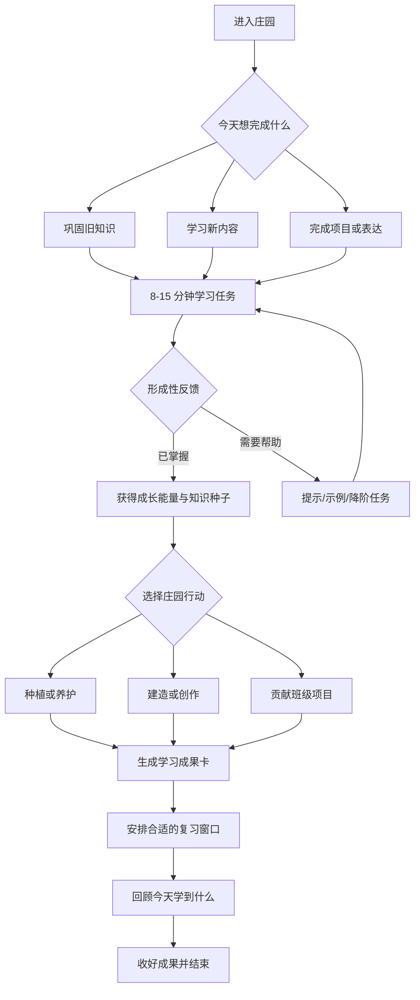

# EduAI Prism 个人庄园前端闭环升级优化路线 v3.0

> 文档类型：前端产品、交互、视觉与技术实施规格  
> 适用模块：`/student/manor` 个人庄园  
> 版本日期：2026-08-24  
> 实施范围：先完成前端闭环、模拟数据与可视化验收，暂不接真实后端  
> 产品原则：永久免费、无广告、无抽卡、无付费货币、学习收益优先于在线时长

---

## 0. 一页决策

现有庄园应继续保留已经成熟的经典农场气质、空间布局、木质控件、作物成长反馈和轻快氛围，不做推倒重来。下一阶段的核心不是继续增加普通游戏按钮，而是把庄园改造成一套真正由学习证据驱动的成长系统：

```text
选择学习目标
  -> 完成真实学习任务
  -> 获得即时形成性反馈
  -> 把掌握度转换为成长能量
  -> 种植 / 养护 / 建造 / 合作
  -> 收获知识成果与作品
  -> 进入间隔复习和反思
  -> 在自然停顿点结束本次使用
```

本方案的四个最高优先级结论：

1. **P0 教育闭环**：点击、停留和连续登录不直接产生高价值奖励；奖励必须来自已完成的学习、复习、订正、表达或合作证据。
2. **P0 响应式重构**：桌面保留沉浸式农场，平板使用安全区和抽屉，手机改为任务优先的纵向界面，不能继续缩放或裁切 1180px 场景。
3. **P0 健康使用**：取消“断签惩罚”和无限循环奖励，提供学习节奏、自然结束点、休息提醒、安静时段和监护设置。
4. **P1 合作替代压迫性排名**：将绝对排行榜降级为可选内容，主入口改为班级共同建设、同伴感谢和个人纵向成长。

---

## 1. 范围、非目标与验收口径

### 1.1 本期范围

- 完成庄园首页、任务板、作物图鉴、记忆温室、创作工坊、班级共建、学习仓库、健康使用中心的前端信息架构。
- 补齐按钮、弹层、抽屉、引导、空态、加载、错误、离线、禁用、成功、撤销和中断恢复状态。
- 使用前端夹具和异步模拟仓储形成可操作的完整闭环。
- 建立桌面、平板、手机三套布局策略及可访问性规范。
- 定义未来后端事件、接口、鉴权、幂等、审核、AI 生图与数据指标的接入边界。
- 建立教育逻辑、视觉回归、交互链路和儿童数字福祉测试清单。

### 1.2 明确不做

- 本期不接真实数据库、支付、广告、第三方社交或真实大模型调用。
- 不把 QQNCmini 的二进制、Flash/Unity 技术、商标、角色、原始素材或专有代码搬入本项目。
- 不以在线时长、点击次数、强制连续签到、随机抽奖作为核心留存机制。
- 不在浏览器端保存任何模型密钥、管理密钥或第三方服务凭证。
- 不把全班公开名次作为默认评价方式。

### 1.3 完成定义

只有同时满足以下条件，前端闭环才可进入后端接入阶段：

- 学生能从“选任务”走到“学习结果反馈、庄园变化、复习安排、主动结束”，全过程无死路。
- 任一奖励都能追溯到明确的学习证据类型。
- 390px、768px、1024px、1280px、1440px 视口的核心操作均可见、可达、无裁切。
- 不依赖颜色表达状态；键盘、读屏和减少动态效果模式可用。
- 失败、断网、重复提交、退出恢复和内容不可用均有明确反馈。
- 无广告、无充值、无抽卡、无强迫性通知、无断签惩罚。
- 前端模拟层可替换为真实仓储实现，页面组件不直接依赖 HTTP 细节。

---

## 2. 调研方法与证据边界

### 2.1 QQNCmini 只读静态审计

审计位置：`%LOCALAPPDATA%\QQNCmini`（本轮可重复使用的输入为该安装目录、项目内既有审计报告与去标识化重绘资产）

本轮只进行了文件清单、签名、配置、资源名和二进制字符串的静态审阅，没有启动该程序，也没有使用其中缓存登录态连接腾讯服务。原因是该目录可能包含历史账号令牌和远端自动登录逻辑，直接运行不符合最小风险原则。

主要发现：

- 安装目录约 363 MB、110 个文件，主体是 CEF 86、CefSharp、WPF/WinForms 微端壳层。
- `launcher_config.json` 和 `app/config/config.json` 指向腾讯远端更新、主页、论坛及 Flash/Unity 游戏入口。
- 壳层提供刷新、清理、截图、声音、老板键、入口、主页、论坛、多标签、多账号、快速登录和冻结页恢复。
- 真正的农场界面主要来自远端或运行时缓存中的 SWF、UnityFS 与图片资源，而不是 CEF 壳本身。
- 既有项目审计已识别 `farmui4_v_79.swf`、`farmui5_v_89.swf`、`happyfarm3_v_502.swf` 等缓存资源，并形成去标识化重绘场景。

**可借鉴的是**：农场空间分区、明确的土地状态、木质与纸张材质、成熟作物的强反馈、工具就近出现、邻居关系、仓库与图鉴的长期目标。  
**不可直接复制的是**：商标、角色、美术原件、音频、二进制、接口、账号逻辑、随机消费机制和已淘汰的 Flash/Unity Web 插件路线。

既有证据：

- `开发材料/EduAI-Prism-QQNCmini-农场资源审计与复刻映射-20260823.md`
- `开发材料/EduAI-Prism-个人庄园教育化重构-设计实施与验收报告-20260823.md`
- `app/public/art/qq-farm/farm-scene.png`

### 2.2 现有庄园代码审阅

| 文件 | 当前作用 | 本轮判断 |
|---|---|---|
| `app/app/(shell)/student/manor/page.tsx` | 24 块土地、作物、工具、好友、仓库、模式与反馈状态 | 桌面闭环可演示，但 802 行单文件承担过多职责 |
| `app/app/(shell)/student/manor/manor.module.css` | 场景、控件、弹层和状态样式 | 视觉完成度高，但移动端仍以固定舞台裁切为主 |
| `app/app/api/manor/route.ts` | 早期庄园行为接口 | 与当前 UI 模型不一致，本期不直连 |
| `app/lib/gamify.ts` | 积分、徽章、周任务、班级共建基础规则 | 可作为未来领域规则输入，不应让 UI 直接调用 |
| `app/tests/manor-fidelity.mjs` | 庄园视觉与交互保真检查 | 应扩展教育闭环、响应式和健康使用断言 |

### 2.3 实际交互与视觉基线审计

基线截图：`app/test-results/manor-1440.png`

本轮在本地服务中使用学生演示账号进行真实操作并等待状态返回：

1. 在 1440×900 打开庄园，确认舞台占满首屏且无横向文档滚动。
2. 打开“牧场”模式弹层，确认遮罩、焦点和关闭路径正常。
3. 在空地选择小麦并等待 950ms，确认土地状态变为小麦；当前基线实测金币从 26840 变为 26832，过程与成功提示依次返回。该扣币行为只记录为现状证据，P0 必须改为金币保持不变、由学习证据产生的成长能量驱动土地成长。
4. 切换到失败状态，确认错误说明可见，再执行重试恢复正常状态。
5. 检查控制台，未发现错误。
6. 切换 1280×800，主要工具和仓库仍可见。
7. 切换 1024×768，固定 1180px 舞台导致模式栏和工具栏越出视口。
8. 切换 390×844，工具、好友、仓库和主要模式被裁切，无法完成闭环。

**结论**：桌面视觉与基础反馈合格；移动端不是“视觉微调”问题，而是信息架构和交互模式需要重排。

---

## 3. 教育与儿童福祉依据如何落到界面

本方案不把“游戏化”理解为积分、徽章和排行榜的堆叠，而把它理解为：明确目标、可选择路径、适宜挑战、即时反馈、低风险重试、有意义合作和可见成长。

| 依据 | 设计转译 | 禁止误用 |
|---|---|---|
| 自我决定理论：自主、胜任、联结 | 每日给 2-3 个等价任务选择；难度可调；同伴合作而非强制竞争 | 用倒计时、断签、惩罚性文案控制学生 |
| 掌握学习 | 完成证据驱动作物阶段；未掌握先获得支架与重试 | 一次答错就扣除长期资产或公开羞辱 |
| 提取练习 | 收获前用短测或解释任务唤起知识 | 把重复点击当作复习 |
| 间隔练习 | 作物“需要照料”对应到合适的复习窗口 | 真实时间强制等待、半夜催促或错过即枯萎 |
| 形成性反馈 | 反馈包含“做对了什么、下一步是什么、可用什么帮助” | 只给红叉、分数或笼统鼓励 |
| 合作学习 | 班级共同建造、角色互补、贡献可解释 | 只有高分学生才能主导、低分学生无贡献位 |
| 儿童数字福祉 | 自然结束点、安静时段、休息提醒、监护配置 | 无限奖励链、抽卡、稀缺倒计时、连环弹窗 |
| 未成年人隐私 | 最少收集、私密默认、预设消息、可删除、可申诉 | 公开精确成绩、地理位置、自由私聊或画像出售 |

研究给出的边界同样重要：2024 年的游戏化与自我决定理论系统综述显示，游戏化对内在动机的总体效果较小，效果依赖具体设计；控制性积分和绝对排行榜可能削弱自主性并给低排名学生带来压力。关于负面效应的映射研究也指出，积分、徽章、竞争和排行榜是最常与无效、动机下降、混乱及“钻规则空子”同时出现的元素。因此本方案以合作、成长和学习证据为中心，不照搬传统 PBL 套件。

核心参考：

- [游戏化学习元分析，Educational Psychology Review](https://link.springer.com/article/10.1007/s10648-019-09498-w)
- [游戏化与自我决定理论系统综述，Educational Technology Research and Development](https://link.springer.com/article/10.1007/s11423-023-10337-7)
- [游戏化负面效应映射研究，Information and Software Technology](https://doi.org/10.1016/j.infsof.2022.107142)
- [提取练习原始研究，Association for Psychological Science](https://www.psychologicalscience.org/journals/psychological-science/j.1467-9280.2006.01693.x/)
- [Khan Academy 自主掌握学习说明](https://support.khanacademy.org/hc/en-us/articles/360007253831-Using-self-paced-practice-and-Mastery-in-the-classroom)
- [Duolingo 教学方法](https://blog.duolingo.com/duolingo-teaching-method/)
- [Duolingo 间隔重复模型论文](https://research.duolingo.com/papers/settles.acl16.pdf)
- [Minecraft Education 的学习、合作与评估能力](https://education.minecraft.net/en-us/discover/what-is-minecraft)
- [Minecraft Education 作品集与学习证据功能](https://edusupport.minecraft.net/hc/en-us/articles/360047117032-Features-of-Minecraft-Education)
- [UNICEF RITEC 儿童数字游戏福祉框架](https://www.unicef.org/innovation/responsible-innovation-technology-children-ritec)
- [UNICEF RITEC 设计工具箱](https://www.unicef.org/childrightsandbusiness/workstreams/responsible-technology/online-gaming/ritec-design-toolbox)
- [《未成年人网络保护条例》教育部全文](https://www.moe.gov.cn/jyb_xxgk/moe_1777/moe_1778/202310/t20231025_1087333.html)
- [《中华人民共和国未成年人保护法》网络保护条款](https://www.cac.gov.cn/2020-10/22/c_1604928959588622.htm)
- [《中华人民共和国个人信息保护法》未满十四周岁规则](https://www.miit.gov.cn/zwgk/zcwj/flfg/art/2022/art_04a0f1fb5df244e39688fd5372623a8d.html)

法规说明：本文件是产品与工程设计建议，不替代正式法律意见。上线前需由法务结合产品形态、运营地区、数据类型和最新监管要求复核。

---

## 4. 产品定位与设计原则

### 4.1 一句话定位

个人庄园是学习成果的可视化世界，不是把学习包装成刷币游戏的休闲农场。

### 4.2 六条不可妥协原则

1. **先学习，后反馈**：庄园变化由学习证据触发，游戏行为不反客为主。
2. **短周期有结果，长周期有意义**：一次 8-15 分钟可完成一个小循环，数周可形成项目和作品集。
3. **选择不等于放任**：学生可选择任务和表现方式，系统仍保证课程目标、先修关系和安全边界。
4. **失败是信息**：错误触发支架、示例和重试，不触发资产损失或公开评价。
5. **合作不排名**：共同目标、互相感谢和角色互补优先于绝对名次。
6. **主动结束也是成功**：完成学习循环后明确提供“收好成果，今天到这里”，不制造无限滚动。

### 4.3 留存定义

本产品追求的是“愿意回来继续学”，不是“被机制困住继续点”。

主指标建议：

- 有效学习循环完成率。
- 学习后 7 日知识保持率。
- 自主选择任务比例。
- 失败后成功重试率。
- 合作任务中每位成员的有效贡献覆盖率。
- 健康结束率，即在自然结束点主动退出且没有立即被召回。
- 学生对自主、胜任、联结和情绪安全的简短自评。

不作为北极星指标：总在线时长、总点击数、通知打开率、连续签到天数、排行榜参与率。

---

## 5. 完整学习闭环



### 5.1 学习证据类型

| 证据 | 示例 | 可驱动的庄园反馈 |
|---|---|---|
| 掌握 | 通过知识点练习或单元检查 | 作物进入下一阶段、解锁同主题种子 |
| 订正 | 能解释错误原因并再次正确作答 | 清除病叶、恢复成长，不扣长期资产 |
| 提取 | 无提示回忆、短测、口头复述 | 提高作物“记忆强度” |
| 迁移 | 用知识解决新情境问题 | 生成稀有但非随机的变体或装饰 |
| 表达 | 作品、讲解、实验记录、学习日志 | 进入作品仓库并形成展示牌 |
| 合作 | 完成分工并给出可验证贡献 | 班级建筑推进，展示团队角色 |
| 反思 | 写出“我会了什么、下一步是什么” | 生成次日任务建议和学习天气 |

### 5.2 成长阶段

每块地不再只由真实时间推进，而由“学习证据 + 合理间隔”共同推进：

```text
空地 -> 选择知识种子 -> 发芽 -> 理解 -> 巩固 -> 迁移 -> 可收获作品
```

- `发芽`：完成一次新知学习或诊断任务。
- `理解`：首次达到目标掌握度。
- `巩固`：在建议时间窗完成提取练习。
- `迁移`：解决一道变式题、进行解释或完成应用任务。
- `收获`：生成成果卡、学习记录或项目素材。
- 错过复习时作物只显示“需要照料”，不会死亡、清零或制造羞耻。

---

## 6. 信息架构

### 6.1 一级入口

| 入口 | 学习目的 | 桌面位置 | 移动端位置 |
|---|---|---|---|
| 庄园 | 查看成长、操作土地、进入今日任务 | 主场景 | 底部导航“庄园” |
| 任务板 | 选择、继续、复习或提交学习任务 | 左上活动板 | 底部导航“任务” |
| 记忆温室 | 查看待复习知识与记忆强度 | 场景建筑 | 任务页二级标签 |
| 创作工坊 | 项目、实验、作品与 AI 辅助创作 | 场景建筑 | 底部导航“工坊” |
| 班级共建 | 合作任务、角色分工和感谢 | 右侧邻居区 | 底部导航“伙伴” |
| 学习仓库 | 成果卡、作品集、图鉴和装饰 | 右下仓库 | 底部导航“成果” |
| 健康使用 | 学习节奏、安静时段、动效和隐私 | 头像菜单 | 设置页固定入口 |

### 6.2 首页视觉层级

1. **第一层：今天做什么**。任务板只突出一个推荐任务和两个可选任务。
2. **第二层：哪里需要照料**。最多高亮 3 个有明确学习原因的土地或建筑。
3. **第三层：长期成长**。庄园全景、班级项目和图鉴作为探索内容。
4. **第四层：辅助功能**。仓库、设置、声音、帮助进入稳定边缘区，不抢主任务注意力。

---

## 7. 页面与组件实施规格

### 7.1 顶部学生状态栏

保留现有微端标题条与头像结构，改造数值含义：

| 现有/新增元素 | 新语义 | 交互 |
|---|---|---|
| 头像与等级 | 学习旅程等级，只代表累计成长，不代表班级名次 | 点击打开个人成长摘要 |
| 金币 | 仅用于免费装饰和布局，不购买学习优势 | 点击打开收支说明 |
| 新增成长能量 | 当日由有效学习证据获得，有每日温和上限 | 点击查看来源与当日余量 |
| 学习节奏 | 周目标完成 3/4 次，不显示断签火焰 | 点击调整周目标或使用恢复日 |
| 学习天气 | 根据任务类型显示“适合复习/适合创作” | 点击查看推荐理由，可关闭个性化 |

状态要求：加载骨架、无数据、同步中、离线、数据过期、减少数据展示模式。

### 7.2 今日任务板 `MissionBoard`

任务卡必须显示：

- 任务名称与学科图标。
- 学习目标，而非只写游戏奖励。
- 预计 8/12/15 分钟，不显示精确倒计时。
- 当前掌握度与推荐原因。
- 可获得的成长能量和庄园作用。
- 主按钮“开始学习”或“继续学习”。
- 次按钮“换一个”，说明更换不会受罚。
- “为什么推荐给我”可展开解释。

任务选择规则：

- 每天默认 1 个推荐任务 + 2 个等价选择。
- 至少有一个非计时模式。
- 学生可选择文字、语音、操作或作品形式完成同一目标。
- 不把困难任务与更高货币奖励绑定，避免诱导学生选择不适合自己的任务。

### 7.3 土地与作物 `LearningPlot`

土地完整状态：

```text
locked | empty | selecting | planted | learning | review_due |
needs_support | ready | harvesting | completed | sync_error
```

每个状态必须有图形、文字和辅助技术标签：

- `locked`：显示解锁条件“完成分数单元的 2 个基础目标”，不显示神秘付费锁。
- `empty`：按钮文案“选择知识种子”。
- `selecting`：打开种子抽屉，按学科、目标和预计周期筛选。
- `learning`：显示“完成下一步学习后成长”，不显示无意义等待倒计时。
- `review_due`：显示“适合回顾”，允许推迟到明天。
- `needs_support`：显示帮助入口，不使用枯萎、哭脸或惩罚色。
- `ready`：显示收获对应的知识成果，不制造短时消失压力。
- `sync_error`：本地保留动作，提供“重新同步”和“查看离线记录”。

土地点击后的上下文动作最多 4 个，按当前状态动态显示，不常驻堆满按钮。

### 7.4 种子抽屉 `SeedDrawer`

分为三个标签：

- `适合今天`：按学习计划推荐。
- `我的学科`：按知识目标浏览。
- `自由探索`：跨学科主题与项目，不影响必修进度。

种子卡字段：知识点、先修条件、成长阶段、预计需要的学习次数、可产生的成果形式。没有随机品质，没有抽取概率，没有限时付费。

### 7.5 记忆温室 `MemoryGreenhouse`

使用“记忆叶片”代替红色错题列表：

- 绿色：近期稳定掌握。
- 蓝色：适合今天复习。
- 金色：可以尝试迁移任务。
- 中性灰：数据不足。

不得只用颜色；同时显示状态标签和图标。推荐复习使用 3-5 题或一次 2-4 分钟复述，不将复习做成无限题海。

### 7.6 创作工坊 `CreationWorkshop`

四类入口：

1. 实验记录。
2. 项目制作。
3. 讲给别人听。
4. AI 辅助配图。

AI 辅助配图必须显示“AI 生成”标识、提示词预览、重新生成次数限制、内容安全提示和手工替代路径。学生提交的是学习主题与画面意图，不直接接触模型端点或密钥。

### 7.7 班级共建 `ClassBuild`

默认展示共同目标而非个人名次，例如“全班完成 60 次有效复习，共建气象站”。

- 显示整体进度、我的贡献、可选择角色和下一步。
- 角色包括资料员、解题员、讲解员、设计员、检查员，避免只有高分贡献。
- 同伴互动只提供教师配置的预设短语，如“谢谢你的解释”“这个方法很清楚”。
- 默认不展示精确个人分数和全班排序。
- 学生可退出公开展示，仍可完成私人贡献。
- 教师可冻结互动、隐藏成员、撤回内容和导出欺凌处理记录。

### 7.8 学习仓库 `LearningWarehouse`

仓库不是物品堆积页，而是学生可理解的学习作品集：

- `成果卡`：目标、证据、反馈、下一步和完成日期。
- `作品`：图片、实验、项目、语音讲解与文档。
- `知识图鉴`：已掌握、复习中、准备迁移。
- `装饰`：由里程碑解锁，可自由布置，不影响学习能力。
- `成长回放`：按周展示“我从不会到会”的变化，不展示与他人的差距。

### 7.9 健康使用中心 `WellbeingCenter`

学生可见：

- 本次学习已完成几个循环。
- “休息一下”“今天到这里”“继续一个短任务”三个平等选项。
- 减少动态效果、降低音效、隐藏数值、专注模式。
- 安静时段和通知总开关。

监护人/教师可配置：

- 每次建议使用长度与休息间隔。
- 可用时段和睡前安静时间。
- 社交、作品公开和 AI 生成功能权限。
- 数据下载、删除、更正和投诉举报入口。

---

## 8. 按钮、反馈与状态规范

### 8.1 命令层级

| 层级 | 用法 | 示例 |
|---|---|---|
| Primary | 当前唯一建议动作 | 开始学习、提交成果、完成收获 |
| Secondary | 安全替代路径 | 换一个、稍后复习、保存草稿 |
| Tertiary | 查看或配置 | 为什么推荐、查看证据、调整目标 |
| Destructive | 删除或放弃 | 删除作品、放弃未提交草稿 |

同一弹层最多一个 Primary。图标按钮使用 Lucide 图标并提供工具提示与 `aria-label`。触控目标不小于 44×44px。

### 8.2 异步操作反馈

所有可能等待的按钮必须遵循：

```text
idle -> pending -> success | recoverable_error | blocked_error
```

- `pending`：按钮保持宽度，出现进度图标并禁用重复提交。
- 超过 800ms：显示动作说明，如“正在保存学习证据”。
- 超过 5s：显示“仍在处理”，允许转入后台或取消非关键任务。
- `success`：说明数据变化及下一步，不只显示“成功”。
- `recoverable_error`：保留输入和本地操作，提供重试。
- `blocked_error`：说明缺少权限、内容被审核或服务不可用，并给出替代路径。

### 8.3 全局状态页

| 状态 | 界面要求 |
|---|---|
| 加载 | 保留场景骨架，不闪烁，不移动固定控件 |
| 空数据 | 解释为什么为空并给一个可完成动作 |
| 离线 | 顶部轻提示，本地动作进入待同步队列 |
| 部分失败 | 失败区域独立重试，不遮住整个庄园 |
| 会话过期 | 保存本地草稿，重新登录后恢复 |
| 维护 | 展示预计影响范围，不虚构精确恢复时间 |
| 内容被拦截 | 使用儿童可理解的中性说明，允许修改或申诉 |

---

## 9. 关键用户流程

### 9.1 首次进入

1. 选择“我更喜欢怎样学习”：看、听、做、讲，可多选并可跳过。
2. 选择每周 2-5 次的柔性目标，系统明确“可以随时修改，不会因中断受罚”。
3. 完成 2-3 分钟轻量诊断。
4. 系统推荐第一颗知识种子并解释原因。
5. 学生完成一个微任务，看到土地从空地到发芽。
6. 以“今天已经完成一个学习循环”结束，不连续弹出第二个任务。

### 9.2 日常学习

1. 首页只出现一个主建议：“有一株分数番茄适合今天照料”。
2. 学生可选择推荐任务或两个替代任务。
3. 进入真实学习页面，庄园转为低干扰背景。
4. 提交后等待结果返回，再呈现形成性反馈。
5. 达标后获得成长能量，并由学生选择用于土地、工坊或共建。
6. 生成成果卡和下次复习窗口。
7. 显示自然结束卡。

### 9.3 答错与重试

1. 不扣金币、不降等级、不让作物死亡。
2. 显示错误类型和一个最小帮助。
3. 提供“看示例”“拆小一步”“换种表达”三种支架。
4. 再次作答后评价是否真正掌握，而非是否点击过帮助。
5. 把订正本身记录为有效学习证据。

### 9.4 间隔复习

1. 到达建议窗口时，土地显示蓝色“适合回顾”。
2. 学生可选择现在、明天或本周计划；推迟不受罚。
3. 复习先进行无提示提取，再根据结果补充支架。
4. 通过后进入巩固或迁移阶段。
5. 未通过时调整下次间隔，不清零历史成长。

### 9.5 班级共建

1. 学生选择适合自己的角色。
2. 完成与课程目标一致的分工任务。
3. 系统验证贡献证据后更新共同建筑。
4. 成员可用预设短语表达感谢或请求解释。
5. 完成后生成团队成果页，展示多样贡献，不生成个人名次。

### 9.6 退出、中断和恢复

- 学习中离开：自动保存草稿，返回时从最近可验证步骤继续。
- 网络中断：本地排队并显示同步状态，不重复奖励。
- 主动结束：展示本次学习和庄园变化摘要。
- 达到建议时长：先在自然节点提醒，不强行打断正在作答的题目。
- 重新进入：先恢复未完成任务，再显示新建议。

---

## 10. 免费经济与激励系统

### 10.1 三类资源

| 资源 | 获得方式 | 用途 | 上限/约束 |
|---|---|---|---|
| 成长能量 | 掌握、订正、复习、表达、合作 | 推动作物、建造和创作 | 每日柔性上限，超出仍记录学习但不制造刷取动机 |
| 知识种子 | 课程目标解锁或教师分配 | 开启对应学习路径 | 不随机、不售卖、不限时消失 |
| 装饰币 | 长期里程碑、作品集与班级贡献 | 免费装饰和布局 | 不影响学习进度，无现金价值 |

### 10.2 禁止机制

- 不设置充值、付费会员、广告换奖励、付费复活。
- 不设置抽卡、盲盒、概率掉落或稀缺倒计时。
- 不出售提高成绩、跳过学习或放大排名的能力。
- 不以错过一天为由清空连续记录。
- 不使用红点堆叠和连环弹窗召回学生。

### 10.3 学习节奏替代连续签到

展示“本周计划 4 次，已完成 3 次”，允许学生自主安排。中断后使用温和文案“欢迎回来，从适合你的地方继续”，不展示损失动画。恢复日是系统默认权利，不是稀缺道具。

---

## 11. 年龄、设备与无障碍适配

### 11.1 年龄分层

| 年龄段 | 交互密度 | 任务与反馈 | 社交 |
|---|---|---|---|
| 小学 1-3 年级 | 大图标、单目标、少文字、可朗读 | 一次一个步骤，具体反馈，优先操作与语音 | 默认关闭公开比较，只用预设感谢 |
| 小学 4-6 年级 | 允许简单计划和多步任务 | 展示推荐原因和成长阶段 | 小组合作、角色分工、教师可见 |
| 初中 | 更强自主性、项目和反思 | 支持目标调整、迁移任务和作品评价量规 | 可选协作，默认私密成长对比 |

年龄适配必须来自账户/学校配置，不能通过高侵入式年龄识别推断。

### 11.2 响应式策略

#### 桌面 `>= 1180px`

- 保留当前全景农场和边缘工具布局。
- 所有固定控件放入 `safe-area`，使用 CSS Grid 和容器查询约束。
- 弹层宽度不超过 680px，场景仍可感知但不抢阅读。

#### 平板 `768-1179px`

- 使用“场景相机裁切 + 中央安全区”，不按比例缩小全部 UI。
- 模式栏与活动栏合并为底部可展开抽屉。
- 好友与仓库进入右侧 Sheet。
- 土地上下文操作以底部 Action Sheet 展示。

#### 手机 `< 768px`

- 改为任务优先的纵向壳层，不直接展示 1180px 固定舞台。
- 顶部显示学生状态和今日主任务。
- 中部使用可横向轻扫但非无限滚动的 3-6 块“关注土地”。
- 底部五项导航：庄园、任务、工坊、伙伴、成果。
- 全景庄园作为可进入的“地图视图”，支持拖动和缩放，但所有关键命令仍有列表入口。

### 11.3 可访问性

- 文本对比度满足 WCAG 2.2 AA；大字和关键图标不得压在复杂背景上。
- 状态同时使用图标、文字和形状，不只使用红绿颜色。
- 支持 200% 文本缩放，按钮文案可换行且不遮挡。
- 所有弹层实施焦点锁、Esc 关闭、返回焦点和读屏标题。
- 提供 `prefers-reduced-motion`，关闭粒子、摇晃、连续漂浮和视差。
- 音频不是唯一反馈；字幕、文本与触觉提示可替代。
- 地块可通过键盘列表导航，不要求精确点击等距地图。

---

## 12. 视觉设计系统

### 12.1 风格方向

继续使用当前已被认可的经典农场视觉作为主体：清晰的土地、木质工具条、纸质任务板、绿色植被、金色收获反馈和可识别建筑。教育信息使用更克制的冷色语义层，避免把全页面重新涂成单一蓝色或紫色 SaaS 面板。

### 12.2 建议色彩令牌

| 令牌 | 建议色 | 用途 |
|---|---|---|
| `--earth-700` | `#5A3A24` | 木材深边、标题文字 |
| `--earth-500` | `#8A5A36` | 木质控件主体 |
| `--leaf-600` | `#2F7D4A` | 可操作、健康成长 |
| `--leaf-300` | `#A9D98E` | 轻量成功背景 |
| `--sun-500` | `#E5A92F` | 收获、里程碑、焦点强调 |
| `--sky-600` | `#2E6F9E` | 学习、复习与信息操作 |
| `--ink-900` | `#20252B` | 主文本 |
| `--paper-100` | `#FFF8E8` | 任务板和弹层底色 |
| `--danger-600` | `#B33A3A` | 仅用于真实风险或破坏性操作 |

所有正式色值需通过对比度测试后定稿。状态色不直接等于作物颜色，以免成熟作物与操作状态混淆。

### 12.3 字体与排版

- 中文优先使用项目现有无衬线字体栈，标题可使用圆润但易读的展示字重。
- 页面标题 24-32px，弹层标题 18-22px，正文 14-16px，辅助文字不低于 12px。
- 字距固定为 0，不随视口缩放字体。
- 数值采用等宽数字特性，避免进度变化导致布局跳动。

### 12.4 材质和容器

- 木质控件用于游戏世界命令，纸张用于任务和知识说明，纯色轻面板用于设置与可访问性。
- 圆角控制在 4-8px；作物卡片可使用有机剪影，但不要形成卡片套卡片。
- 阴影只表达层级，不使用大面积发光、渐变球或模糊装饰。
- 重要内容放在稳定底板上，不直接覆盖高纹理场景。

### 12.5 动效

| 场景 | 时长 | 规则 |
|---|---|---|
| 按钮反馈 | 80-140ms | 轻微压下，不放大布局 |
| 抽屉/弹层 | 180-240ms | 使用透明度与位移，支持减少动态效果 |
| 作物阶段变化 | 450-700ms | 一次性成长，不循环闪烁 |
| 收获庆祝 | 800-1200ms | 小范围粒子，立刻可跳过，不阻塞下一步 |
| 班级建筑推进 | 600-900ms | 展示具体贡献来源，不营造随机爆奖 |

禁止连续抖动、倒计时闪烁、关闭按钮延迟出现和不可跳过庆祝。

---

## 13. 美术与生图资产路线

### 13.1 优先资产清单

1. 四季庄园环境变体，但土地和关键建筑位置保持一致。
2. 数学、语文、英语、科学、综合实践五套知识种子与作物图标。
3. 记忆温室、创作工坊、班级共建、学习仓库四栋建筑的昼夜状态。
4. 成长能量、知识种子、装饰币的非货币化图形。
5. 小学低年级朗读引导和无障碍高对比图标套件。
6. 空态、离线、需要帮助、完成反思等情境插图。

### 13.2 生图提示词模板

```text
面向中国中小学生的教育农场游戏 UI 资产，[具体对象]，
经典 2.5D 等距农场视角，清晰轮廓，温暖自然材质，
木质与纸张细节，绿色植被与金色阳光，少量蓝色学习语义点缀，
无商标、无文字、无已知游戏角色、无付费图标、无抽卡元素，
透明背景，适合 2x WebP 导出，保持同一光源和比例。
```

### 13.3 资产验收

- 必须去标识化，不与 QQNCmini 原始素材逐像素相同。
- 产出 PNG/WebP 2x，记录提示词、模型、日期、授权和人工修改。
- 使用真实页面截图检验比例、透明边缘、色彩和不同 DPR 下清晰度。
- 生成素材必须经过儿童内容安全与版权人工复核。

本期路线文档不直接调用外部生图端点，避免在未完成服务端安全层、内容审核与密钥轮换前产生不可审计请求。

---

## 14. 前端技术实施路线

### 14.1 目标目录

```text
app/app/(shell)/student/manor/
  page.tsx
  manor.module.css
  components/
    ManorScene.tsx
    StudentStatusBar.tsx
    MissionBoard.tsx
    LearningPlot.tsx
    PlotActionSheet.tsx
    SeedDrawer.tsx
    MemoryGreenhouse.tsx
    CreationWorkshop.tsx
    ClassBuild.tsx
    LearningWarehouse.tsx
    WellbeingCenter.tsx
    ManorFeedback.tsx
  hooks/
    useManorController.ts
    useLearningLoop.ts
    useResponsiveManor.ts
  model/
    manor.types.ts
    manor.reducer.ts
    manor.selectors.ts
    manor.fixtures.ts
    manor.repository.ts
    manor.mock-repository.ts
```

### 14.2 状态管理

当前页面可先使用 `useReducer + Context` 拆分状态，避免为单页引入新的状态机依赖。若后续跨页面共享庄园状态，再迁移到项目已有 Zustand。

领域状态分为：

- `serverState`：任务、证据、土地、资产、班级项目、作品。
- `sessionState`：当前任务、选中土地、草稿、待同步动作。
- `uiState`：弹层、抽屉、焦点、通知、响应式模式。
- `policyState`：年龄档、权限、健康使用、可访问性。

组件只派发领域动作，不直接修改金币、作物阶段或奖励：

```ts
type ManorCommand =
  | { type: 'mission.started'; missionId: string }
  | { type: 'evidence.submitted'; missionId: string; evidenceId: string }
  | { type: 'plot.seeded'; plotId: string; seedId: string }
  | { type: 'review.scheduled'; knowledgeId: string; window: string }
  | { type: 'session.ended'; reason: 'completed' | 'break' | 'manual' };
```

### 14.3 模拟仓储

定义 `ManorRepository` 接口，并提供可控延迟、成功、失败、离线和重复请求场景的 mock 实现。页面只依赖接口：

```ts
interface ManorRepository {
  getSnapshot(): Promise<ManorSnapshot>;
  startMission(input: StartMissionInput): Promise<MissionSession>;
  submitEvidence(input: SubmitEvidenceInput): Promise<EvidenceResult>;
  applyGrowth(input: ApplyGrowthInput): Promise<ManorSnapshot>;
  scheduleReview(input: ScheduleReviewInput): Promise<ReviewPlan>;
  endSession(input: EndSessionInput): Promise<SessionSummary>;
}
```

夹具必须覆盖 9 类场景：新用户、正常成长、需要复习、需要帮助、班级共建、空作品集、离线待同步、部分错误和会话过期。

### 14.4 现有接口的处理

`app/app/api/manor/route.ts` 与 `app/lib/gamify.ts` 暂时保留，不让新 UI 直接绑定其旧数据模型。后续先建立领域契约和迁移映射，再决定扩展或替换，防止当前前端闭环被旧的“普通农场行为”限制。

---

## 15. 未来后端与 AI 接入契约

### 15.1 建议接口

| 方法 | 路径 | 用途 |
|---|---|---|
| GET | `/api/v2/manor/snapshot` | 获取学生庄园、任务、政策与同步版本 |
| POST | `/api/v2/manor/missions/:id/start` | 启动学习任务 |
| POST | `/api/v2/manor/evidence` | 提交学习证据并等待评价结果 |
| POST | `/api/v2/manor/plots/:id/actions` | 基于已验证奖励执行种植/养护/收获 |
| POST | `/api/v2/manor/reviews/schedule` | 安排复习窗口 |
| POST | `/api/v2/manor/class-builds/:id/contributions` | 提交班级贡献 |
| POST | `/api/v2/manor/art/jobs` | 创建安全审核后的 AI 配图任务 |
| GET | `/api/v2/manor/art/jobs/:id` | 轮询配图状态 |
| POST | `/api/v2/manor/sessions/end` | 保存总结与健康结束原因 |

所有写操作使用 `Idempotency-Key`，奖励由服务端权威计算。前端可乐观展示动作，但服务器拒绝时必须回滚并解释原因。

### 15.2 AI 服务安全架构

```text
浏览器
  -> EduAI Prism 服务端鉴权与速率限制
  -> 提示词模板、年龄策略、隐私脱敏
  -> 内容安全预检
  -> 第三方模型适配器
  -> 结果安全复检与资产存储
  -> 返回 jobId 和审核状态
```

要求：

- 模型密钥只存在服务端密钥管理或环境变量，不进入 `NEXT_PUBLIC_*`、源码、日志、截图、文档和客户端网络请求。
- 用户在会话中给出的明文密钥已暴露，应立即撤销并轮换；本文件不保存该值。
- 用户提供的第三方基础 URL 仅视为候选配置，尚未完成所有权、隐私、可用性、数据驻留和内容安全验证，不得直接用于未成年人生产数据。
- 通过 `AI_PROVIDER_BASE_URL`、`AI_PROVIDER_API_KEY`、`AI_IMAGE_MODEL` 等服务端变量配置，不在前端写死。
- 模型故障时降级为本地模板素材或教师素材库，不能阻断学习主流程。
- 提示词不得包含真实姓名、联系方式、精确学校班级、位置、面部生物信息或完整学习档案。

### 15.3 隐私和权限

- 不满十四周岁学生数据按敏感个人信息高标准处理，真实上线前完成监护人同意与专门规则。
- 学生作品默认仅本人、监护人和授权教师可见。
- 同伴看到昵称、预设头像和必要贡献，不看到精确成绩、错题详情或行为画像。
- 提供访问、更正、导出、删除、撤回同意和投诉举报入口。
- 审计日志记录谁在何时查看或修改了学生公开范围。

---

## 16. 分阶段实施计划

### P0：打通最小教育闭环，预计 2 个迭代

1. 拆分 `page.tsx`，建立 reducer、类型、选择器和 mock repository。
2. 上线今日任务板、学习证据结果、成长能量和自然结束卡。
3. 把土地状态改为学习驱动，补齐帮助、复习、同步错误状态。
4. 完成手机任务优先壳层和平板抽屉，不再裁切关键控件。
5. 加入减少动态效果、键盘操作和基础读屏标签。

P0 验收：学生能在三类设备上完成“选任务 -> 等待学习结果 -> 推动作物 -> 安排复习 -> 主动结束”。

### P1：形成长期学习与合作，预计 2-3 个迭代

1. 上线记忆温室、学习仓库和成果卡。
2. 上线班级共建、角色分工和预设感谢。
3. 上线年龄分层、健康使用中心和安静时段。
4. 完成装饰布局和非付费长期图鉴。

P1 验收：学生能看到知识保持、作品与合作贡献，教师可配置互动和公开范围。

### P2：项目化与 AI 辅助，预计 2 个迭代

1. 上线创作工坊、实验记录和项目模板。
2. 接入服务端 AI 配图作业、审核、降级和资产追踪。
3. 上线学习天气与可解释推荐。
4. 建立课程、庄园与作品集的跨模块跳转。

P2 验收：AI 不暴露密钥、不接触不必要的学生数据，失败时不影响学习闭环。

### P3：真实后端迁移

1. 冻结领域契约并与旧 `/api/manor`、`gamify.ts` 建立迁移表。
2. 实现鉴权、幂等、版本冲突、离线队列、审核和审计日志。
3. 双写/影子验证后切换真实仓储。
4. 数据迁移前制定回滚方案并进行安全与法务复核。

---

## 17. 测试与验收矩阵

### 17.1 教育逻辑测试

- 未返回学习评价前，不发放成长能量、不推进作物。
- 点击、停留和连续登录不能直接生成高价值奖励。
- 答错后获得支架，历史资产不减少。
- 推迟复习不会导致作物死亡或连续记录清零。
- 同一证据重复提交只产生一次奖励。
- 班级贡献必须有证据和角色，不能只靠在线时长。
- 完成一个循环后出现明确结束入口，不自动开始下一任务。

### 17.2 状态与异常测试

- 800ms、5s、超时、断网、服务端 4xx/5xx 均有对应反馈。
- 刷新、返回、登录过期后草稿可恢复。
- 局部请求失败不遮挡整个庄园。
- 离线动作恢复网络后按幂等键同步。
- AI 配图被拒绝时可修改提示词或改用模板素材。

### 17.3 视觉与响应式测试

Playwright 视口：

```text
390x844   手机
768x1024  竖向平板
1024x768  横向平板/小屏桌面
1280x800  标准笔记本
1440x900  设计基线
```

断言：

- 主任务、土地操作、退出/休息和错误恢复始终可达。
- 无横向页面滚动；地图可独立平移时须有列表替代入口。
- 弹层不超出视口，关闭按钮和标题始终可见。
- 文本 200% 缩放不遮挡按钮与后续内容。
- 截图差异超过阈值时人工审阅，不以像素相似度代替可用性判断。

### 17.4 可访问性测试

- axe-core 无严重或高等级问题。
- 全流程可只用键盘完成。
- 读屏顺序与视觉顺序一致。
- 减少动态效果时无持续动画和视差。
- 高对比与色觉差异模拟下仍能识别所有状态。

### 17.5 儿童福祉与暗黑模式审计

每次发布前回答：

- 是否用损失、羞耻或恐惧召回学生？
- 是否制造了无限奖励链或随机稀缺？
- 是否让低排名学生被公开比较？
- 是否收集了实现功能不需要的未成年人数据？
- 是否把休息或退出藏起来？
- 是否允许学生理解推荐原因并关闭个性化？
- 是否给监护人和教师清晰的权限与投诉入口？

任一答案不合格即阻止发布。

---

## 18. 风险清单与缓解

| 风险 | 影响 | 缓解 |
|---|---|---|
| 视觉很像农场，但学习只是跳转 | 形成“先玩后学”的割裂 | 所有成长动作绑定学习证据，庄园显示推荐原因 |
| 游戏奖励压过内在动机 | 学生只刷币或寻找捷径 | 每日柔性上限、奖励透明、成长解释优先 |
| 公开排名打击低排名学生 | 回避、焦虑、同伴标签化 | 默认个人纵向成长与班级共同目标 |
| 固定舞台在移动端裁切 | 关键按钮不可达，闭环中断 | 手机重排为任务壳层，地图只作为可选视图 |
| 旧 API 与新领域模型冲突 | 返工和状态不一致 | 先稳定 repository 契约，再做迁移映射 |
| AI 服务泄露密钥或学生数据 | 严重安全与合规问题 | 服务端网关、密钥轮换、脱敏、审核、限流和降级 |
| 直接复刻第三方素材 | 知识产权风险 | 只借鉴模式和空间语言，全部资产去标识化重绘 |
| 动效和通知诱导沉迷 | 伤害睡眠和自主性 | 自然结束点、安静时段、无断签惩罚和发布前审计 |
| 教育理论停留在文案 | 无真实学习收益 | 使用可验证证据、保持率、迁移和反馈质量作为指标 |

---

## 19. 任务拆分建议

### Epic A：领域模型与模拟层

- A1 定义 `ManorSnapshot`、`LearningEvidence`、`MissionSession`、`ReviewPlan`。
- A2 实现 reducer、selectors 和动作合法性检查。
- A3 实现 mock repository 及 9 类夹具。
- A4 实现本地草稿、幂等键和离线队列模拟。

### Epic B：教育闭环 UI

- B1 今日任务板与推荐解释。
- B2 学习结果反馈与支架选择。
- B3 学习驱动土地状态与种子抽屉。
- B4 成长能量与收获成果卡。
- B5 复习安排与自然结束卡。

### Epic C：长期模块

- C1 记忆温室。
- C2 学习仓库和成长回放。
- C3 创作工坊。
- C4 班级共建和安全互动。
- C5 健康使用中心。

### Epic D：设计系统与多端

- D1 视觉令牌和组件状态规范。
- D2 桌面安全区。
- D3 平板抽屉布局。
- D4 手机任务优先壳层。
- D5 无障碍与减少动态效果。

### Epic E：测试与上线门禁

- E1 教育规则单元测试。
- E2 Playwright 五视口闭环测试。
- E3 视觉基线与布局像素检查。
- E4 axe、键盘、读屏和动效测试。
- E5 儿童福祉、隐私和暗黑模式审计。

---

## 20. 最终交付检查表

### 产品

- [ ] 每个庄园反馈都能说明对应学习证据。
- [ ] 学生有真实选择，失败后有支架且不受惩罚。
- [ ] 不以在线时长和连续登录作为核心奖励。
- [ ] 无付费、无广告、无抽卡、无随机稀缺。
- [ ] 有自然结束点、安静时段和监护设置。

### UI/UX

- [ ] 桌面保留现有农场视觉完成度。
- [ ] 平板和手机核心动作无裁切。
- [ ] 所有按钮具有 pending、success、error 和 disabled 状态。
- [ ] 弹层、抽屉、空态、离线和会话恢复完整。
- [ ] 文本、焦点、对比度、读屏和减少动态效果合格。

### 工程

- [ ] 页面完成组件、领域、仓储和 UI 状态分层。
- [ ] mock repository 可被真实实现替换。
- [ ] 写操作具备幂等设计和明确回滚。
- [ ] 前端代码、日志和构建产物无密钥。
- [ ] AI 生图只经服务端网关，包含审核、限流和降级。

### 教育与安全

- [ ] 完成年龄适配与学习证据审阅。
- [ ] 默认不公开精确成绩和绝对排名。
- [ ] 未成年人个人信息最少收集、私密默认、可删除。
- [ ] 每次发布完成儿童福祉和暗黑模式审计。
- [ ] 上线前由教研、教师、学生、监护人、安全与法务共同评审。

---

## 21. 推荐下一步

按本文件先实施 **P0 最小教育闭环**。第一批代码只处理领域模型、任务板、学习证据、土地成长、自然结束和三端布局，不同时开发所有长期模块。P0 经学生真实任务测试后，再进入记忆温室、作品集和班级共建。

最重要的验收不是“庄园看起来更像游戏”，而是学生完成一次真实学习后，能清楚回答三个问题：

1. 我刚才学会了什么？
2. 我的庄园为什么发生了这个变化？
3. 我下一次应该在什么时候、用什么方式继续？

这三个问题都能由界面直接回答时，个人庄园才真正从高保真农场升级为有教育价值、可持续留存、尊重儿童发展的学习世界。
